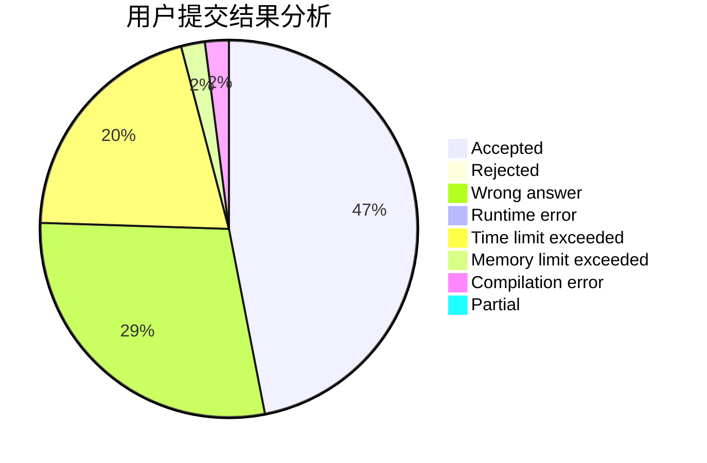
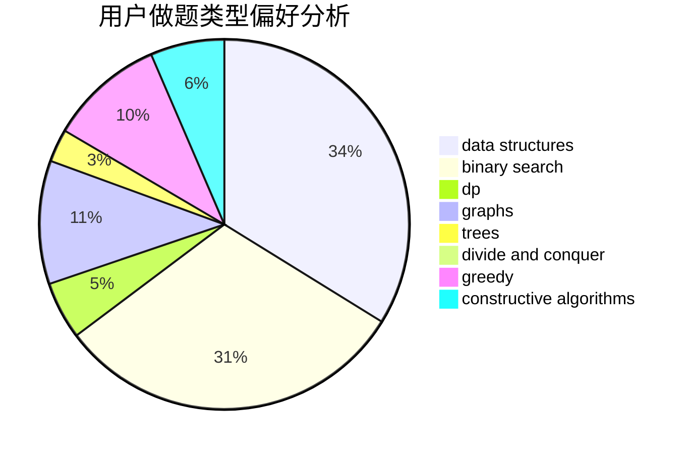
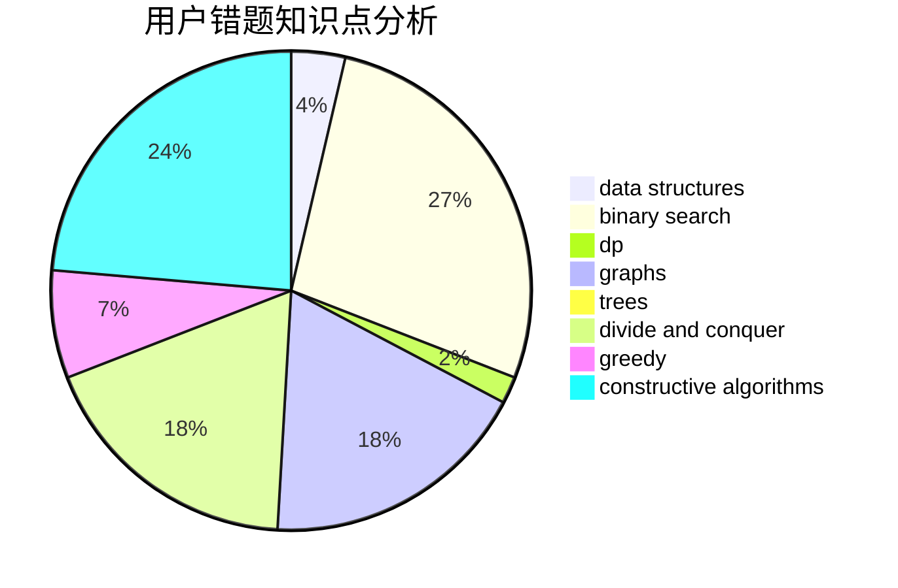

# MrMiroticc

<!-- tabs:start -->

#### **用户提交结果分析**

#### **用户做题类型偏好分析**

#### **用户错题知识点分析**

<!-- tabs:end -->
# 推荐题目
[1143F](https://codeforces.com/contest/1143/problem/F)		dsu,graphs,sortings,trees		  
[489B](https://codeforces.com/contest/489/problem/B)		dfs and similar,
                        dp,
                        graph matchings,
                        greedy,
                        sortings,
                        two pointers		  
[960F](https://codeforces.com/contest/960/problem/F)		data structures,
                        dp,
                        graphs		  
[747D](https://codeforces.com/contest/747/problem/D)		dp,
                        greedy,
                        sortings		  
[1438C](https://codeforces.com/contest/1438/problem/C)		2-sat,
                        chinese remainder theorem,
                        constructive algorithms,
                        fft,
                        flows		  
[316A2](https://codeforces.com/contest/316A/problem/2)		math		  
[596A](https://codeforces.com/contest/596/problem/A)		geometry,
                        implementation		  
[1267K](https://codeforces.com/contest/1267/problem/K)		combinatorics,
                        math		  
[923E](https://codeforces.com/contest/923/problem/E)		fft,
                        math,
                        matrices		  
[656E](https://codeforces.com/contest/656/problem/E)		*special problem		  
