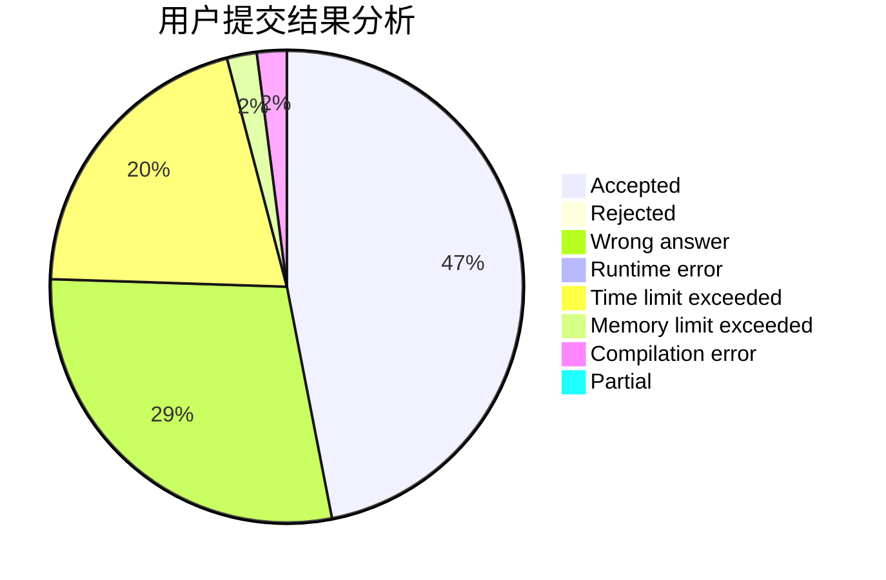
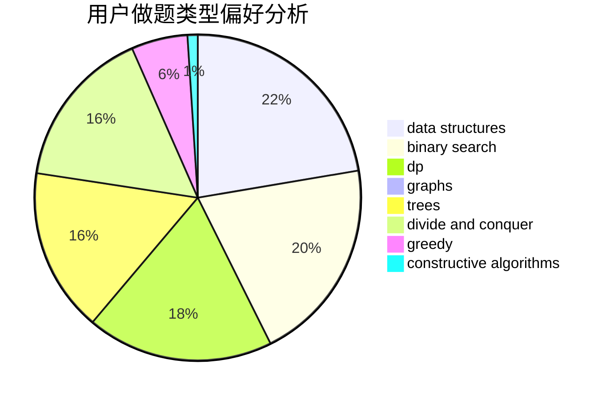
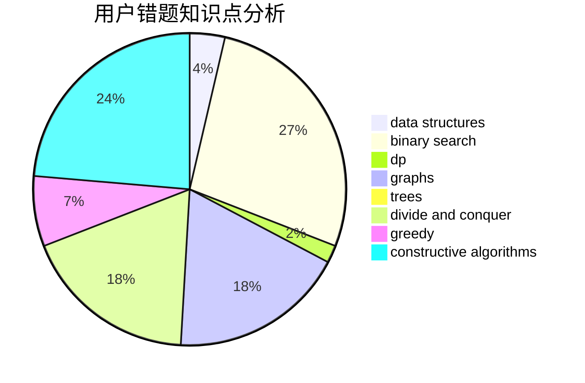

# MrMiroticc

<!-- tabs:start -->

#### **用户提交结果分析**

#### **用户做题类型偏好分析**

#### **用户错题知识点分析**

<!-- tabs:end -->
# 推荐题目
[1146A](https://codeforces.com/contest/1146/problem/A)		implementation,
                        strings		  
[509C](https://codeforces.com/contest/509/problem/C)		dp,
                        greedy,
                        implementation		  
[982E](https://codeforces.com/contest/982/problem/E)		geometry,
                        number theory		  
[767A](https://codeforces.com/contest/767/problem/A)		data structures,
                        implementation		  
[144D](https://codeforces.com/contest/144/problem/D)		data structures,
                        dfs and similar,
                        graphs,
                        shortest paths		  
[33A](https://codeforces.com/contest/33/problem/A)		greedy,
                        implementation		  
[613A](https://codeforces.com/contest/613/problem/A)		binary search,
                        geometry,
                        ternary search		  
[1276F](https://codeforces.com/contest/1276/problem/F)		string suffix structures		  
[947C](https://codeforces.com/contest/947/problem/C)		dsu,graphs,sortings,trees		  
[678E](https://codeforces.com/contest/678/problem/E)		bitmasks,
                        dp,
                        math,
                        probabilities		  
