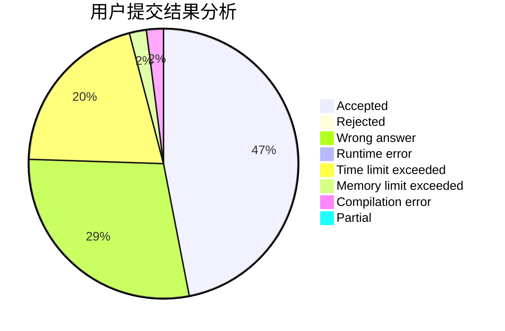
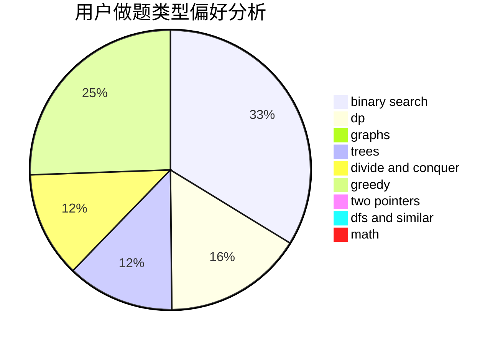

# MrMiroticc

<!-- tabs:start -->

#### **用户提交结果分析**

#### **用户做题类型偏好分析**

<!-- tabs:end -->
# 推荐题目
[1146A](https://codeforces.com/contest/1146/problem/A)
[509C](https://codeforces.com/contest/509/problem/C)
[982E](https://codeforces.com/contest/982/problem/E)
[767A](https://codeforces.com/contest/767/problem/A)
[144D](https://codeforces.com/contest/144/problem/D)
[33A](https://codeforces.com/contest/33/problem/A)
[613A](https://codeforces.com/contest/613/problem/A)
[1276F](https://codeforces.com/contest/1276/problem/F)
[947C](https://codeforces.com/contest/947/problem/C)
[678E](https://codeforces.com/contest/678/problem/E)
