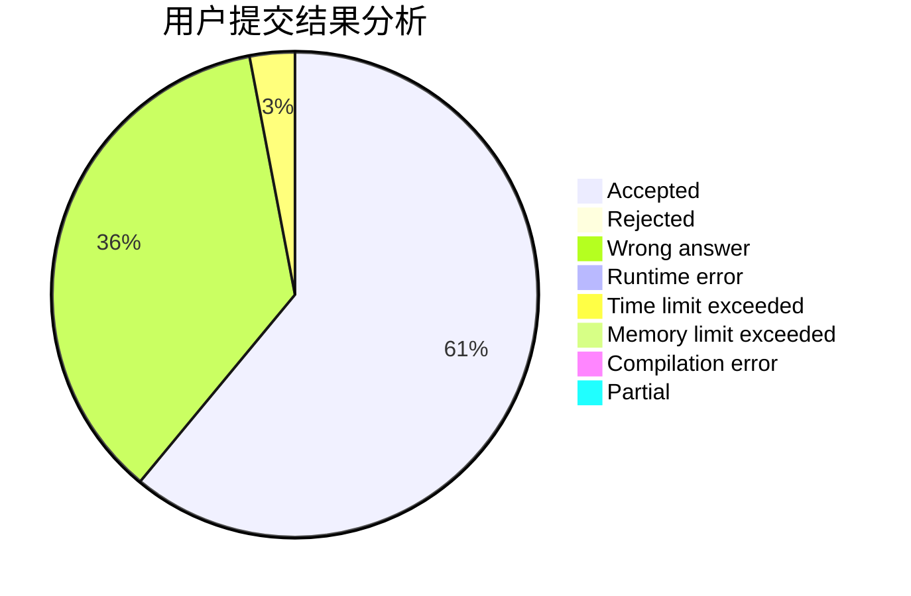
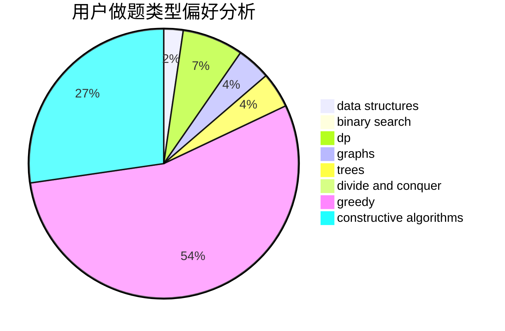
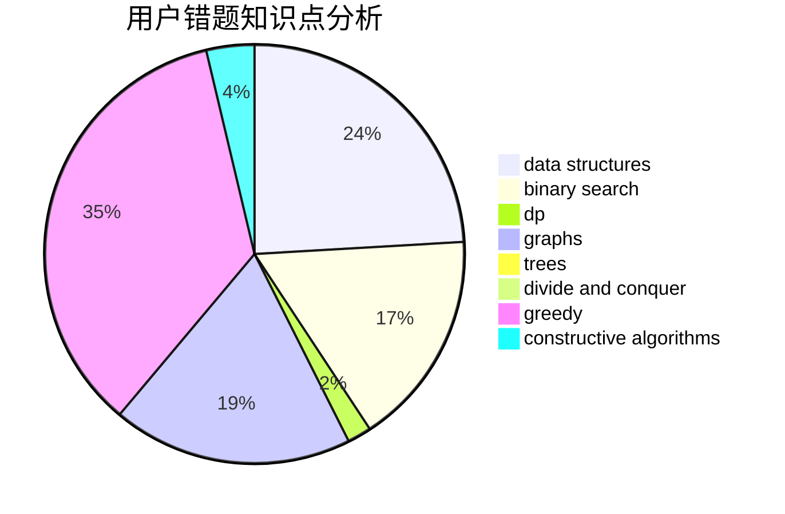

# 87ouo

<!-- tabs:start -->

#### **用户提交结果分析**

#### **用户做题类型偏好分析**

#### **用户错题知识点分析**

<!-- tabs:end -->
# 推荐题目
[1444C](https://codeforces.com/contest/1444/problem/C)		data structures,
                        dfs and similar,
                        dsu,
                        graphs		  
[1446C](https://codeforces.com/contest/1446/problem/C)		binary search,
                        bitmasks,
                        data structures,
                        divide and conquer,
                        dp,
                        trees		  
[1312D](https://codeforces.com/contest/1312/problem/D)		combinatorics,
                        math		  
[1446E](https://codeforces.com/contest/1446/problem/E)		constructive algorithms,
                        dfs and similar		  
[14472](https://codeforces.com/contest/1447/problem/2)		dsu,graphs,sortings,trees		  
[116A](https://codeforces.com/contest/116/problem/A)		implementation		  
[1141B](https://codeforces.com/contest/1141/problem/B)		implementation		  
[1182A](https://codeforces.com/contest/1182/problem/A)		dp,
                        math		  
[1316A](https://codeforces.com/contest/1316/problem/A)		implementation		  
[11651](https://codeforces.com/contest/1165/problem/1)		dsu,graphs,sortings,trees		  
