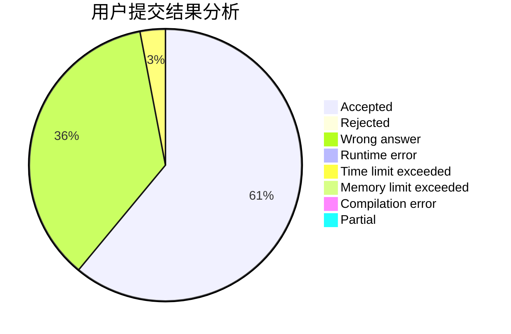
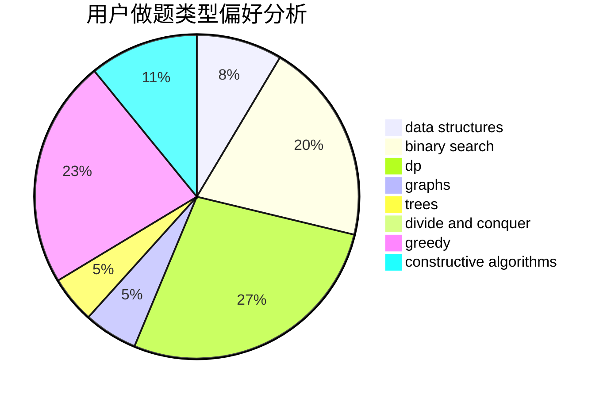
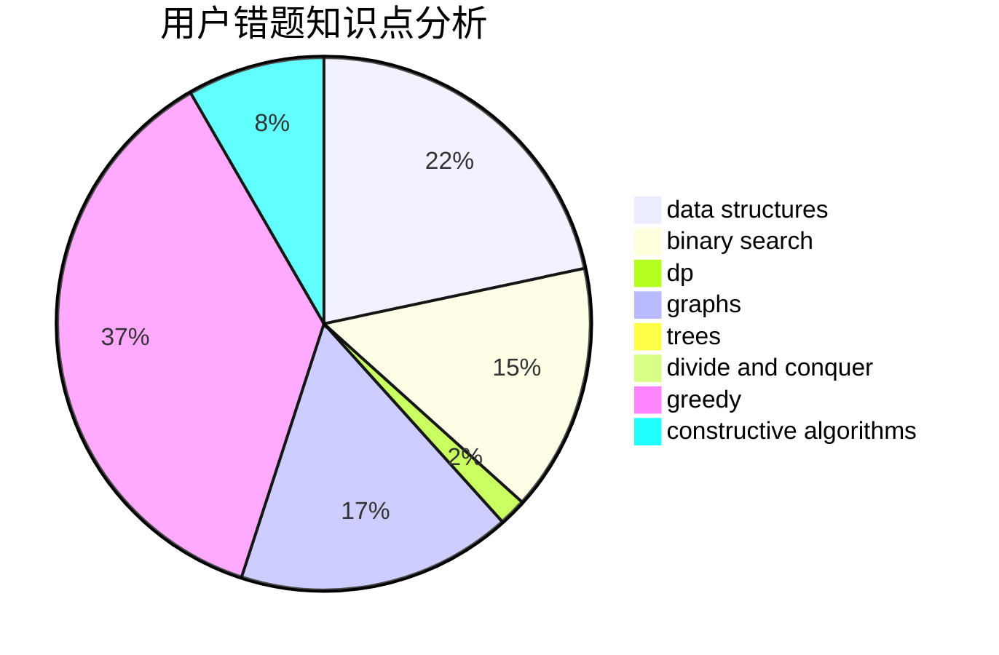

# 87ouo

<!-- tabs:start -->

#### **用户提交结果分析**

#### **用户做题类型偏好分析**

#### **用户错题知识点分析**

<!-- tabs:end -->
# 推荐题目
[1434C](https://codeforces.com/contest/1434/problem/C)		dsu,graphs,sortings,trees		  
[1436E](https://codeforces.com/contest/1436/problem/E)		binary search,
                        data structures,
                        two pointers		  
[1303F](https://codeforces.com/contest/1303/problem/F)		dsu,
                        implementation		  
[1436F](https://codeforces.com/contest/1436/problem/F)		combinatorics,
                        math,
                        number theory		  
[1437C](https://codeforces.com/contest/1437/problem/C)		dp,
                        flows,
                        graph matchings,
                        greedy,
                        math,
                        sortings		  
[1166E](https://codeforces.com/contest/1166/problem/E)		bitmasks,
                        brute force,
                        constructive algorithms,
                        math,
                        number theory		  
[113B](https://codeforces.com/contest/113/problem/B)		brute force,
                        data structures,
                        hashing,
                        strings		  
[1179B](https://codeforces.com/contest/1179/problem/B)		constructive algorithms		  
[1307E](https://codeforces.com/contest/1307/problem/E)		binary search,
                        combinatorics,
                        dp,
                        greedy,
                        implementation,
                        math		  
[1163C2](https://codeforces.com/contest/1163C/problem/2)		data structures,
                        geometry,
                        implementation,
                        math		  
