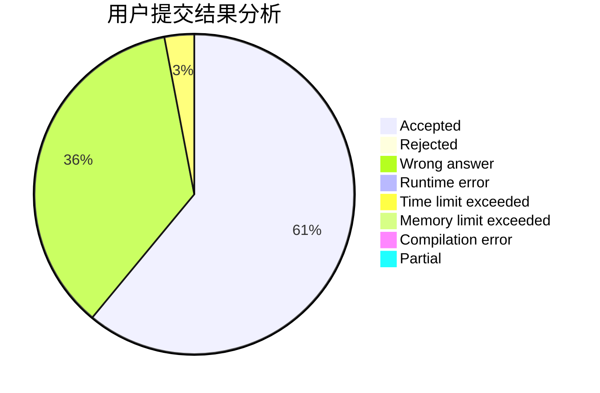
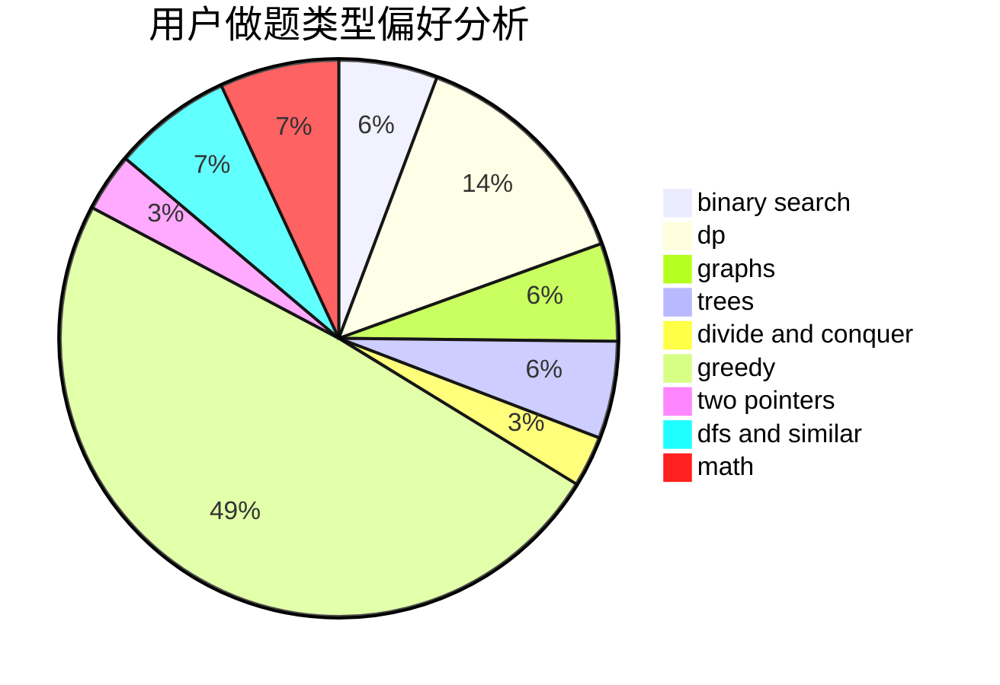

# 87ouo

<!-- tabs:start -->

#### **用户提交结果分析**

#### **用户做题类型偏好分析**

<!-- tabs:end -->
# 推荐题目
[1444C](https://codeforces.com/contest/1444/problem/C)
[1446C](https://codeforces.com/contest/1446/problem/C)
[1312D](https://codeforces.com/contest/1312/problem/D)
[1446E](https://codeforces.com/contest/1446/problem/E)
[14472](https://codeforces.com/contest/1447/problem/2)
[116A](https://codeforces.com/contest/116/problem/A)
[1141B](https://codeforces.com/contest/1141/problem/B)
[1182A](https://codeforces.com/contest/1182/problem/A)
[1316A](https://codeforces.com/contest/1316/problem/A)
[11651](https://codeforces.com/contest/1165/problem/1)
