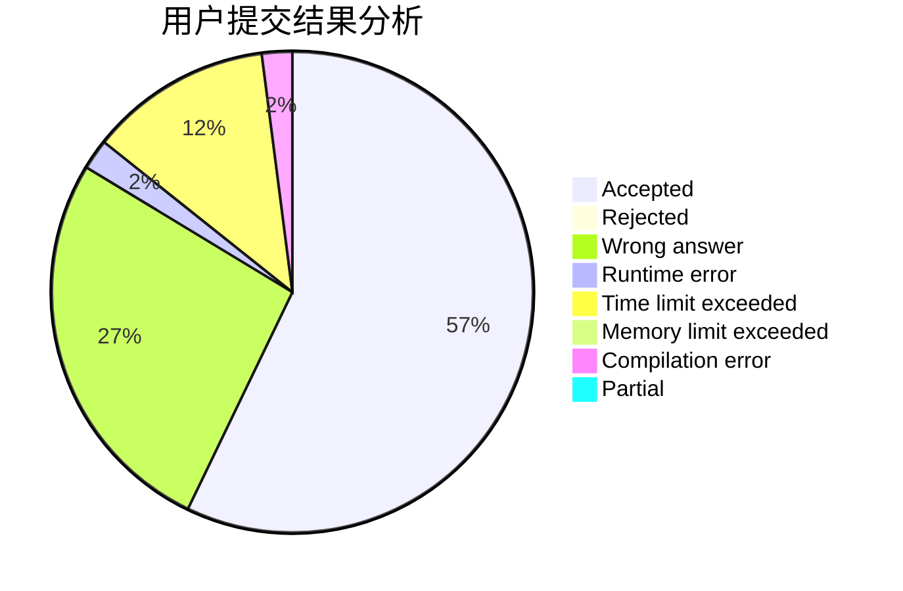
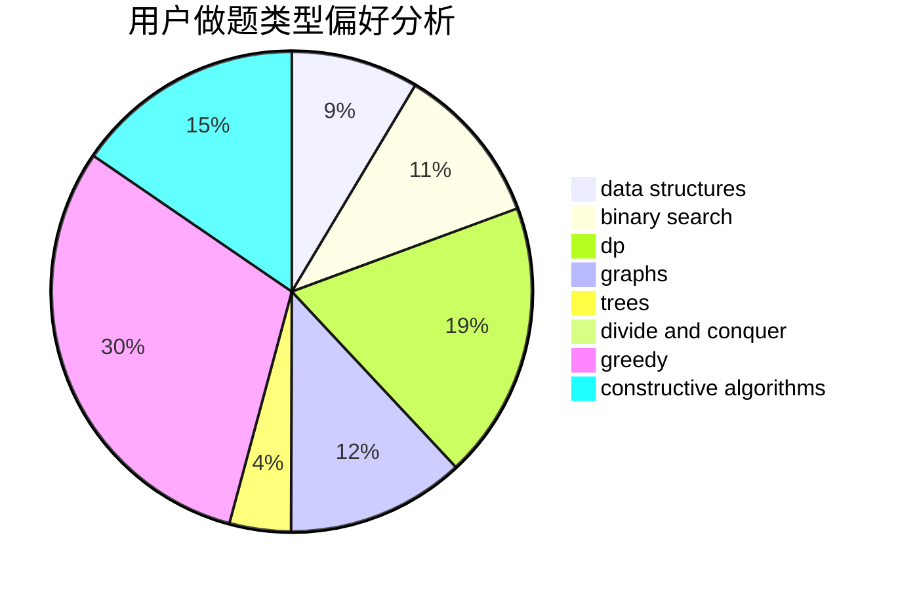
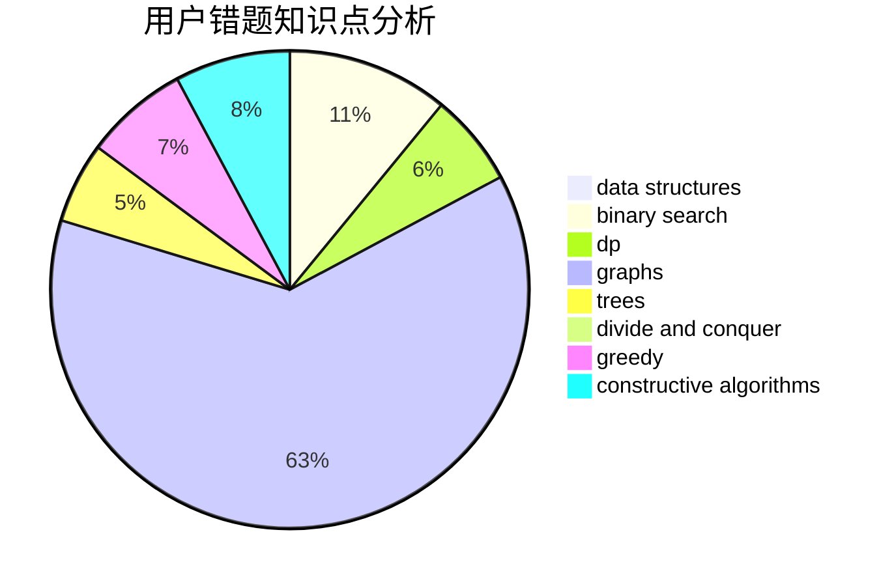

# MrMiroticcc
<!-- tabs:start -->
#### **用户提交结果分析**

#### **用户做题类型偏好分析**

#### **用户错题知识点分析**

<!-- tabs:end -->
# 推荐题目
[Same Parity Summands](http://codeforces.com/problemset/problem/1352/B)		constructive algorithms,
                        math		  
[Fox And Names](http://codeforces.com/problemset/problem/510/C)		dfs and similar,
                        graphs,
                        sortings		  
[Points on the line](http://codeforces.com/problemset/problem/940/A)		brute force,
                        greedy,
                        sortings		  
[Photo Processing](http://codeforces.com/problemset/problem/883/I)		binary search,
                        dp		  
[Nuts](http://codeforces.com/problemset/problem/402/A)		greedy,
                        math		  
[Jamie and Interesting Graph](http://codeforces.com/problemset/problem/916/C)		constructive algorithms,
                        graphs,
                        shortest paths		  
[Where do I Turn?](http://codeforces.com/problemset/problem/227/A)		geometry		  
[Lucky Numbers](http://codeforces.com/problemset/problem/95/B)		dp,
                        greedy		  
[XOR Equation](https://codeforces.com/contest/634/problem/B)		dp,
                        math		  
[Transferring Pyramid](http://codeforces.com/problemset/problem/354/D)		dp		  
<!-- tabs:start -->
#### **data structures**
[Same Parity Summands](https://codeforces.com/contest/719/problem/E)		data structures,
                        math,
                        matrices		  
[Fox And Names](http://codeforces.com/problemset/problem/1185/C2)		brute force,
                        data structures,
                        greedy,
                        math		  
[Points on the line](http://codeforces.com/problemset/problem/1299/C)		data structures,
                        geometry,
                        greedy		  
[Photo Processing](https://codeforces.com/contest/1321/problem/B)		data structures,
                        dp,
                        greedy,
                        math,
                        sortings		  
[Nuts](http://codeforces.com/problemset/problem/1466/I)		binary search,
                        data structures,
                        data structures,
                        interactive		  
[Jamie and Interesting Graph](http://codeforces.com/problemset/problem/1492/C)		binary search,
                        data structures,
                        dp,
                        greedy,
                        two pointers		  
[Where do I Turn?](http://codeforces.com/problemset/problem/1490/G)		binary search,
                        data structures,
                        math		  
[Lucky Numbers](http://codeforces.com/problemset/problem/1479/D)		binary search,
                        bitmasks,
                        brute force,
                        data structures,
                        probabilities,
                        trees		  
[XOR Equation](http://codeforces.com/problemset/problem/1497/A)		brute force,
                        data structures,
                        greedy,
                        sortings		  
[Transferring Pyramid](http://codeforces.com/problemset/problem/1491/C)		brute force,
                        data structures,
                        dp,
                        greedy,
                        implementation		  
#### **binary search**
[Same Parity Summands](http://codeforces.com/problemset/problem/883/I)		binary search,
                        dp		  
[Fox And Names](https://codeforces.com/contest/1434/problem/A)		binary search,
                        brute force,
                        dp,
                        implementation,
                        sortings,
                        two pointers		  
[Points on the line](http://codeforces.com/problemset/problem/1466/I)		binary search,
                        data structures,
                        data structures,
                        interactive		  
[Photo Processing](http://codeforces.com/problemset/problem/1492/C)		binary search,
                        data structures,
                        dp,
                        greedy,
                        two pointers		  
[Nuts](http://codeforces.com/problemset/problem/1463/D)		binary search,
                        constructive algorithms,
                        greedy,
                        two pointers		  
[Jamie and Interesting Graph](http://codeforces.com/problemset/problem/1490/G)		binary search,
                        data structures,
                        math		  
[Where do I Turn?](http://codeforces.com/problemset/problem/1479/D)		binary search,
                        bitmasks,
                        brute force,
                        data structures,
                        probabilities,
                        trees		  
[Lucky Numbers](http://codeforces.com/problemset/problem/1436/E)		binary search,
                        data structures,
                        two pointers		  
[XOR Equation](http://codeforces.com/problemset/problem/1461/D)		binary search,
                        brute force,
                        data structures,
                        divide and conquer,
                        implementation,
                        sortings		  
[Transferring Pyramid](http://codeforces.com/problemset/problem/1493/C)		binary search,
                        brute force,
                        constructive algorithms,
                        greedy,
                        strings		  
#### **dp**
[Same Parity Summands](http://codeforces.com/problemset/problem/883/I)		binary search,
                        dp		  
[Fox And Names](http://codeforces.com/problemset/problem/95/B)		dp,
                        greedy		  
[Points on the line](https://codeforces.com/contest/634/problem/B)		dp,
                        math		  
[Photo Processing](http://codeforces.com/problemset/problem/354/D)		dp		  
[Nuts](https://codeforces.com/contest/1434/problem/A)		binary search,
                        brute force,
                        dp,
                        implementation,
                        sortings,
                        two pointers		  
[Jamie and Interesting Graph](http://codeforces.com/problemset/problem/285/E)		combinatorics,
                        dp,
                        math		  
[Where do I Turn?](https://codeforces.com/contest/1321/problem/B)		data structures,
                        dp,
                        greedy,
                        math,
                        sortings		  
[Lucky Numbers](http://codeforces.com/problemset/problem/1492/C)		binary search,
                        data structures,
                        dp,
                        greedy,
                        two pointers		  
[XOR Equation](https://codeforces.com/contest/1457/problem/C)		brute force,
                        dp,
                        implementation		  
[Transferring Pyramid](http://codeforces.com/problemset/problem/1491/C)		brute force,
                        data structures,
                        dp,
                        greedy,
                        implementation		  
#### **graph**
[Same Parity Summands](http://codeforces.com/problemset/problem/510/C)		dfs and similar,
                        graphs,
                        sortings		  
[Fox And Names](http://codeforces.com/problemset/problem/916/C)		constructive algorithms,
                        graphs,
                        shortest paths		  
[Points on the line](http://codeforces.com/problemset/problem/1012/B)		constructive algorithms,
                        dfs and similar,
                        dsu,
                        graphs,
                        matrices		  
[Photo Processing](https://codeforces.com/contest/1465/problem/C)		dfs and similar,
                        dsu,
                        graphs		  
[Nuts](http://codeforces.com/problemset/problem/22/E)		dfs and similar,
                        graphs,
                        trees		  
[Jamie and Interesting Graph](http://codeforces.com/problemset/problem/1487/C)		brute force,
                        constructive algorithms,
                        dfs and similar,
                        graphs,
                        greedy,
                        implementation,
                        math		  
[Where do I Turn?](http://codeforces.com/problemset/problem/1437/C)		dp,
                        flows,
                        graph matchings,
                        greedy,
                        math,
                        sortings		  
[Lucky Numbers](http://codeforces.com/problemset/problem/1470/D)		constructive algorithms,
                        dfs and similar,
                        graph matchings,
                        graphs,
                        greedy		  
[XOR Equation](http://codeforces.com/problemset/problem/1476/C)		dp,
                        graphs,
                        greedy		  
[Transferring Pyramid](http://codeforces.com/problemset/problem/1304/D)		constructive algorithms,
                        graphs,
                        greedy,
                        two pointers		  
#### **trees**
[Same Parity Summands](http://codeforces.com/problemset/problem/1361/D)		greedy,
                        implementation,
                        math,
                        trees		  
[Fox And Names](http://codeforces.com/problemset/problem/22/E)		dfs and similar,
                        graphs,
                        trees		  
[Points on the line](http://codeforces.com/problemset/problem/1479/D)		binary search,
                        bitmasks,
                        brute force,
                        data structures,
                        probabilities,
                        trees		  
[Photo Processing](http://codeforces.com/problemset/problem/1511/C)		brute force,
                        data structures,
                        implementation,
                        trees		  
[Nuts](http://codeforces.com/problemset/problem/1499/F)		combinatorics,
                        dfs and similar,
                        dp,
                        trees		  
[Jamie and Interesting Graph](http://codeforces.com/problemset/problem/1491/E)		brute force,
                        dfs and similar,
                        divide and conquer,
                        number theory,
                        trees		  
[Where do I Turn?](http://codeforces.com/problemset/problem/1466/D)		data structures,
                        greedy,
                        sortings,
                        trees		  
[Lucky Numbers](http://codeforces.com/problemset/problem/1495/D)		combinatorics,
                        dfs and similar,
                        graphs,
                        math,
                        shortest paths,
                        trees		  
[XOR Equation](http://codeforces.com/problemset/problem/1303/G)		data structures,
                        divide and conquer,
                        geometry,
                        trees		  
[Transferring Pyramid](http://codeforces.com/problemset/problem/1454/E)		combinatorics,
                        dfs and similar,
                        graphs,
                        trees		  
#### **divide and conquer**
[Same Parity Summands](http://codeforces.com/problemset/problem/1461/D)		binary search,
                        brute force,
                        data structures,
                        divide and conquer,
                        implementation,
                        sortings		  
[Fox And Names](http://codeforces.com/problemset/problem/1466/G)		combinatorics,
                        divide and conquer,
                        hashing,
                        math,
                        string suffix structures,
                        strings		  
[Points on the line](http://codeforces.com/problemset/problem/1490/D)		dfs and similar,
                        divide and conquer,
                        implementation		  
[Photo Processing](https://codeforces.com/contest/1483/problem/C)		data structures,
                        divide and conquer,
                        dp		  
[Nuts](http://codeforces.com/problemset/problem/1491/E)		brute force,
                        dfs and similar,
                        divide and conquer,
                        number theory,
                        trees		  
[Jamie and Interesting Graph](http://codeforces.com/problemset/problem/1303/G)		data structures,
                        divide and conquer,
                        geometry,
                        trees		  
[Where do I Turn?](http://codeforces.com/problemset/problem/1494/D)		constructive algorithms,
                        data structures,
                        dfs and similar,
                        divide and conquer,
                        dsu,
                        greedy,
                        sortings,
                        trees		  
[Lucky Numbers](http://codeforces.com/problemset/problem/1482/E)		data structures,
                        divide and conquer,
                        dp		  
[XOR Equation](http://codeforces.com/problemset/problem/566/C)		dfs and similar,
                        divide and conquer,
                        trees		  
[Transferring Pyramid](http://codeforces.com/problemset/problem/1428/F)		binary search,
                        data structures,
                        divide and conquer,
                        dp,
                        two pointers		  
#### **greedy**
[Same Parity Summands](http://codeforces.com/problemset/problem/940/A)		brute force,
                        greedy,
                        sortings		  
[Fox And Names](http://codeforces.com/problemset/problem/402/A)		greedy,
                        math		  
[Points on the line](http://codeforces.com/problemset/problem/95/B)		dp,
                        greedy		  
[Photo Processing](https://codeforces.com/contest/805/problem/C)		constructive algorithms,
                        greedy,
                        math		  
[Nuts](http://codeforces.com/problemset/problem/479/B)		brute force,
                        constructive algorithms,
                        greedy,
                        implementation,
                        sortings		  
[Jamie and Interesting Graph](http://codeforces.com/problemset/problem/1361/D)		greedy,
                        implementation,
                        math,
                        trees		  
[Where do I Turn?](http://codeforces.com/problemset/problem/515/C)		greedy,
                        math,
                        sortings		  
[Lucky Numbers](http://codeforces.com/problemset/problem/436/A)		greedy		  
[XOR Equation](http://codeforces.com/problemset/problem/1185/C2)		brute force,
                        data structures,
                        greedy,
                        math		  
[Transferring Pyramid](http://codeforces.com/problemset/problem/1203/D1)		greedy,
                        implementation		  
#### **constructive algorithms**
[Same Parity Summands](http://codeforces.com/problemset/problem/1352/B)		constructive algorithms,
                        math		  
[Fox And Names](http://codeforces.com/problemset/problem/916/C)		constructive algorithms,
                        graphs,
                        shortest paths		  
[Points on the line](http://codeforces.com/problemset/problem/1136/C)		constructive algorithms,
                        sortings		  
[Photo Processing](https://codeforces.com/contest/805/problem/C)		constructive algorithms,
                        greedy,
                        math		  
[Nuts](http://codeforces.com/problemset/problem/479/B)		brute force,
                        constructive algorithms,
                        greedy,
                        implementation,
                        sortings		  
[Jamie and Interesting Graph](http://codeforces.com/problemset/problem/1012/B)		constructive algorithms,
                        dfs and similar,
                        dsu,
                        graphs,
                        matrices		  
[Where do I Turn?](http://codeforces.com/problemset/problem/482/A)		constructive algorithms,
                        greedy		  
[Lucky Numbers](http://codeforces.com/problemset/problem/1493/A)		constructive algorithms,
                        greedy		  
[XOR Equation](http://codeforces.com/problemset/problem/1463/D)		binary search,
                        constructive algorithms,
                        greedy,
                        two pointers		  
[Transferring Pyramid](https://codeforces.com/contest/1456/problem/B)		bitmasks,
                        brute force,
                        constructive algorithms		  
#### **sortings**
[Same Parity Summands](http://codeforces.com/problemset/problem/510/C)		dfs and similar,
                        graphs,
                        sortings		  
[Fox And Names](http://codeforces.com/problemset/problem/940/A)		brute force,
                        greedy,
                        sortings		  
[Points on the line](http://codeforces.com/problemset/problem/1136/C)		constructive algorithms,
                        sortings		  
[Photo Processing](http://codeforces.com/problemset/problem/479/B)		brute force,
                        constructive algorithms,
                        greedy,
                        implementation,
                        sortings		  
[Nuts](http://codeforces.com/problemset/problem/515/C)		greedy,
                        math,
                        sortings		  
[Jamie and Interesting Graph](https://codeforces.com/contest/1434/problem/A)		binary search,
                        brute force,
                        dp,
                        implementation,
                        sortings,
                        two pointers		  
[Where do I Turn?](https://codeforces.com/contest/1321/problem/B)		data structures,
                        dp,
                        greedy,
                        math,
                        sortings		  
[Lucky Numbers](https://codeforces.com/contest/1496/problem/C)		geometry,
                        greedy,
                        math,
                        sortings		  
[XOR Equation](http://codeforces.com/problemset/problem/1495/A)		geometry,
                        greedy,
                        math,
                        sortings		  
[Transferring Pyramid](http://codeforces.com/problemset/problem/1497/A)		brute force,
                        data structures,
                        greedy,
                        sortings		  
<!-- tabs:end -->
