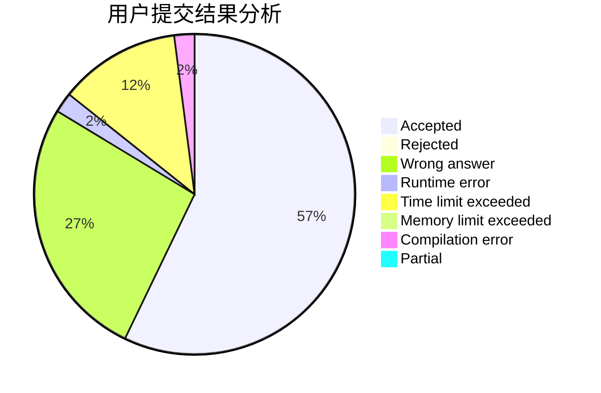
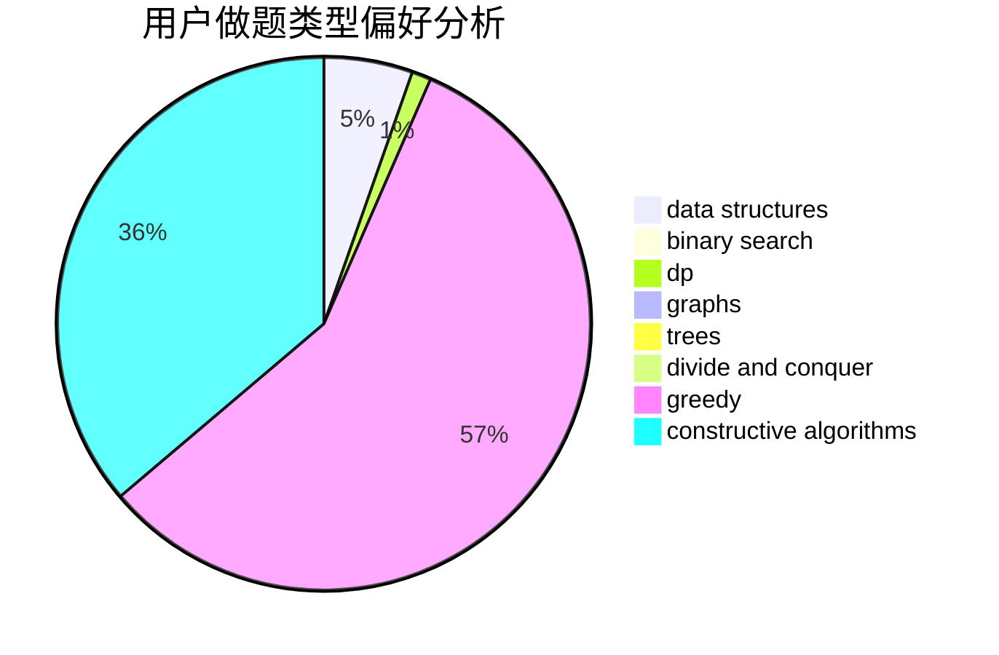
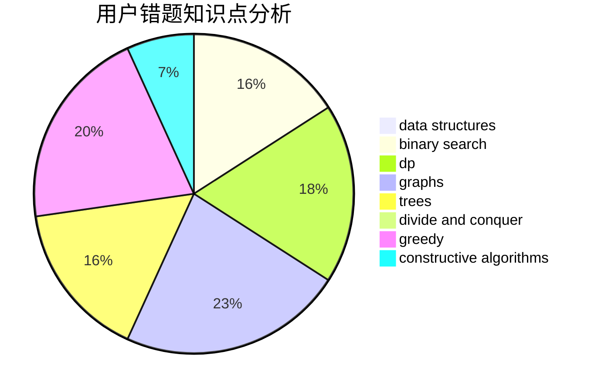

# MrMiroticcc

<!-- tabs:start -->

#### **用户提交结果分析**

#### **用户做题类型偏好分析**

#### **用户错题知识点分析**

<!-- tabs:end -->
# 推荐题目
[666E](https://codeforces.com/contest/666/problem/E)		data structures,
                        string suffix structures		  
[936D](https://codeforces.com/contest/936/problem/D)		dp,
                        greedy		  
[961E](https://codeforces.com/contest/961/problem/E)		data structures		  
[901C](https://codeforces.com/contest/901/problem/C)		binary search,
                        data structures,
                        dfs and similar,
                        dsu,
                        graphs,
                        two pointers		  
[49A](https://codeforces.com/contest/49/problem/A)		implementation		  
[246B](https://codeforces.com/contest/246/problem/B)		greedy,
                        math		  
[821D](https://codeforces.com/contest/821/problem/D)		dfs and similar,
                        graphs,
                        shortest paths		  
[1358F](https://codeforces.com/contest/1358/problem/F)		binary search,
                        constructive algorithms,
                        greedy,
                        implementation		  
[1138E](https://codeforces.com/contest/1138/problem/E)		dsu,graphs,sortings,trees		  
[542D](https://codeforces.com/contest/542/problem/D)		dfs and similar,
                        dp,
                        hashing,
                        math,
                        number theory		  
