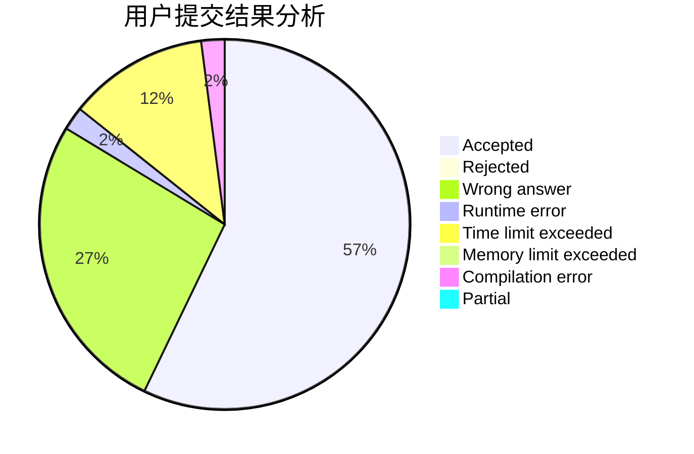
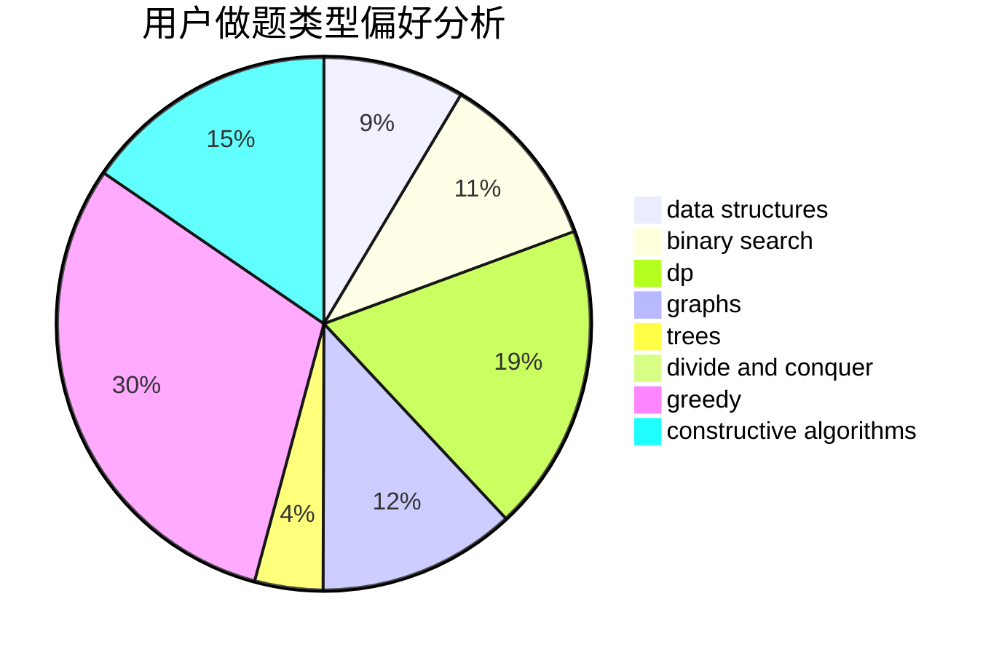
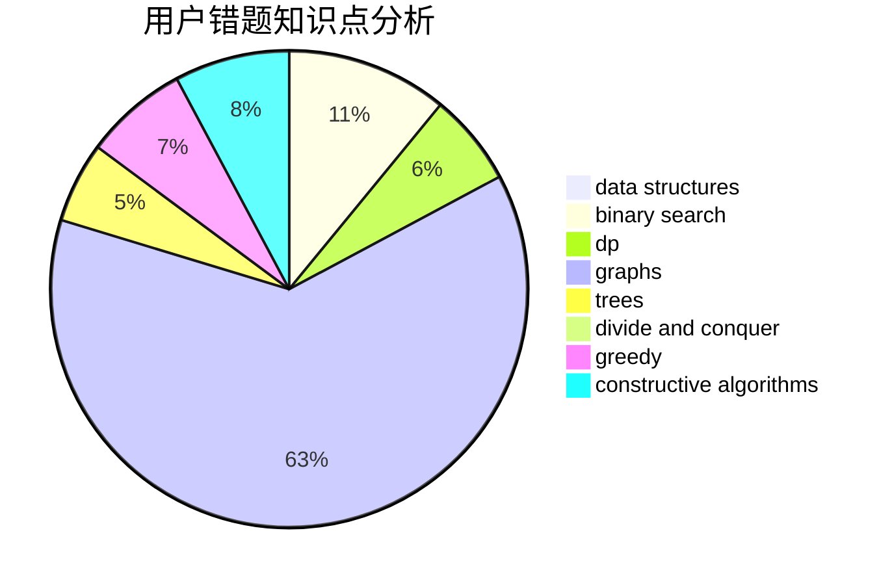

# MrMiroticcc

<!-- tabs:start -->

#### **用户提交结果分析**

#### **用户做题类型偏好分析**

#### **用户错题知识点分析**

<!-- tabs:end -->
# 推荐题目
[634B](https://codeforces.com/contest/634/problem/B)		dsu,graphs,sortings,trees		  
[916C](https://codeforces.com/contest/916/problem/C)		constructive algorithms,
                        graphs,
                        shortest paths		  
[940A](https://codeforces.com/contest/940/problem/A)		brute force,
                        greedy,
                        sortings		  
[883I](https://codeforces.com/contest/883/problem/I)		binary search,
                        dp		  
[479B](https://codeforces.com/contest/479/problem/B)		brute force,
                        constructive algorithms,
                        greedy,
                        implementation,
                        sortings		  
[227A](https://codeforces.com/contest/227/problem/A)		geometry		  
[805C](https://codeforces.com/contest/805/problem/C)		dsu,graphs,sortings,trees		  
[1352B](https://codeforces.com/contest/1352/problem/B)		constructive algorithms,
                        math		  
[1136C](https://codeforces.com/contest/1136/problem/C)		constructive algorithms,
                        sortings		  
[515C](https://codeforces.com/contest/515/problem/C)		greedy,
                        math,
                        sortings		  
