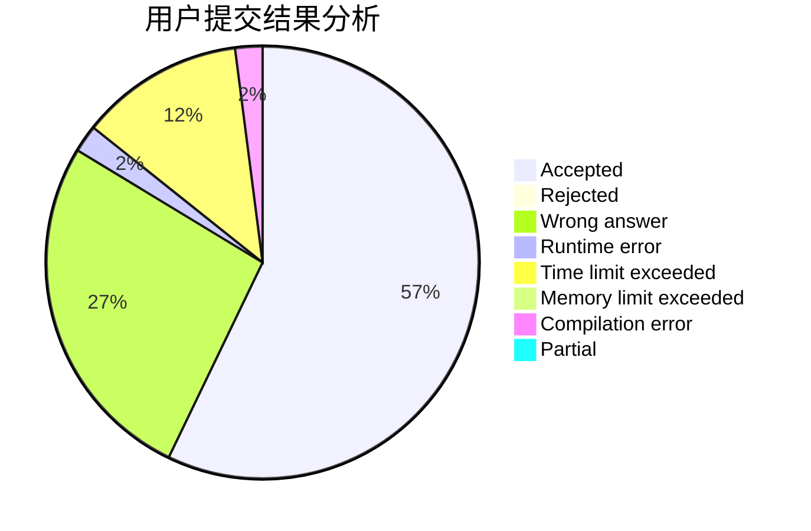
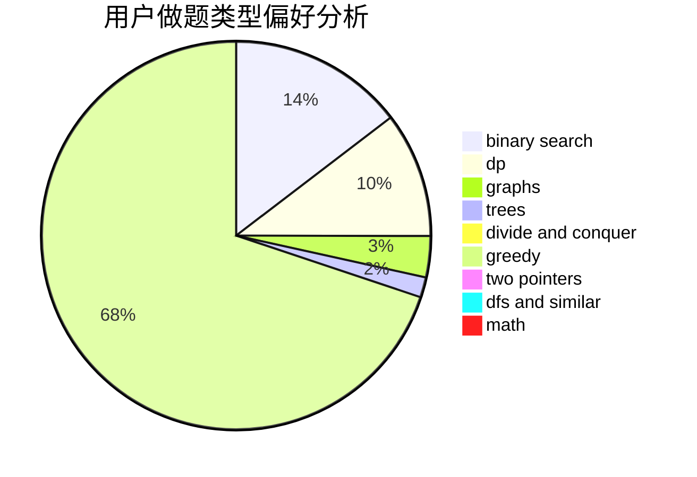

# MrMiroticcc

<!-- tabs:start -->

#### **用户提交结果分析**

#### **用户做题类型偏好分析**

<!-- tabs:end -->
# 推荐题目
[666E](https://codeforces.com/contest/666/problem/E)
[936D](https://codeforces.com/contest/936/problem/D)
[961E](https://codeforces.com/contest/961/problem/E)
[901C](https://codeforces.com/contest/901/problem/C)
[49A](https://codeforces.com/contest/49/problem/A)
[246B](https://codeforces.com/contest/246/problem/B)
[821D](https://codeforces.com/contest/821/problem/D)
[1358F](https://codeforces.com/contest/1358/problem/F)
[1138E](https://codeforces.com/contest/1138/problem/E)
[542D](https://codeforces.com/contest/542/problem/D)
