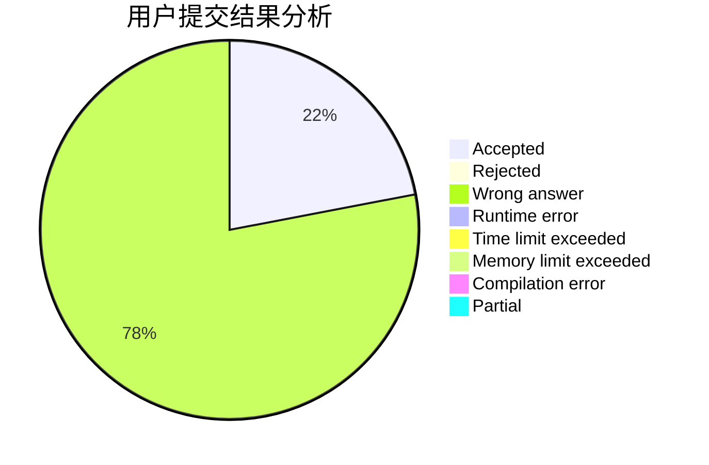
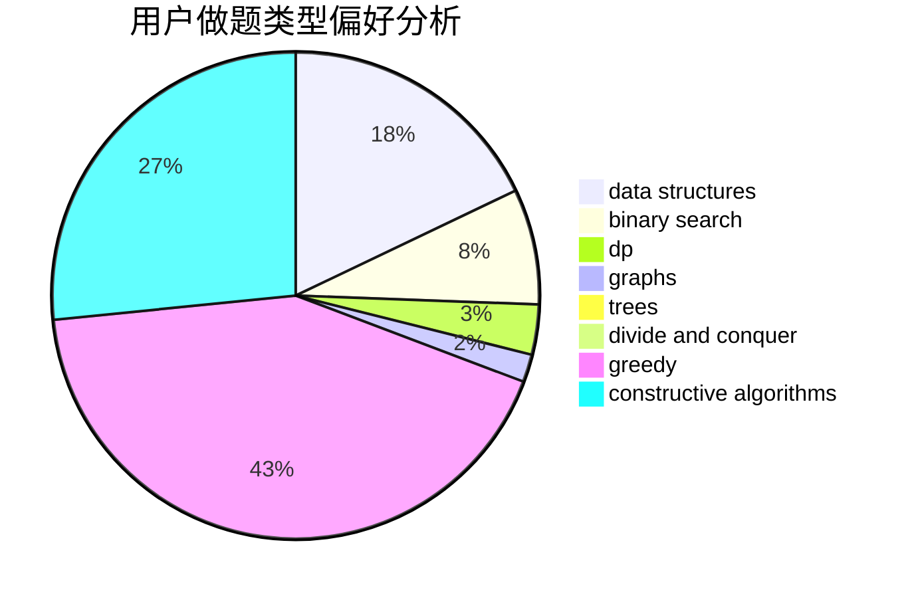
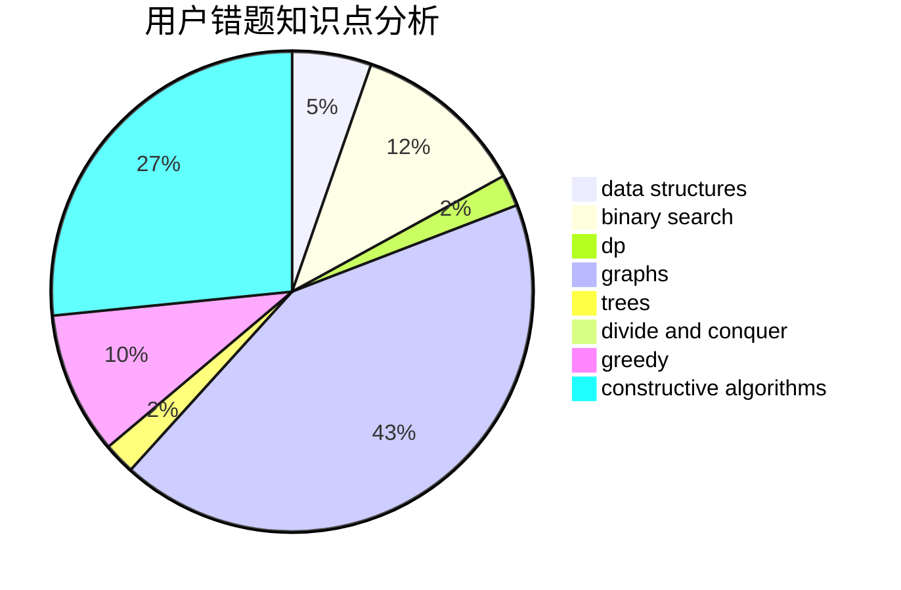

# MrMiroticccc

<!-- tabs:start -->

#### **用户提交结果分析**

#### **用户做题类型偏好分析**

#### **用户错题知识点分析**

<!-- tabs:end -->
# 推荐题目
[338E](https://codeforces.com/contest/338/problem/E)		data structures		  
[1500D](https://codeforces.com/contest/1500/problem/D)		data structures,
                        sortings,
                        two pointers		  
[878E](https://codeforces.com/contest/878/problem/E)		combinatorics,
                        dp		  
[1453D](https://codeforces.com/contest/1453/problem/D)		brute force,
                        constructive algorithms,
                        greedy,
                        math,
                        probabilities		  
[1065B](https://codeforces.com/contest/1065/problem/B)		constructive algorithms,
                        graphs		  
[761E](https://codeforces.com/contest/761/problem/E)		constructive algorithms,
                        dfs and similar,
                        graphs,
                        greedy,
                        trees		  
[805B](https://codeforces.com/contest/805/problem/B)		constructive algorithms		  
[1339A](https://codeforces.com/contest/1339/problem/A)		brute force,
                        dp,
                        implementation,
                        math		  
[812E](https://codeforces.com/contest/812/problem/E)		games,
                        trees		  
[1031A](https://codeforces.com/contest/1031/problem/A)		implementation,
                        math		  
