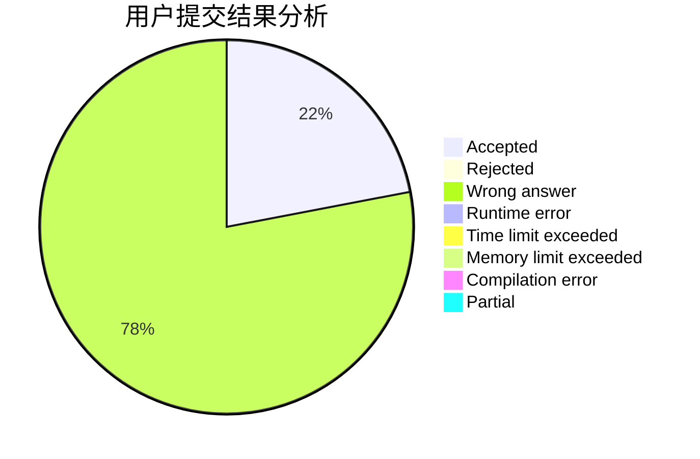
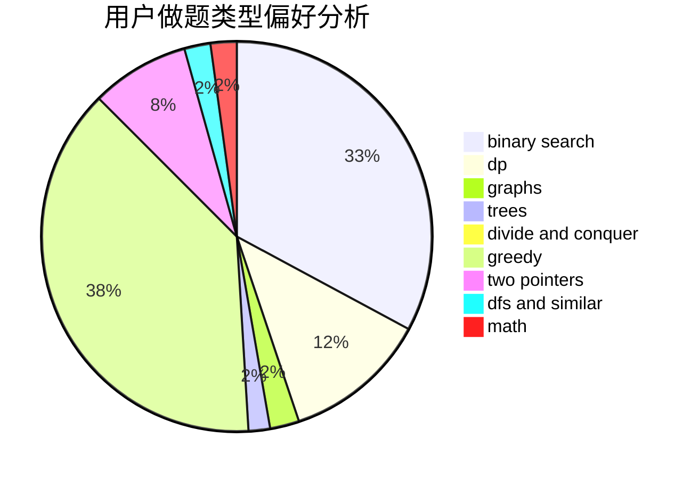

# MrMiroticccc

<!-- tabs:start -->

#### **用户提交结果分析**

#### **用户做题类型偏好分析**

<!-- tabs:end -->
# 推荐题目
[364D](https://codeforces.com/contest/364/problem/D)
[1510J](https://codeforces.com/contest/1510/problem/J)
[899D](https://codeforces.com/contest/899/problem/D)
[1463A](https://codeforces.com/contest/1463/problem/A)
[1065F](https://codeforces.com/contest/1065/problem/F)
[780C](https://codeforces.com/contest/780/problem/C)
[821C](https://codeforces.com/contest/821/problem/C)
[1346A](https://codeforces.com/contest/1346/problem/A)
[831B](https://codeforces.com/contest/831/problem/B)
[1031D](https://codeforces.com/contest/1031/problem/D)
