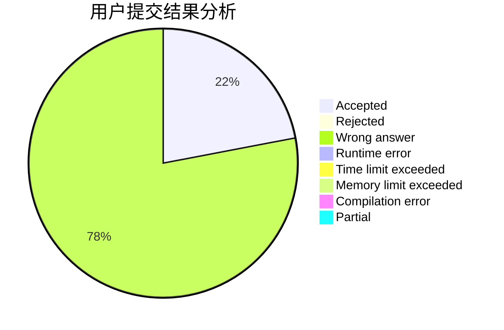
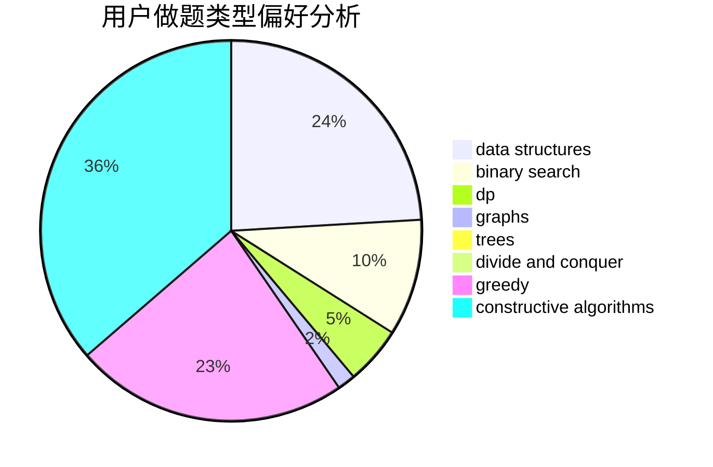
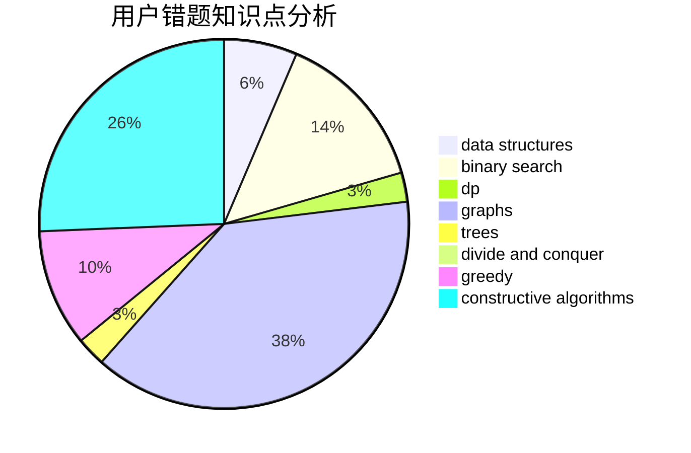

# MrMiroticccc

<!-- tabs:start -->

#### **用户提交结果分析**

#### **用户做题类型偏好分析**

#### **用户错题知识点分析**

<!-- tabs:end -->
# 推荐题目
[364D](https://codeforces.com/contest/364/problem/D)		brute force,
                        math,
                        probabilities		  
[1510J](https://codeforces.com/contest/1510/problem/J)		constructive algorithms,
                        math		  
[899D](https://codeforces.com/contest/899/problem/D)		constructive algorithms,
                        math		  
[1463A](https://codeforces.com/contest/1463/problem/A)		binary search,
                        math		  
[1065F](https://codeforces.com/contest/1065/problem/F)		dfs and similar,
                        dp,
                        trees		  
[780C](https://codeforces.com/contest/780/problem/C)		dfs and similar,
                        graphs,
                        greedy,
                        trees		  
[821C](https://codeforces.com/contest/821/problem/C)		data structures,
                        greedy,
                        trees		  
[1346A](https://codeforces.com/contest/1346/problem/A)		*special problem,
                        math		  
[831B](https://codeforces.com/contest/831/problem/B)		implementation,
                        strings		  
[1031D](https://codeforces.com/contest/1031/problem/D)		greedy		  
