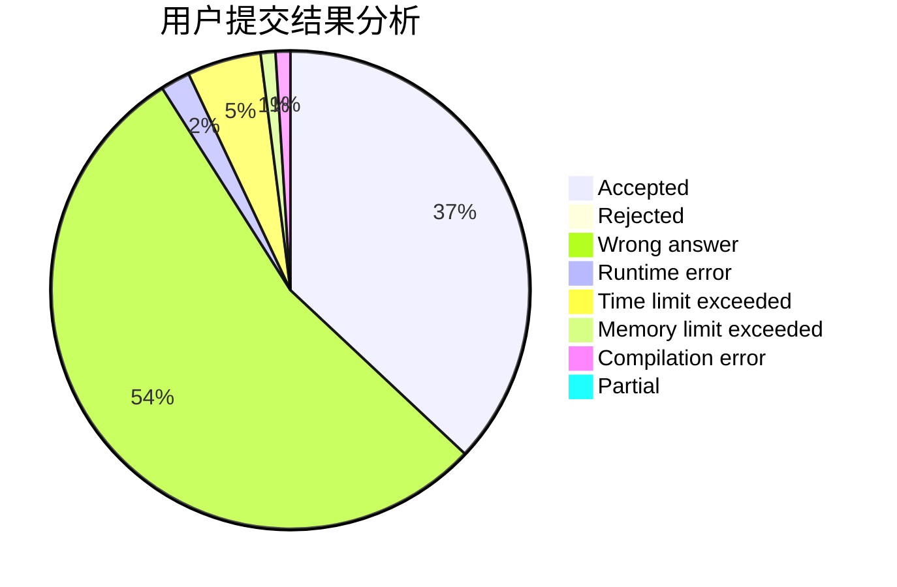
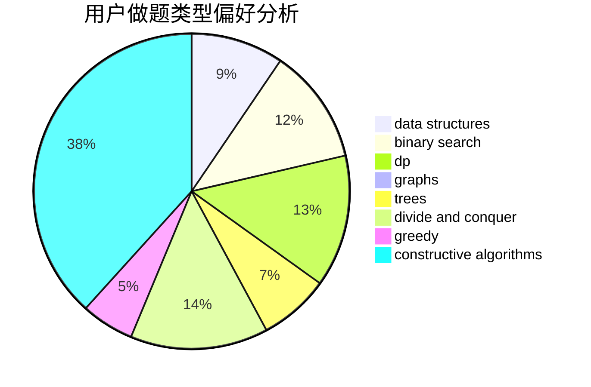
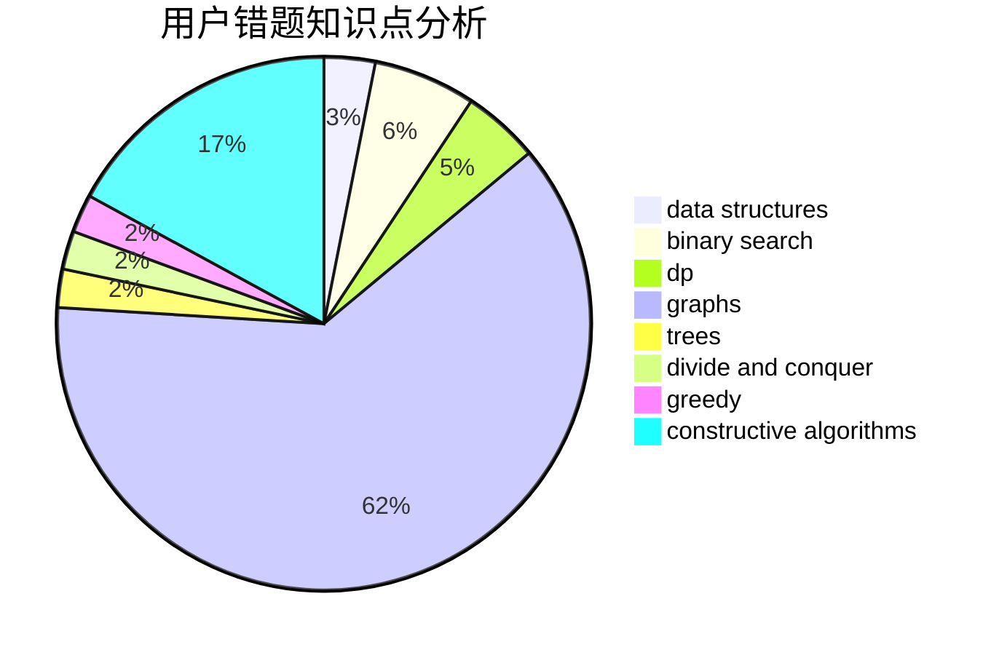

# Mr_Eight

<!-- tabs:start -->

#### **用户提交结果分析**

#### **用户做题类型偏好分析**

#### **用户错题知识点分析**

<!-- tabs:end -->
# 推荐题目
[1020A](https://codeforces.com/contest/1020/problem/A)		math		  
[77B](https://codeforces.com/contest/77/problem/B)		math,
                        probabilities		  
[1479D](https://codeforces.com/contest/1479/problem/D)		binary search,
                        bitmasks,
                        brute force,
                        data structures,
                        probabilities,
                        trees		  
[1161A](https://codeforces.com/contest/1161/problem/A)		dsu,graphs,sortings,trees		  
[652E](https://codeforces.com/contest/652/problem/E)		dfs and similar,
                        dsu,
                        graphs,
                        trees		  
[1341F](https://codeforces.com/contest/1341/problem/F)		dsu,graphs,sortings,trees		  
[1131F](https://codeforces.com/contest/1131/problem/F)		constructive algorithms,
                        dsu		  
[1251C](https://codeforces.com/contest/1251/problem/C)		greedy,
                        two pointers		  
[11961](https://codeforces.com/contest/1196/problem/1)		dsu,graphs,sortings,trees		  
[52B](https://codeforces.com/contest/52/problem/B)		combinatorics		  
