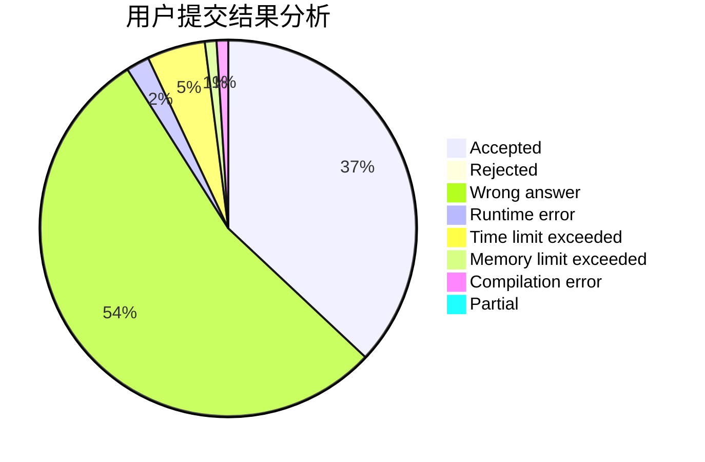
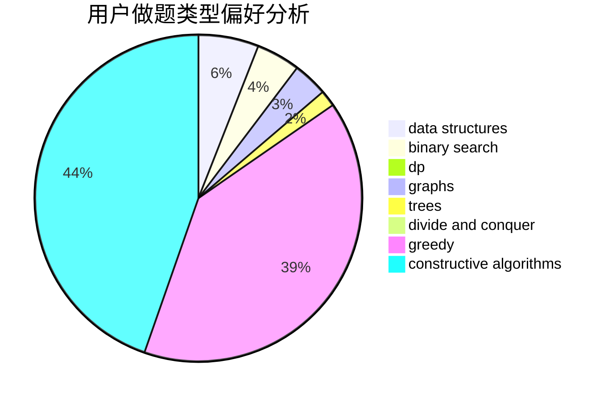
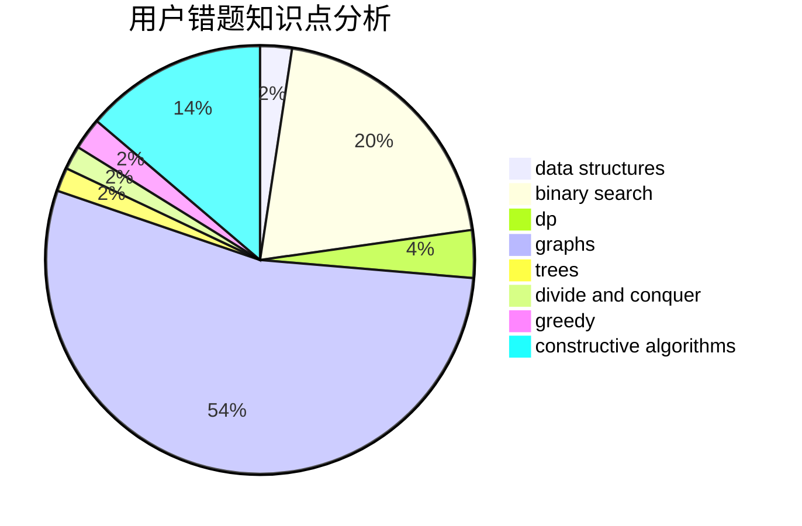

# Mr_Eight

<!-- tabs:start -->

#### **用户提交结果分析**

#### **用户做题类型偏好分析**

#### **用户错题知识点分析**

<!-- tabs:end -->
# 推荐题目
[1019E](https://codeforces.com/contest/1019/problem/E)		data structures,
                        divide and conquer,
                        trees		  
[75D](https://codeforces.com/contest/75/problem/D)		data structures,
                        dp,
                        greedy,
                        implementation,
                        math,
                        trees		  
[1471B](https://codeforces.com/contest/1471/problem/B)		brute force,
                        greedy,
                        implementation,
                        math		  
[1158B](https://codeforces.com/contest/1158/problem/B)		constructive algorithms,
                        math,
                        strings		  
[626D](https://codeforces.com/contest/626/problem/D)		brute force,
                        combinatorics,
                        dp,
                        probabilities		  
[1334G](https://codeforces.com/contest/1334/problem/G)		bitmasks,
                        brute force,
                        fft		  
[112A](https://codeforces.com/contest/112/problem/A)		implementation,
                        strings		  
[1247D](https://codeforces.com/contest/1247/problem/D)		dsu,graphs,sortings,trees		  
[1190A](https://codeforces.com/contest/1190/problem/A)		implementation,
                        two pointers		  
[509C](https://codeforces.com/contest/509/problem/C)		dp,
                        greedy,
                        implementation		  
