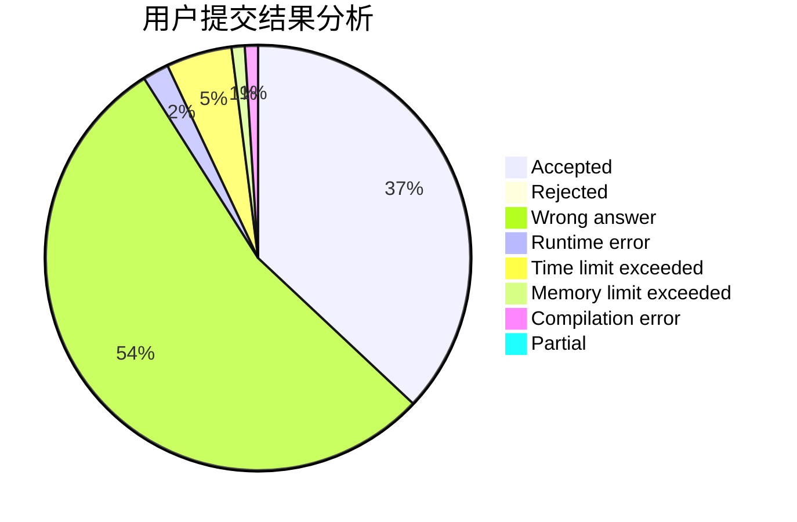
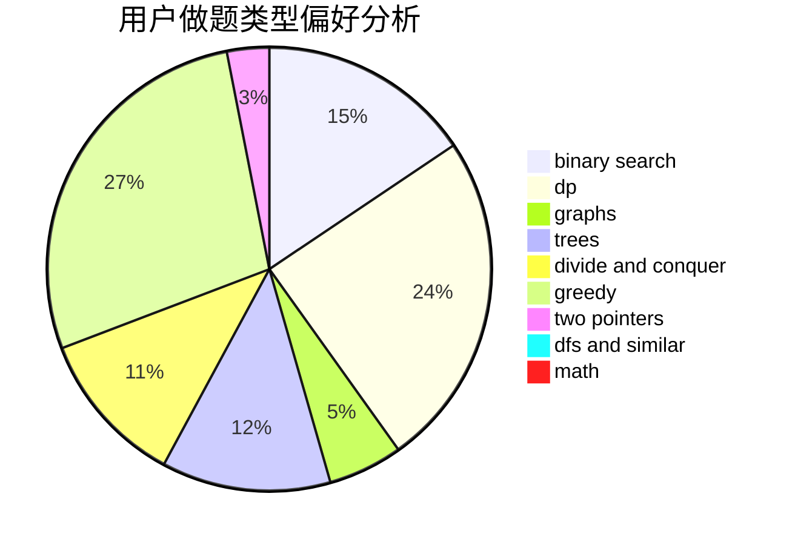

# Mr_Eight

<!-- tabs:start -->

#### **用户提交结果分析**

#### **用户做题类型偏好分析**

<!-- tabs:end -->
# 推荐题目
[1020A](https://codeforces.com/contest/1020/problem/A)
[77B](https://codeforces.com/contest/77/problem/B)
[1479D](https://codeforces.com/contest/1479/problem/D)
[1161A](https://codeforces.com/contest/1161/problem/A)
[652E](https://codeforces.com/contest/652/problem/E)
[1341F](https://codeforces.com/contest/1341/problem/F)
[1131F](https://codeforces.com/contest/1131/problem/F)
[1251C](https://codeforces.com/contest/1251/problem/C)
[11961](https://codeforces.com/contest/1196/problem/1)
[52B](https://codeforces.com/contest/52/problem/B)
