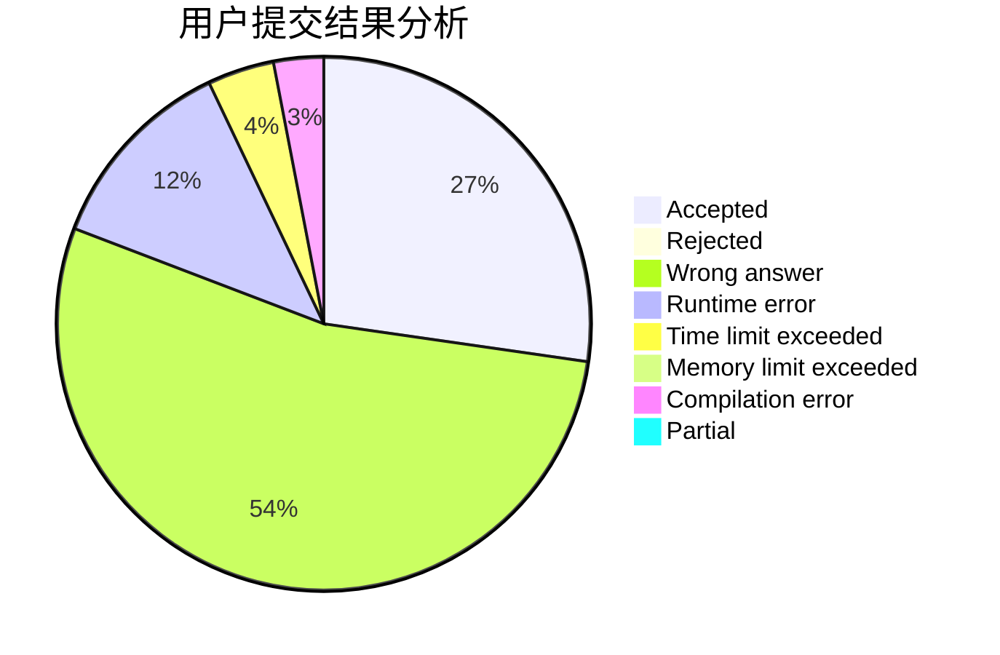
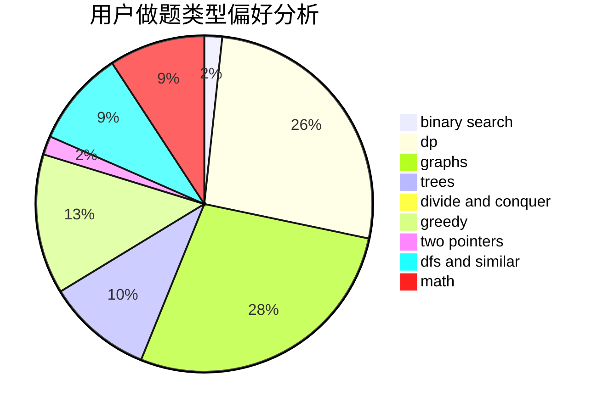

# Mr_Spade

<!-- tabs:start -->

#### **用户提交结果分析**

#### **用户做题类型偏好分析**

<!-- tabs:end -->
# 推荐题目
[1131A](https://codeforces.com/contest/1131/problem/A)
[216A](https://codeforces.com/contest/216/problem/A)
[614D](https://codeforces.com/contest/614/problem/D)
[645G](https://codeforces.com/contest/645/problem/G)
[11E](https://codeforces.com/contest/11/problem/E)
[300B](https://codeforces.com/contest/300/problem/B)
[472C](https://codeforces.com/contest/472/problem/C)
[12371](https://codeforces.com/contest/1237/problem/1)
[812A](https://codeforces.com/contest/812/problem/A)
[850B](https://codeforces.com/contest/850/problem/B)
