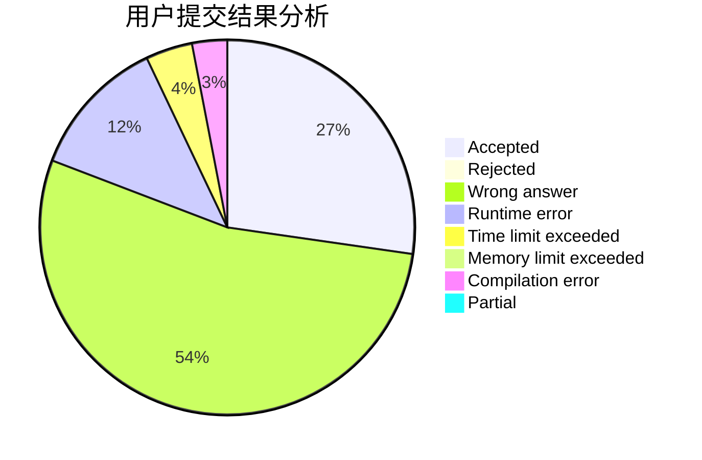
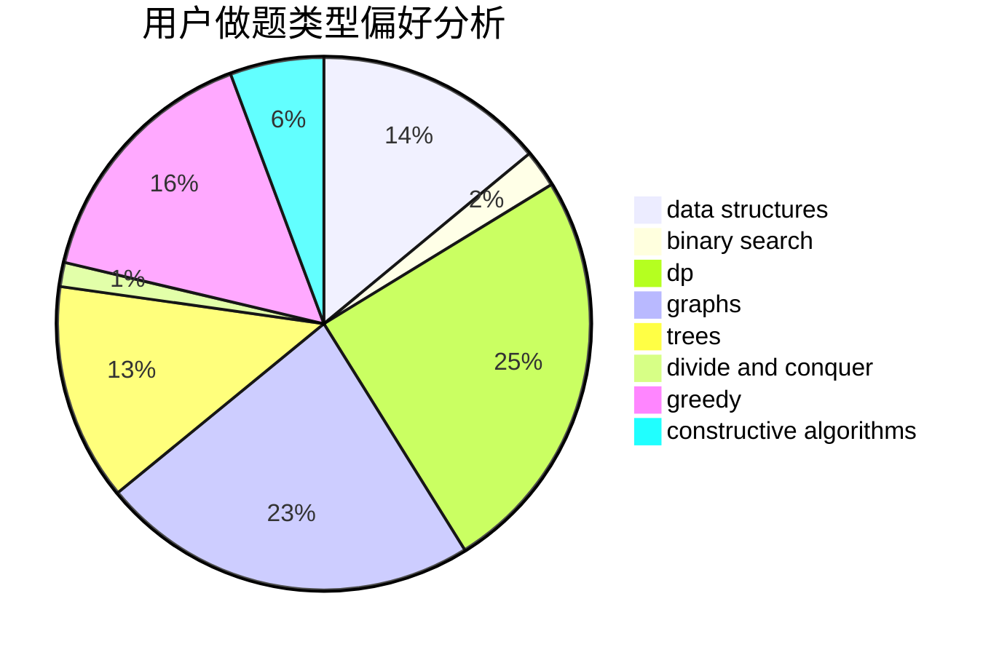
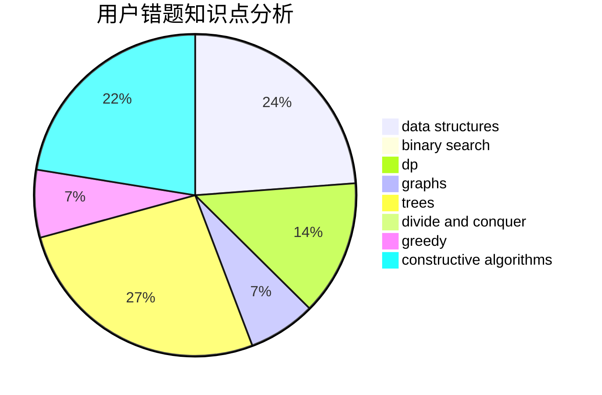

# Mr_Spade

<!-- tabs:start -->

#### **用户提交结果分析**

#### **用户做题类型偏好分析**

#### **用户错题知识点分析**

<!-- tabs:end -->
# 推荐题目
[1131A](https://codeforces.com/contest/1131/problem/A)		math		  
[216A](https://codeforces.com/contest/216/problem/A)		implementation,
                        math		  
[614D](https://codeforces.com/contest/614/problem/D)		dsu,graphs,sortings,trees		  
[645G](https://codeforces.com/contest/645/problem/G)		binary search,
                        geometry		  
[11E](https://codeforces.com/contest/11/problem/E)		binary search,
                        dp,
                        greedy		  
[300B](https://codeforces.com/contest/300/problem/B)		brute force,
                        dfs and similar,
                        graphs		  
[472C](https://codeforces.com/contest/472/problem/C)		greedy		  
[12371](https://codeforces.com/contest/1237/problem/1)		dsu,graphs,sortings,trees		  
[812A](https://codeforces.com/contest/812/problem/A)		implementation		  
[850B](https://codeforces.com/contest/850/problem/B)		implementation,
                        number theory		  
