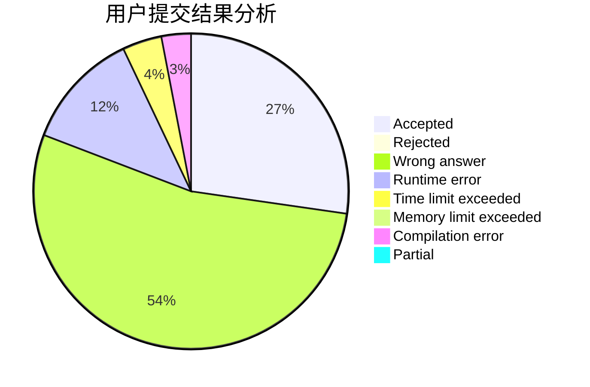
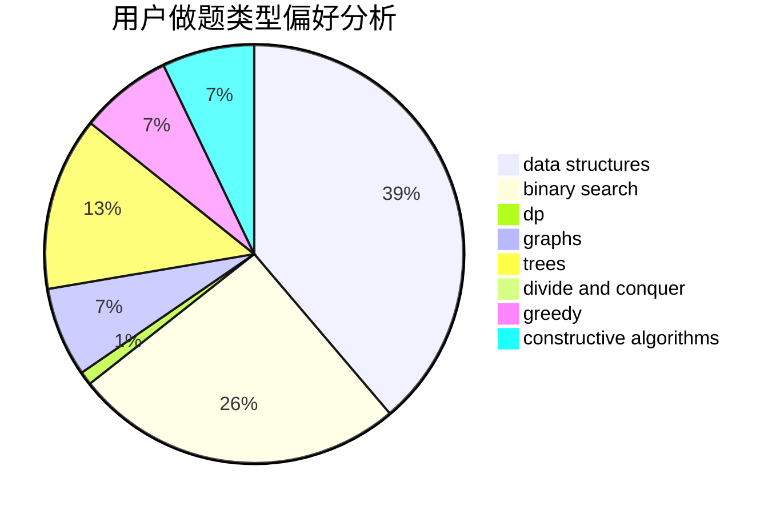
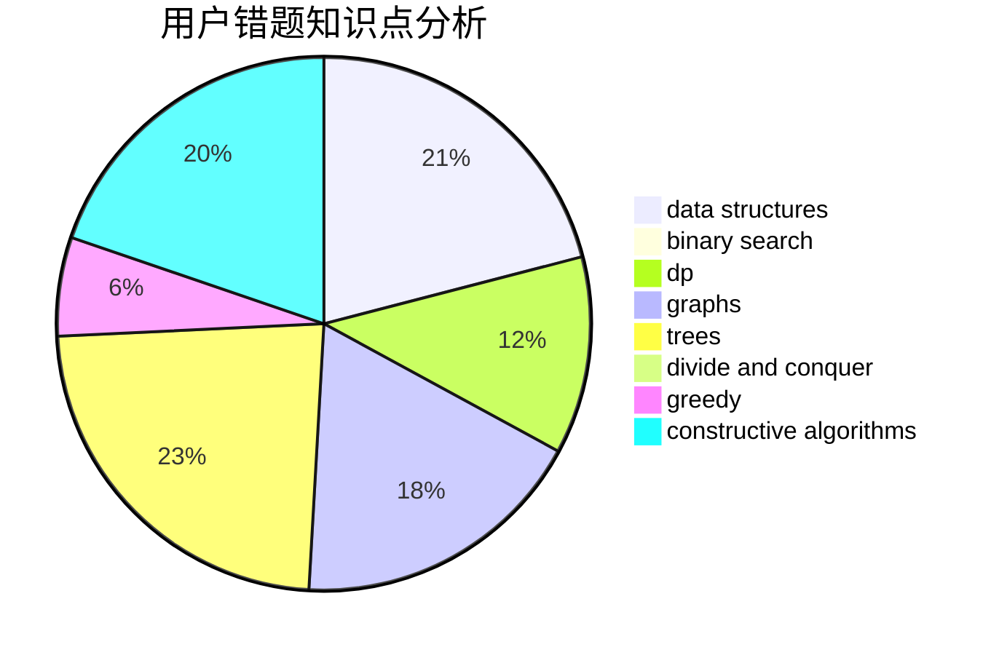

# Mr_Spade

<!-- tabs:start -->

#### **用户提交结果分析**

#### **用户做题类型偏好分析**

#### **用户错题知识点分析**

<!-- tabs:end -->
# 推荐题目
[1129A2](https://codeforces.com/contest/1129A/problem/2)		brute force,
                        greedy		  
[191C](https://codeforces.com/contest/191/problem/C)		data structures,
                        dfs and similar,
                        trees		  
[597C](https://codeforces.com/contest/597/problem/C)		data structures,
                        dp		  
[621E](https://codeforces.com/contest/621/problem/E)		dp,
                        matrices		  
[1196D1](https://codeforces.com/contest/1196D/problem/1)		implementation		  
[286A](https://codeforces.com/contest/286/problem/A)		constructive algorithms,
                        math		  
[450B](https://codeforces.com/contest/450/problem/B)		implementation,
                        math		  
[1228A](https://codeforces.com/contest/1228/problem/A)		brute force,
                        implementation		  
[798A](https://codeforces.com/contest/798/problem/A)		brute force,
                        constructive algorithms,
                        strings		  
[831F](https://codeforces.com/contest/831/problem/F)		dsu,graphs,sortings,trees		  
