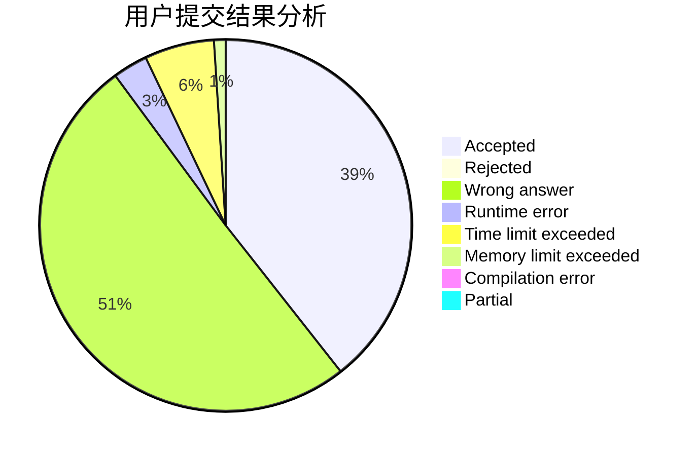
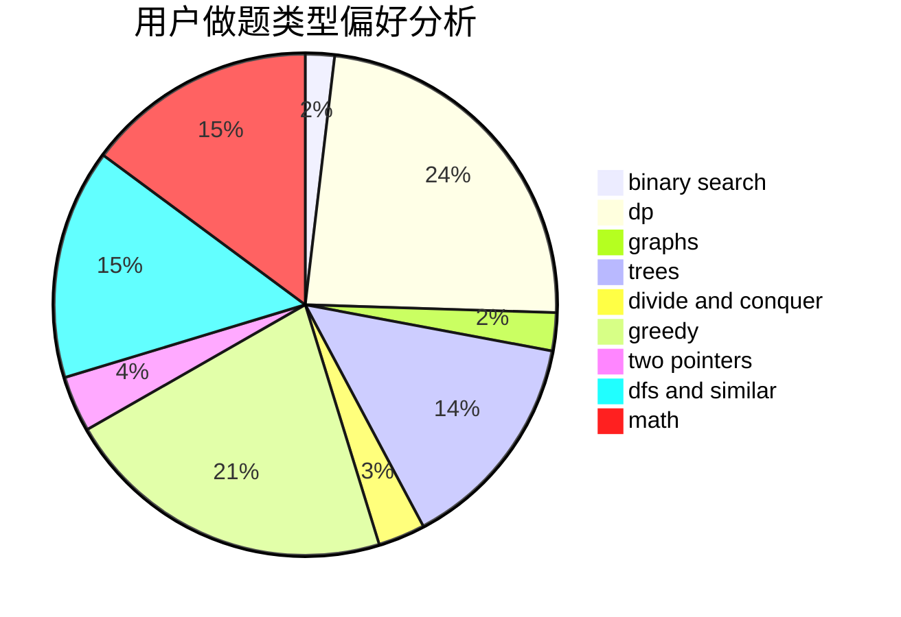

# Mr_Wu

<!-- tabs:start -->

#### **用户提交结果分析**

#### **用户做题类型偏好分析**

<!-- tabs:end -->
# 推荐题目
[1428A](https://codeforces.com/contest/1428/problem/A)
[472D](https://codeforces.com/contest/472/problem/D)
[94C](https://codeforces.com/contest/94/problem/C)
[1510H](https://codeforces.com/contest/1510/problem/H)
[218D](https://codeforces.com/contest/218/problem/D)
[455A](https://codeforces.com/contest/455/problem/A)
[496E](https://codeforces.com/contest/496/problem/E)
[1082C](https://codeforces.com/contest/1082/problem/C)
[1148H](https://codeforces.com/contest/1148/problem/H)
[660D](https://codeforces.com/contest/660/problem/D)
