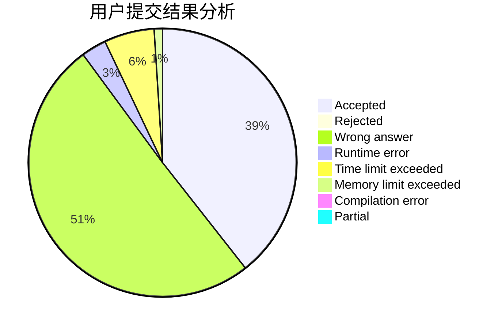
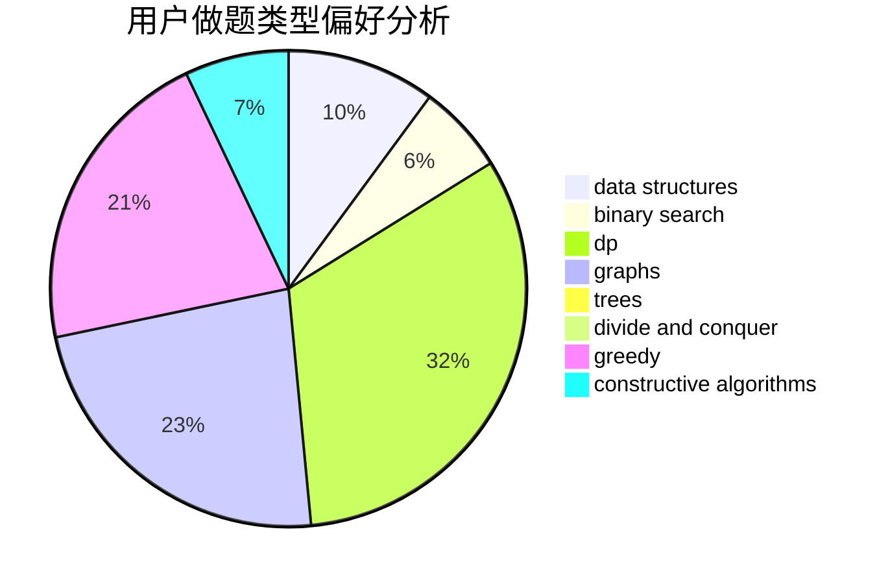

# Mr_Wu

<!-- tabs:start -->

#### **用户提交结果分析**

#### **用户做题类型偏好分析**

#### **用户错题知识点分析**

<!-- tabs:end -->
# 推荐题目
[1420C2](https://codeforces.com/contest/1420C/problem/2)		data structures,
                        divide and conquer,
                        dp,
                        greedy,
                        implementation		  
[451A](https://codeforces.com/contest/451/problem/A)		implementation		  
[930A](https://codeforces.com/contest/930/problem/A)		dfs and similar,
                        graphs,
                        trees		  
[1500B](https://codeforces.com/contest/1500/problem/B)		binary search,
                        brute force,
                        chinese remainder theorem,
                        math,
                        number theory		  
[196E](https://codeforces.com/contest/196/problem/E)		dsu,
                        graphs,
                        shortest paths		  
[434B](https://codeforces.com/contest/434/problem/B)		dsu,graphs,sortings,trees		  
[476E](https://codeforces.com/contest/476/problem/E)		dp,
                        strings		  
[1081G](https://codeforces.com/contest/1081/problem/G)		math,
                        probabilities		  
[1147A](https://codeforces.com/contest/1147/problem/A)		graphs		  
[630I](https://codeforces.com/contest/630/problem/I)		combinatorics,
                        math		  
