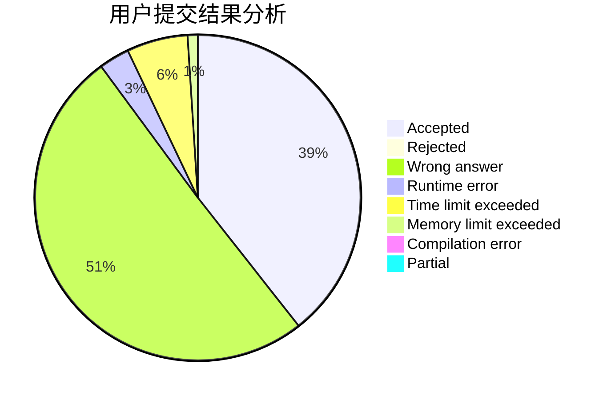
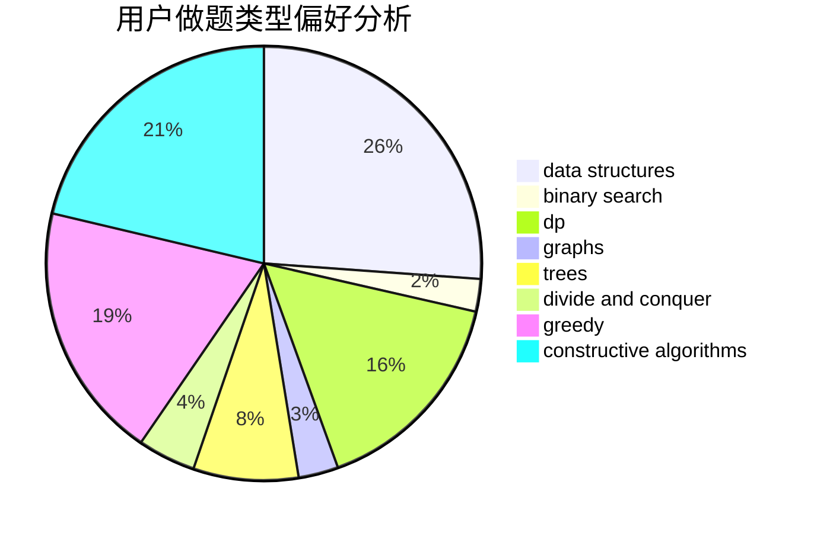
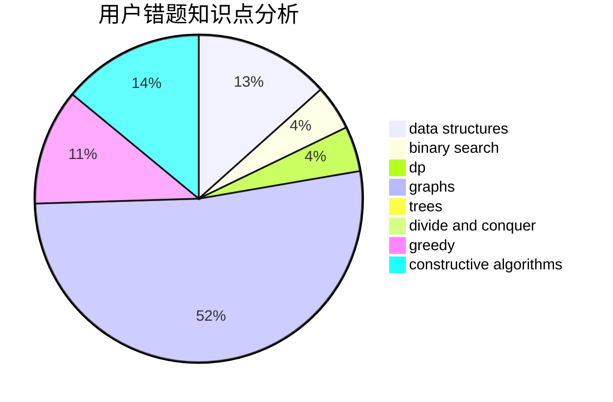

# Mr_Wu

<!-- tabs:start -->

#### **用户提交结果分析**

#### **用户做题类型偏好分析**

#### **用户错题知识点分析**

<!-- tabs:end -->
# 推荐题目
[1428A](https://codeforces.com/contest/1428/problem/A)		math		  
[472D](https://codeforces.com/contest/472/problem/D)		dfs and similar,
                        dsu,
                        shortest paths,
                        trees		  
[94C](https://codeforces.com/contest/94/problem/C)		dsu,graphs,sortings,trees		  
[1510H](https://codeforces.com/contest/1510/problem/H)		dp		  
[218D](https://codeforces.com/contest/218/problem/D)		dsu,graphs,sortings,trees		  
[455A](https://codeforces.com/contest/455/problem/A)		dp		  
[496E](https://codeforces.com/contest/496/problem/E)		greedy,
                        sortings		  
[1082C](https://codeforces.com/contest/1082/problem/C)		greedy,
                        sortings		  
[1148H](https://codeforces.com/contest/1148/problem/H)		data structures		  
[660D](https://codeforces.com/contest/660/problem/D)		geometry		  
