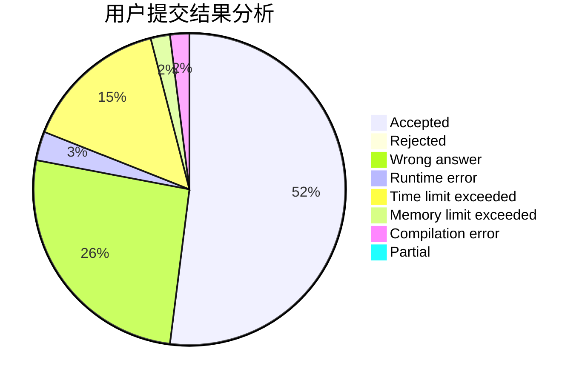
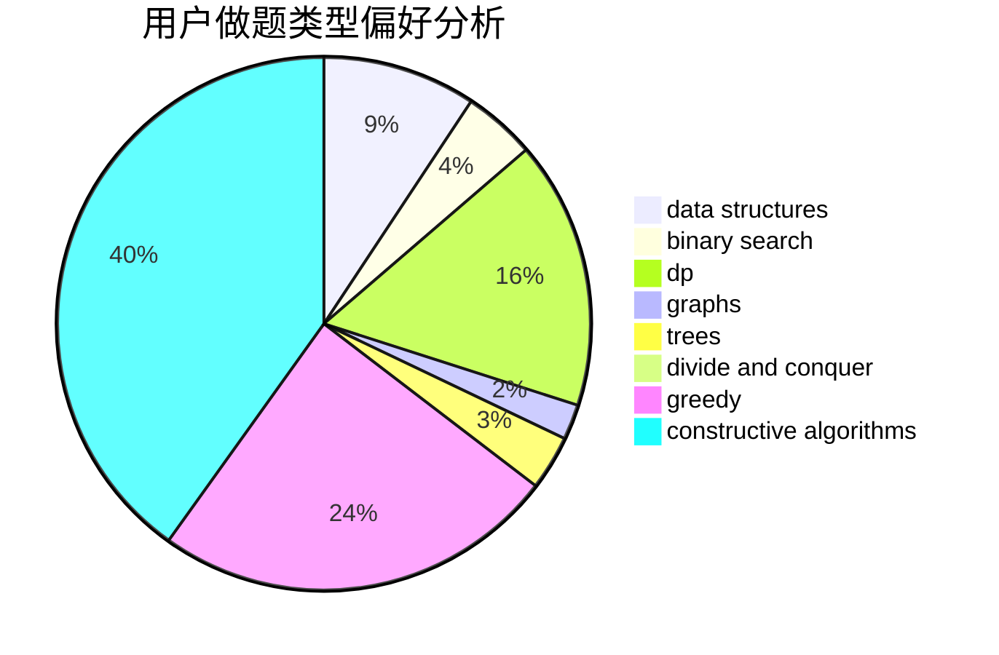

# Mryange

<!-- tabs:start -->

#### **用户提交结果分析**

#### **用户做题类型偏好分析**

#### **用户错题知识点分析**

<!-- tabs:end -->
# 推荐题目
[1065B](https://codeforces.com/contest/1065/problem/B)		constructive algorithms,
                        graphs		  
[292A](https://codeforces.com/contest/292/problem/A)		implementation		  
[13764](https://codeforces.com/contest/1376/problem/4)		dsu,graphs,sortings,trees		  
[780E](https://codeforces.com/contest/780/problem/E)		constructive algorithms,
                        dfs and similar,
                        graphs		  
[669C](https://codeforces.com/contest/669/problem/C)		dsu,graphs,sortings,trees		  
[1347C](https://codeforces.com/contest/1347/problem/C)		dsu,graphs,sortings,trees		  
[1264C](https://codeforces.com/contest/1264/problem/C)		data structures,
                        probabilities		  
[1240B](https://codeforces.com/contest/1240/problem/B)		dsu,graphs,sortings,trees		  
[237A](https://codeforces.com/contest/237/problem/A)		implementation		  
[1132F](https://codeforces.com/contest/1132/problem/F)		dp		  
