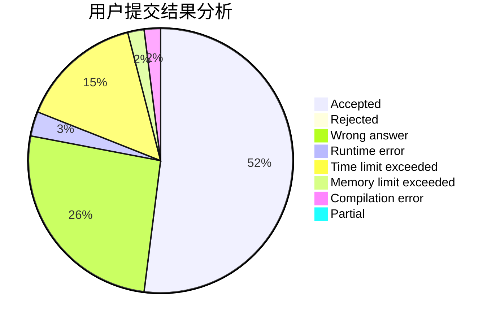
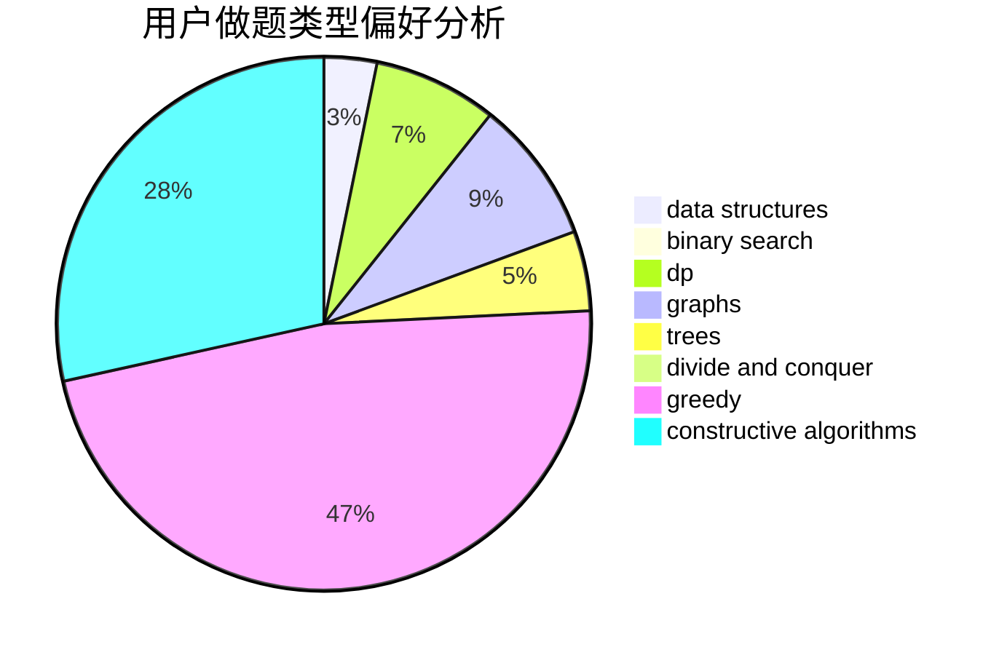
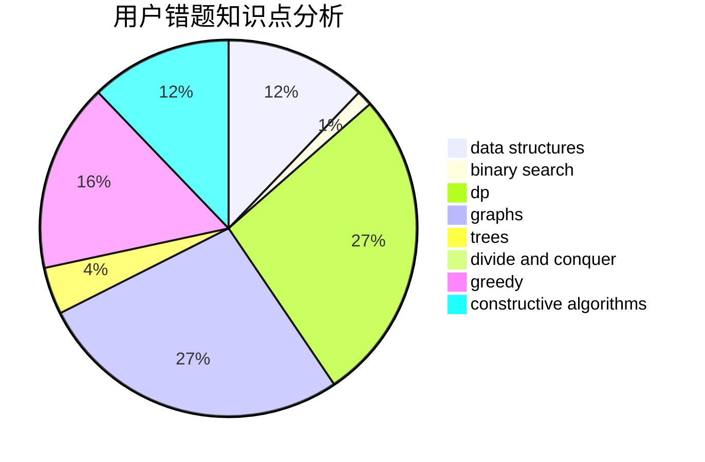

# Mryange
<!-- tabs:start -->
#### **用户提交结果分析**

#### **用户做题类型偏好分析**

#### **用户错题知识点分析**

<!-- tabs:end -->
# 推荐题目
[Necklace Assembly](http://codeforces.com/problemset/problem/1367/E)		brute force,
                        dfs and similar,
                        dp,
                        graphs,
                        greedy,
                        number theory		  
[DeadLee](http://codeforces.com/problemset/problem/1369/E)		data structures,
                        dfs and similar,
                        greedy,
                        implementation,
                        sortings		  
[Dwarves, Hats and Extrasensory Abilities](https://codeforces.com/contest/1064/problem/E)		binary search,
                        constructive algorithms,
                        geometry,
                        interactive		  
[Party](http://codeforces.com/problemset/problem/23/B)		constructive algorithms,
                        graphs,
                        math		  
[Nastya and Time Machine](http://codeforces.com/problemset/problem/1340/D)		constructive algorithms,
                        dfs and similar,
                        graphs,
                        trees		  
[Set of Points](http://codeforces.com/problemset/problem/277/B)		constructive algorithms,
                        geometry		  
[Segments](http://codeforces.com/problemset/problem/926/J)		data structures		  
[Tolik and His Uncle](http://codeforces.com/problemset/problem/1179/B)		constructive algorithms		  
[IQ Test](http://codeforces.com/problemset/problem/328/A)		implementation		  
[Bitwise Formula](https://codeforces.com/contest/779/problem/E)		bitmasks,
                        brute force,
                        dfs and similar,
                        expression parsing,
                        implementation		  
<!-- tabs:start -->
#### **data structures**
[Necklace Assembly](http://codeforces.com/problemset/problem/1369/E)		data structures,
                        dfs and similar,
                        greedy,
                        implementation,
                        sortings		  
[DeadLee](http://codeforces.com/problemset/problem/926/J)		data structures		  
[Dwarves, Hats and Extrasensory Abilities](https://codeforces.com/contest/740/problem/D)		binary search,
                        data structures,
                        dfs and similar,
                        graphs,
                        trees		  
[Party](http://codeforces.com/problemset/problem/1491/I)		brute force,
                        data structures		  
[Nastya and Time Machine](https://codeforces.com/contest/719/problem/E)		data structures,
                        math,
                        matrices		  
[Set of Points](http://codeforces.com/problemset/problem/533/A)		binary search,
                        data structures,
                        dfs and similar,
                        greedy,
                        trees		  
[Segments](http://codeforces.com/problemset/problem/641/E)		data structures		  
[Tolik and His Uncle](http://codeforces.com/problemset/problem/819/B)		data structures,
                        implementation,
                        math		  
[IQ Test](http://codeforces.com/problemset/problem/626/G)		data structures,
                        dp,
                        greedy,
                        math		  
[Bitwise Formula](http://codeforces.com/problemset/problem/1393/B)		constructive algorithms,
                        data structures,
                        greedy,
                        implementation		  
#### **binary search**
[Necklace Assembly](https://codeforces.com/contest/1064/problem/E)		binary search,
                        constructive algorithms,
                        geometry,
                        interactive		  
[DeadLee](http://codeforces.com/problemset/problem/639/E)		binary search,
                        greedy,
                        math,
                        sortings		  
[Dwarves, Hats and Extrasensory Abilities](https://codeforces.com/contest/740/problem/D)		binary search,
                        data structures,
                        dfs and similar,
                        graphs,
                        trees		  
[Party](http://codeforces.com/problemset/problem/533/A)		binary search,
                        data structures,
                        dfs and similar,
                        greedy,
                        trees		  
[Nastya and Time Machine](http://codeforces.com/problemset/problem/201/E)		binary search,
                        combinatorics		  
[Set of Points](http://codeforces.com/problemset/problem/1119/B)		binary search,
                        flows,
                        greedy,
                        sortings		  
[Segments](https://codeforces.com/contest/866/problem/C)		binary search,
                        dp		  
[Tolik and His Uncle](http://codeforces.com/problemset/problem/1355/E)		binary search,
                        greedy,
                        math,
                        sortings,
                        ternary search		  
[IQ Test](http://codeforces.com/problemset/problem/1108/F)		binary search,
                        dsu,
                        graphs,
                        greedy		  
[Bitwise Formula](http://codeforces.com/problemset/problem/1474/B)		binary search,
                        constructive algorithms,
                        greedy,
                        math,
                        number theory		  
#### **dp**
[Necklace Assembly](http://codeforces.com/problemset/problem/1367/E)		brute force,
                        dfs and similar,
                        dp,
                        graphs,
                        greedy,
                        number theory		  
[DeadLee](http://codeforces.com/problemset/problem/626/G)		data structures,
                        dp,
                        greedy,
                        math		  
[Dwarves, Hats and Extrasensory Abilities](http://codeforces.com/problemset/problem/1444/E)		brute force,
                        dfs and similar,
                        dp,
                        interactive,
                        trees		  
[Party](http://codeforces.com/problemset/problem/1510/D)		dp,
                        math,
                        number theory		  
[Nastya and Time Machine](https://codeforces.com/contest/866/problem/C)		binary search,
                        dp		  
[Set of Points](https://codeforces.com/contest/480/problem/C)		combinatorics,
                        dp		  
[Segments](http://codeforces.com/problemset/problem/1415/C)		brute force,
                        dp,
                        implementation		  
[Tolik and His Uncle](http://codeforces.com/problemset/problem/375/E)		dp,
                        implementation,
                        math		  
[IQ Test](http://codeforces.com/problemset/problem/1478/B)		brute force,
                        dp,
                        greedy,
                        math		  
[Bitwise Formula](http://codeforces.com/problemset/problem/1492/C)		binary search,
                        data structures,
                        dp,
                        greedy,
                        two pointers		  
#### **graph**
[Necklace Assembly](http://codeforces.com/problemset/problem/1367/E)		brute force,
                        dfs and similar,
                        dp,
                        graphs,
                        greedy,
                        number theory		  
[DeadLee](http://codeforces.com/problemset/problem/23/B)		constructive algorithms,
                        graphs,
                        math		  
[Dwarves, Hats and Extrasensory Abilities](http://codeforces.com/problemset/problem/1340/D)		constructive algorithms,
                        dfs and similar,
                        graphs,
                        trees		  
[Party](https://codeforces.com/contest/740/problem/D)		binary search,
                        data structures,
                        dfs and similar,
                        graphs,
                        trees		  
[Nastya and Time Machine](http://codeforces.com/problemset/problem/107/A)		dfs and similar,
                        graphs		  
[Set of Points](http://codeforces.com/problemset/problem/1361/A)		constructive algorithms,
                        graphs,
                        greedy,
                        sortings		  
[Segments](http://codeforces.com/problemset/problem/780/C)		dfs and similar,
                        graphs,
                        greedy,
                        trees		  
[Tolik and His Uncle](http://codeforces.com/problemset/problem/1108/F)		binary search,
                        dsu,
                        graphs,
                        greedy		  
[IQ Test](http://codeforces.com/problemset/problem/1487/C)		brute force,
                        constructive algorithms,
                        dfs and similar,
                        graphs,
                        greedy,
                        implementation,
                        math		  
[Bitwise Formula](http://codeforces.com/problemset/problem/1437/C)		dp,
                        flows,
                        graph matchings,
                        greedy,
                        math,
                        sortings		  
#### **trees**
[Necklace Assembly](http://codeforces.com/problemset/problem/1340/D)		constructive algorithms,
                        dfs and similar,
                        graphs,
                        trees		  
[DeadLee](https://codeforces.com/contest/740/problem/D)		binary search,
                        data structures,
                        dfs and similar,
                        graphs,
                        trees		  
[Dwarves, Hats and Extrasensory Abilities](http://codeforces.com/problemset/problem/533/A)		binary search,
                        data structures,
                        dfs and similar,
                        greedy,
                        trees		  
[Party](http://codeforces.com/problemset/problem/1444/E)		brute force,
                        dfs and similar,
                        dp,
                        interactive,
                        trees		  
[Nastya and Time Machine](http://codeforces.com/problemset/problem/780/C)		dfs and similar,
                        graphs,
                        greedy,
                        trees		  
[Set of Points](http://codeforces.com/problemset/problem/482/B)		constructive algorithms,
                        data structures,
                        trees		  
[Segments](http://codeforces.com/problemset/problem/1479/D)		binary search,
                        bitmasks,
                        brute force,
                        data structures,
                        probabilities,
                        trees		  
[Tolik and His Uncle](http://codeforces.com/problemset/problem/1511/C)		brute force,
                        data structures,
                        implementation,
                        trees		  
[IQ Test](http://codeforces.com/problemset/problem/1499/F)		combinatorics,
                        dfs and similar,
                        dp,
                        trees		  
[Bitwise Formula](http://codeforces.com/problemset/problem/1491/E)		brute force,
                        dfs and similar,
                        divide and conquer,
                        number theory,
                        trees		  
#### **divide and conquer**
[Necklace Assembly](http://codeforces.com/problemset/problem/1461/D)		binary search,
                        brute force,
                        data structures,
                        divide and conquer,
                        implementation,
                        sortings		  
[DeadLee](http://codeforces.com/problemset/problem/1466/G)		combinatorics,
                        divide and conquer,
                        hashing,
                        math,
                        string suffix structures,
                        strings		  
[Dwarves, Hats and Extrasensory Abilities](http://codeforces.com/problemset/problem/1490/D)		dfs and similar,
                        divide and conquer,
                        implementation		  
[Party](https://codeforces.com/contest/1483/problem/C)		data structures,
                        divide and conquer,
                        dp		  
[Nastya and Time Machine](http://codeforces.com/problemset/problem/1491/E)		brute force,
                        dfs and similar,
                        divide and conquer,
                        number theory,
                        trees		  
[Set of Points](http://codeforces.com/problemset/problem/1303/G)		data structures,
                        divide and conquer,
                        geometry,
                        trees		  
[Segments](http://codeforces.com/problemset/problem/1494/D)		constructive algorithms,
                        data structures,
                        dfs and similar,
                        divide and conquer,
                        dsu,
                        greedy,
                        sortings,
                        trees		  
[Tolik and His Uncle](http://codeforces.com/problemset/problem/1482/E)		data structures,
                        divide and conquer,
                        dp		  
[IQ Test](http://codeforces.com/problemset/problem/566/C)		dfs and similar,
                        divide and conquer,
                        trees		  
[Bitwise Formula](http://codeforces.com/problemset/problem/1428/F)		binary search,
                        data structures,
                        divide and conquer,
                        dp,
                        two pointers		  
#### **greedy**
[Necklace Assembly](http://codeforces.com/problemset/problem/1367/E)		brute force,
                        dfs and similar,
                        dp,
                        graphs,
                        greedy,
                        number theory		  
[DeadLee](http://codeforces.com/problemset/problem/1369/E)		data structures,
                        dfs and similar,
                        greedy,
                        implementation,
                        sortings		  
[Dwarves, Hats and Extrasensory Abilities](http://codeforces.com/problemset/problem/639/E)		binary search,
                        greedy,
                        math,
                        sortings		  
[Party](http://codeforces.com/problemset/problem/1257/C)		greedy,
                        implementation,
                        sortings,
                        strings,
                        two pointers		  
[Nastya and Time Machine](http://codeforces.com/problemset/problem/533/A)		binary search,
                        data structures,
                        dfs and similar,
                        greedy,
                        trees		  
[Set of Points](http://codeforces.com/problemset/problem/1119/B)		binary search,
                        flows,
                        greedy,
                        sortings		  
[Segments](http://codeforces.com/problemset/problem/1361/A)		constructive algorithms,
                        graphs,
                        greedy,
                        sortings		  
[Tolik and His Uncle](http://codeforces.com/problemset/problem/351/E)		greedy		  
[IQ Test](http://codeforces.com/problemset/problem/550/E)		constructive algorithms,
                        greedy,
                        implementation,
                        math		  
[Bitwise Formula](http://codeforces.com/problemset/problem/626/G)		data structures,
                        dp,
                        greedy,
                        math		  
#### **constructive algorithms**
[Necklace Assembly](https://codeforces.com/contest/1064/problem/E)		binary search,
                        constructive algorithms,
                        geometry,
                        interactive		  
[DeadLee](http://codeforces.com/problemset/problem/23/B)		constructive algorithms,
                        graphs,
                        math		  
[Dwarves, Hats and Extrasensory Abilities](http://codeforces.com/problemset/problem/1340/D)		constructive algorithms,
                        dfs and similar,
                        graphs,
                        trees		  
[Party](http://codeforces.com/problemset/problem/277/B)		constructive algorithms,
                        geometry		  
[Nastya and Time Machine](http://codeforces.com/problemset/problem/1179/B)		constructive algorithms		  
[Set of Points](https://codeforces.com/contest/1130/problem/E)		constructive algorithms		  
[Segments](https://codeforces.com/contest/1180/problem/D)		constructive algorithms		  
[Tolik and His Uncle](http://codeforces.com/problemset/problem/459/C)		combinatorics,
                        constructive algorithms,
                        math		  
[IQ Test](http://codeforces.com/problemset/problem/1361/A)		constructive algorithms,
                        graphs,
                        greedy,
                        sortings		  
[Bitwise Formula](http://codeforces.com/problemset/problem/550/E)		constructive algorithms,
                        greedy,
                        implementation,
                        math		  
#### **sortings**
[Necklace Assembly](http://codeforces.com/problemset/problem/1369/E)		data structures,
                        dfs and similar,
                        greedy,
                        implementation,
                        sortings		  
[DeadLee](http://codeforces.com/problemset/problem/639/E)		binary search,
                        greedy,
                        math,
                        sortings		  
[Dwarves, Hats and Extrasensory Abilities](http://codeforces.com/problemset/problem/1257/C)		greedy,
                        implementation,
                        sortings,
                        strings,
                        two pointers		  
[Party](http://codeforces.com/problemset/problem/1119/B)		binary search,
                        flows,
                        greedy,
                        sortings		  
[Nastya and Time Machine](http://codeforces.com/problemset/problem/1361/A)		constructive algorithms,
                        graphs,
                        greedy,
                        sortings		  
[Set of Points](http://codeforces.com/problemset/problem/1355/E)		binary search,
                        greedy,
                        math,
                        sortings,
                        ternary search		  
[Segments](http://codeforces.com/problemset/problem/1426/D)		constructive algorithms,
                        data structures,
                        greedy,
                        sortings		  
[Tolik and His Uncle](https://codeforces.com/contest/1496/problem/C)		geometry,
                        greedy,
                        math,
                        sortings		  
[IQ Test](http://codeforces.com/problemset/problem/1495/A)		geometry,
                        greedy,
                        math,
                        sortings		  
[Bitwise Formula](http://codeforces.com/problemset/problem/1497/A)		brute force,
                        data structures,
                        greedy,
                        sortings		  
<!-- tabs:end -->
