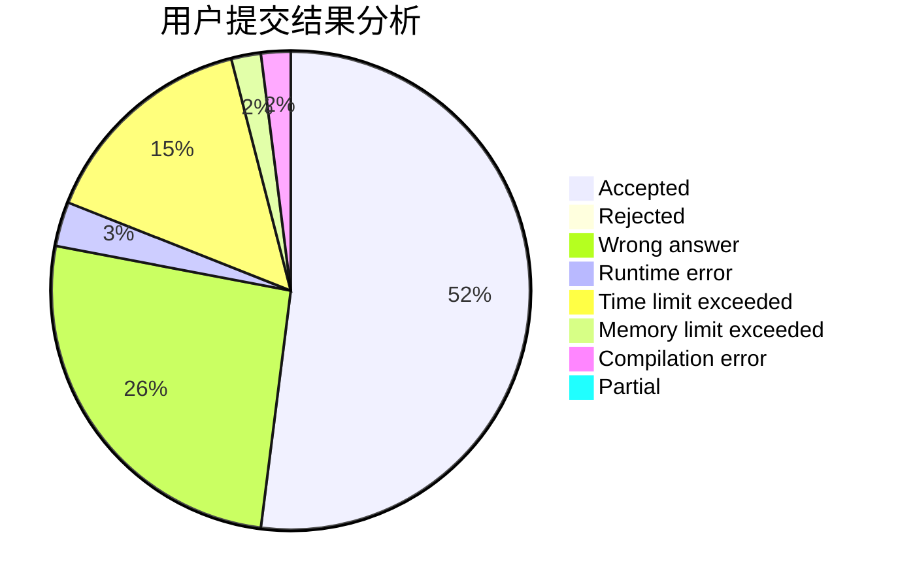
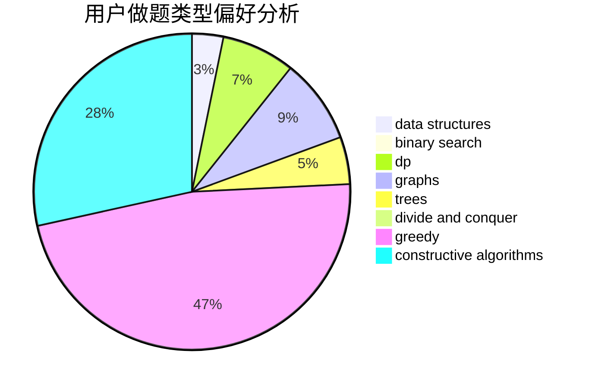
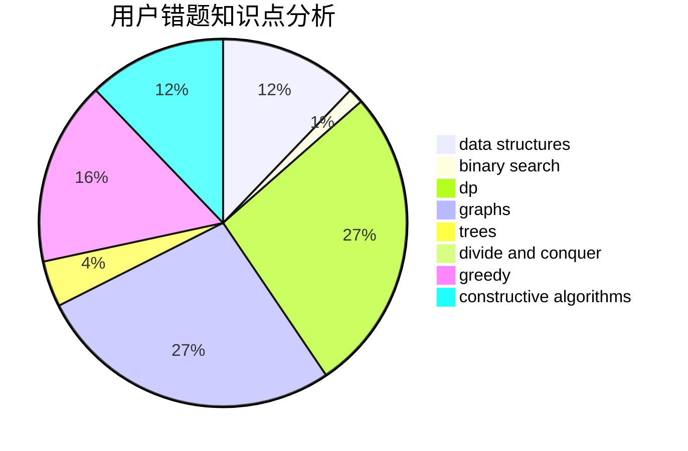

# Mryange

<!-- tabs:start -->

#### **用户提交结果分析**

#### **用户做题类型偏好分析**

#### **用户错题知识点分析**

<!-- tabs:end -->
# 推荐题目
[1064E](https://codeforces.com/contest/1064/problem/E)		dsu,graphs,sortings,trees		  
[277B](https://codeforces.com/contest/277/problem/B)		constructive algorithms,
                        geometry		  
[1369E](https://codeforces.com/contest/1369/problem/E)		data structures,
                        dfs and similar,
                        greedy,
                        implementation,
                        sortings		  
[762A](https://codeforces.com/contest/762/problem/A)		math,
                        number theory		  
[639E](https://codeforces.com/contest/639/problem/E)		binary search,
                        greedy,
                        math,
                        sortings		  
[1340D](https://codeforces.com/contest/1340/problem/D)		constructive algorithms,
                        dfs and similar,
                        graphs,
                        trees		  
[1257C](https://codeforces.com/contest/1257/problem/C)		greedy,
                        implementation,
                        sortings,
                        strings,
                        two pointers		  
[1234E](https://codeforces.com/contest/1234/problem/E)		math		  
[218B](https://codeforces.com/contest/218/problem/B)		implementation		  
[1130E](https://codeforces.com/contest/1130/problem/E)		dsu,graphs,sortings,trees		  
