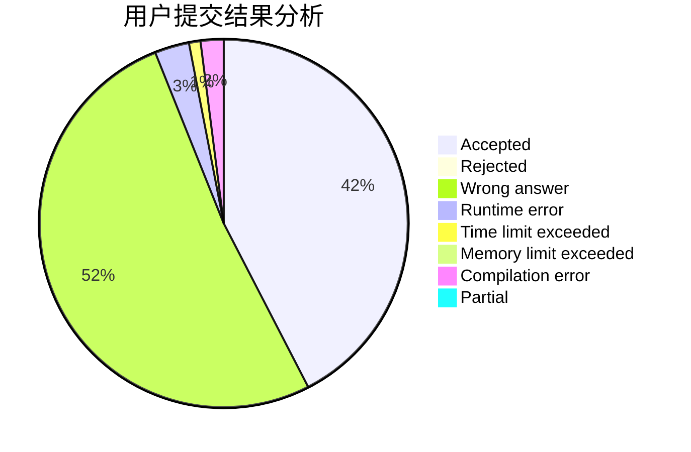
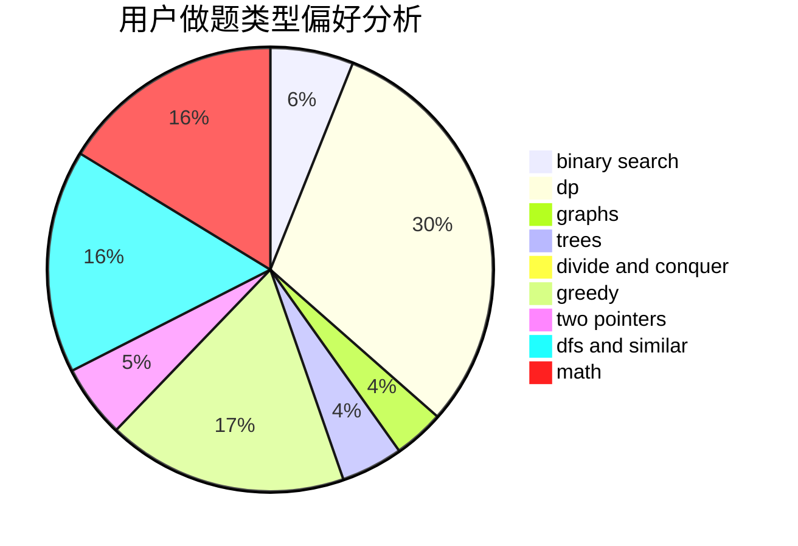

# Msy153

<!-- tabs:start -->

#### **用户提交结果分析**

#### **用户做题类型偏好分析**

<!-- tabs:end -->
# 推荐题目
[1355C](https://codeforces.com/contest/1355/problem/C)
[109A](https://codeforces.com/contest/109/problem/A)
[766D](https://codeforces.com/contest/766/problem/D)
[236D](https://codeforces.com/contest/236/problem/D)
[934B](https://codeforces.com/contest/934/problem/B)
[612F](https://codeforces.com/contest/612/problem/F)
[232A](https://codeforces.com/contest/232/problem/A)
[782C](https://codeforces.com/contest/782/problem/C)
[1314C](https://codeforces.com/contest/1314/problem/C)
[306C](https://codeforces.com/contest/306/problem/C)
