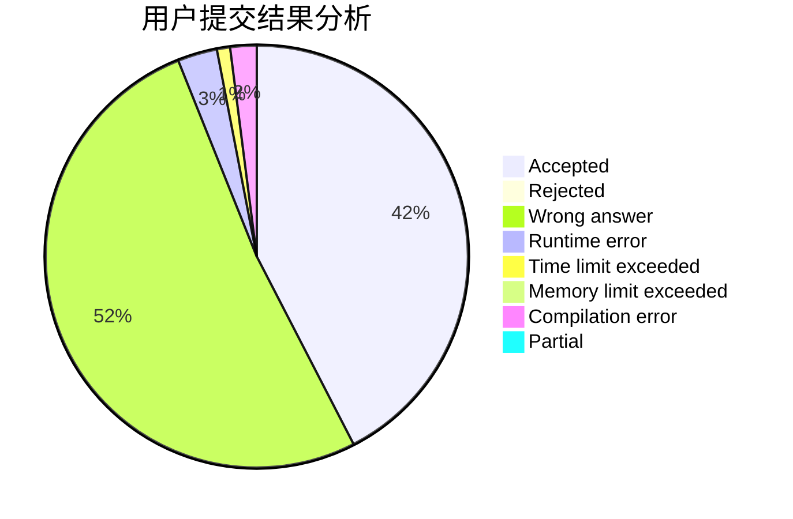
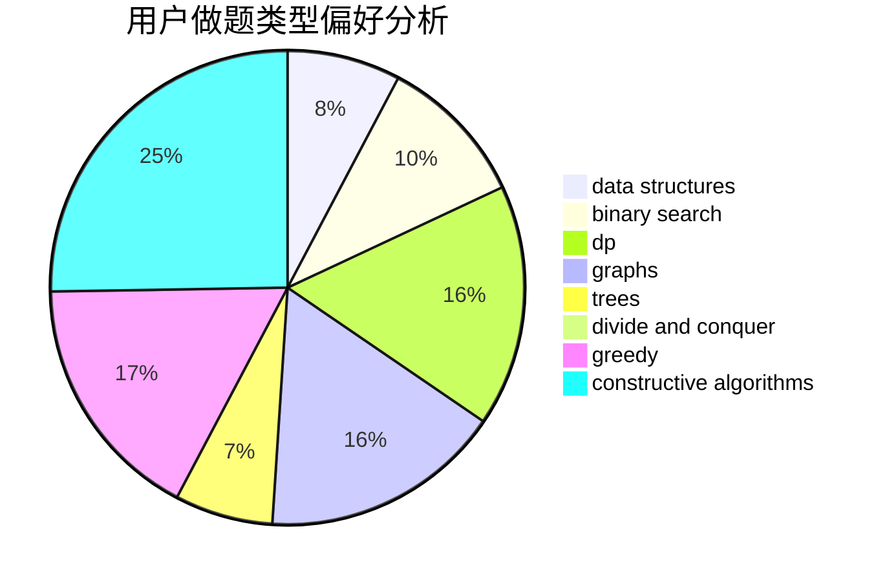
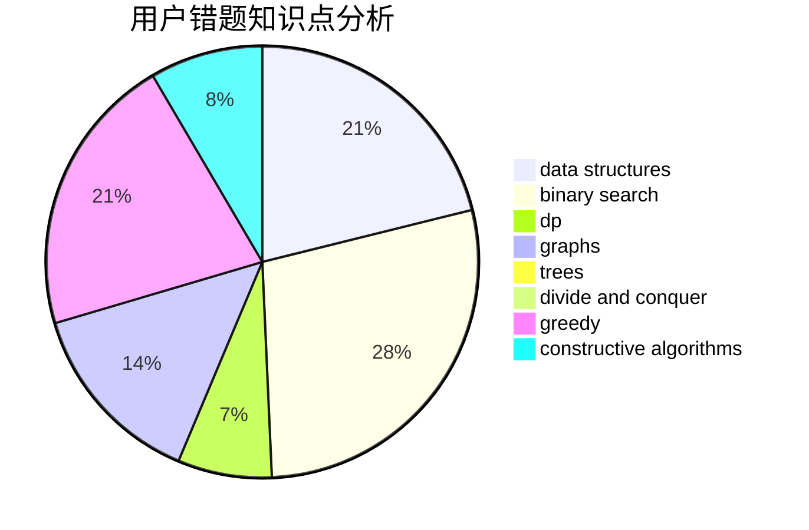

# Msy153

<!-- tabs:start -->

#### **用户提交结果分析**

#### **用户做题类型偏好分析**

#### **用户错题知识点分析**

<!-- tabs:end -->
# 推荐题目
[1355C](https://codeforces.com/contest/1355/problem/C)		binary search,
                        implementation,
                        math,
                        two pointers		  
[109A](https://codeforces.com/contest/109/problem/A)		brute force,
                        implementation		  
[766D](https://codeforces.com/contest/766/problem/D)		data structures,
                        dfs and similar,
                        dp,
                        dsu,
                        graphs		  
[236D](https://codeforces.com/contest/236/problem/D)		dsu,graphs,sortings,trees		  
[934B](https://codeforces.com/contest/934/problem/B)		constructive algorithms,
                        implementation		  
[612F](https://codeforces.com/contest/612/problem/F)		dp		  
[232A](https://codeforces.com/contest/232/problem/A)		binary search,
                        constructive algorithms,
                        graphs,
                        greedy		  
[782C](https://codeforces.com/contest/782/problem/C)		dsu,graphs,sortings,trees		  
[1314C](https://codeforces.com/contest/1314/problem/C)		dsu,graphs,sortings,trees		  
[306C](https://codeforces.com/contest/306/problem/C)		combinatorics,
                        number theory		  
