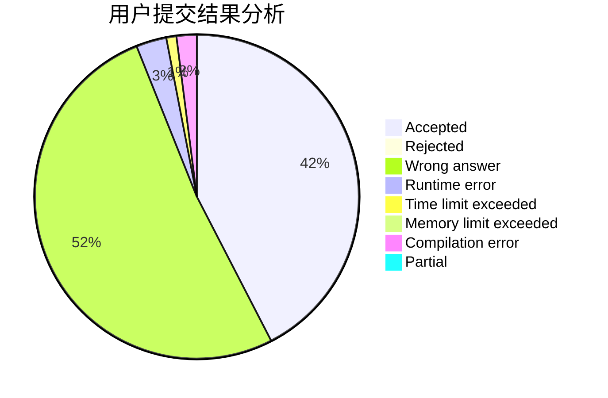
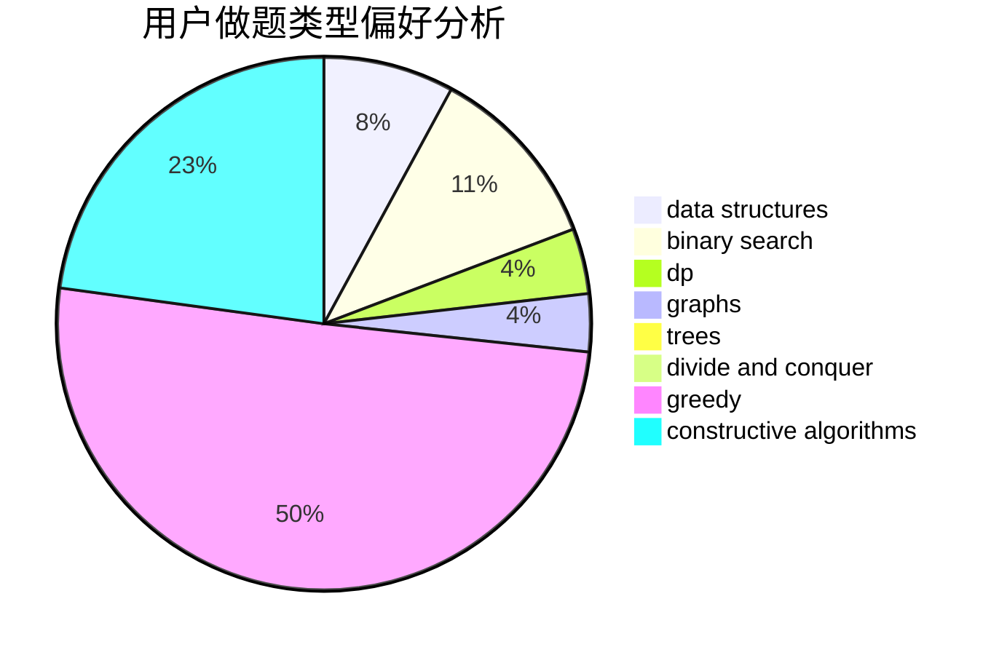
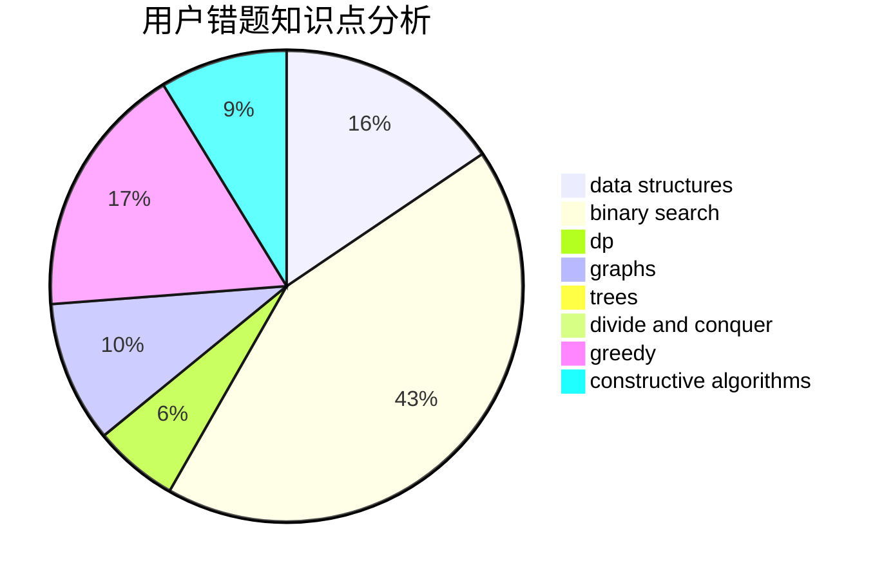

# Msy153

<!-- tabs:start -->

#### **用户提交结果分析**

#### **用户做题类型偏好分析**

#### **用户错题知识点分析**

<!-- tabs:end -->
# 推荐题目
[1348E](https://codeforces.com/contest/1348/problem/E)		brute force,
                        dp,
                        greedy,
                        math		  
[1099D](https://codeforces.com/contest/1099/problem/D)		dsu,graphs,sortings,trees		  
[747A](https://codeforces.com/contest/747/problem/A)		brute force,
                        math		  
[218A](https://codeforces.com/contest/218/problem/A)		brute force,
                        constructive algorithms,
                        implementation		  
[914F](https://codeforces.com/contest/914/problem/F)		bitmasks,
                        brute force,
                        data structures,
                        string suffix structures,
                        strings		  
[594E](https://codeforces.com/contest/594/problem/E)		string suffix structures,
                        strings		  
[212A](https://codeforces.com/contest/212/problem/A)		flows,
                        graphs		  
[763E](https://codeforces.com/contest/763/problem/E)		data structures,
                        divide and conquer,
                        dsu		  
[1305D](https://codeforces.com/contest/1305/problem/D)		constructive algorithms,
                        dfs and similar,
                        interactive,
                        trees		  
[291E](https://codeforces.com/contest/291/problem/E)		*special problem,
                        dfs and similar,
                        hashing,
                        strings		  
