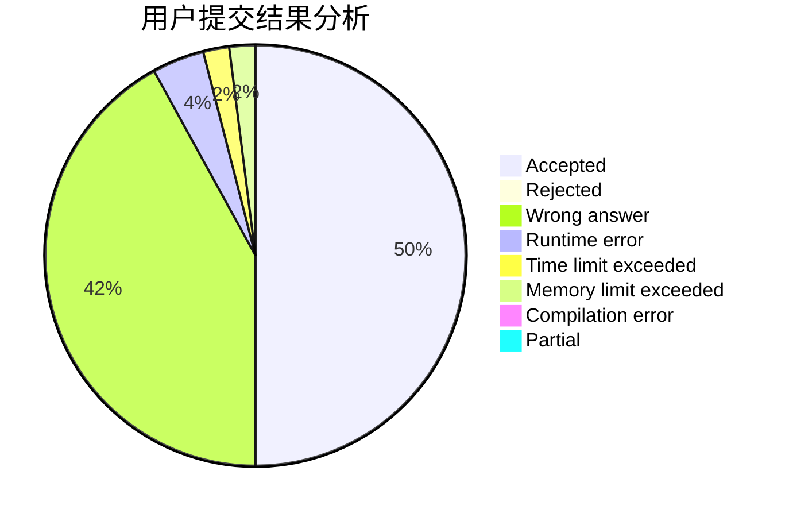
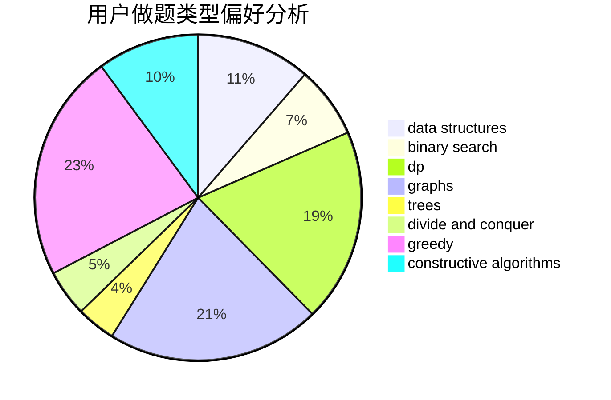
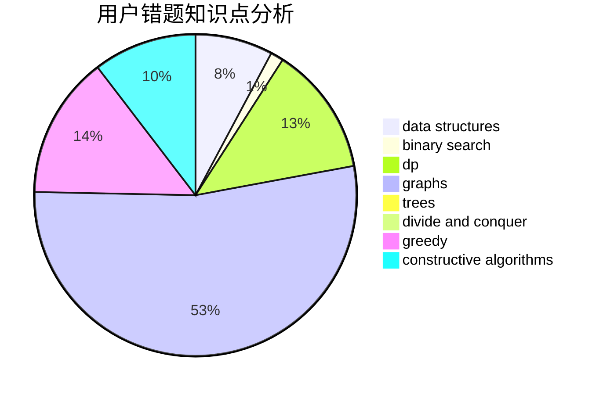

# MtOI

<!-- tabs:start -->

#### **用户提交结果分析**

#### **用户做题类型偏好分析**

#### **用户错题知识点分析**

<!-- tabs:end -->
# 推荐题目
[831B](https://codeforces.com/contest/831/problem/B)		implementation,
                        strings		  
[1320A](https://codeforces.com/contest/1320/problem/A)		data structures,
                        dp,
                        greedy,
                        math,
                        sortings		  
[1241C](https://codeforces.com/contest/1241/problem/C)		dsu,graphs,sortings,trees		  
[1324C](https://codeforces.com/contest/1324/problem/C)		binary search,
                        data structures,
                        dfs and similar,
                        greedy,
                        implementation		  
[1058C](https://codeforces.com/contest/1058/problem/C)		dsu,graphs,sortings,trees		  
[25D](https://codeforces.com/contest/25/problem/D)		dsu,
                        graphs,
                        trees		  
[1092E](https://codeforces.com/contest/1092/problem/E)		constructive algorithms,
                        dfs and similar,
                        greedy,
                        trees		  
[475B](https://codeforces.com/contest/475/problem/B)		brute force,
                        dfs and similar,
                        graphs,
                        implementation		  
[938G](https://codeforces.com/contest/938/problem/G)		bitmasks,
                        data structures,
                        dsu,
                        graphs		  
[643D](https://codeforces.com/contest/643/problem/D)		nan		  
