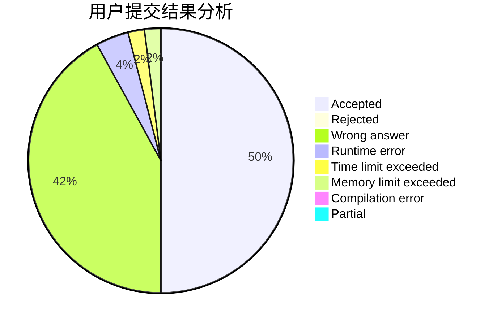
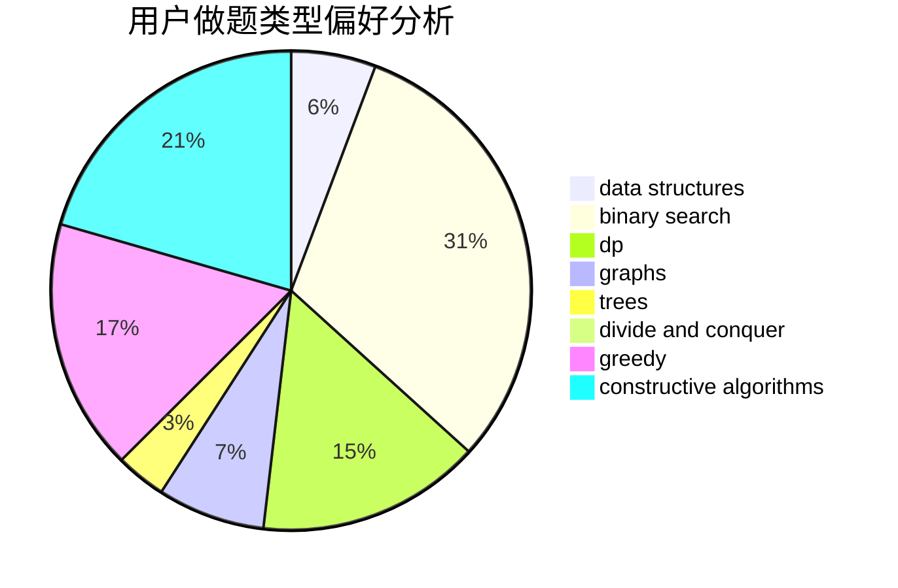
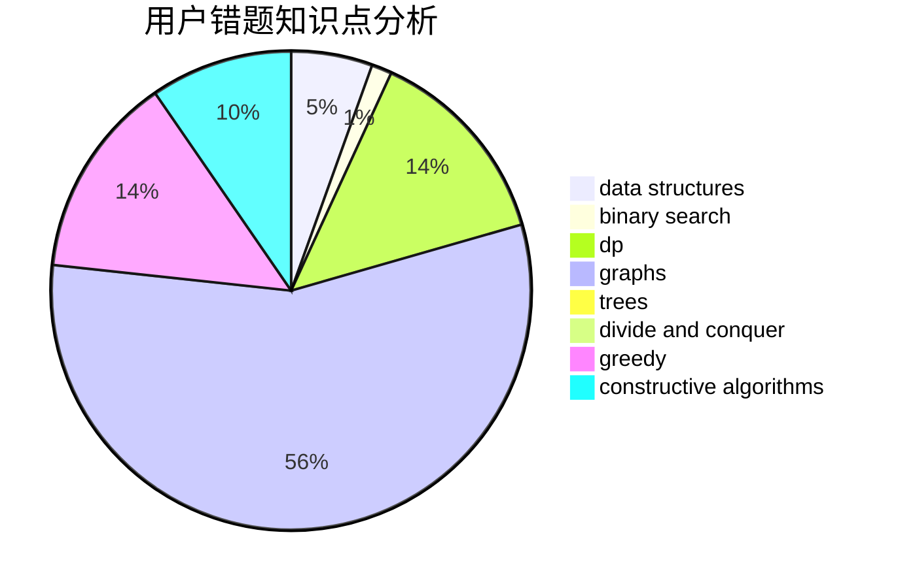

# MtOI

<!-- tabs:start -->

#### **用户提交结果分析**

#### **用户做题类型偏好分析**

#### **用户错题知识点分析**

<!-- tabs:end -->
# 推荐题目
[849B](https://codeforces.com/contest/849/problem/B)		brute force,
                        geometry		  
[1327A](https://codeforces.com/contest/1327/problem/A)		math		  
[12471](https://codeforces.com/contest/1247/problem/1)		dsu,graphs,sortings,trees		  
[1331A](https://codeforces.com/contest/1331/problem/A)		nan		  
[1059A](https://codeforces.com/contest/1059/problem/A)		implementation		  
[277D](https://codeforces.com/contest/277/problem/D)		dp,
                        probabilities		  
[1093B](https://codeforces.com/contest/1093/problem/B)		constructive algorithms,
                        greedy,
                        sortings,
                        strings		  
[494B](https://codeforces.com/contest/494/problem/B)		dp,
                        strings		  
[960C](https://codeforces.com/contest/960/problem/C)		bitmasks,
                        constructive algorithms,
                        greedy,
                        implementation		  
[670B](https://codeforces.com/contest/670/problem/B)		implementation		  
