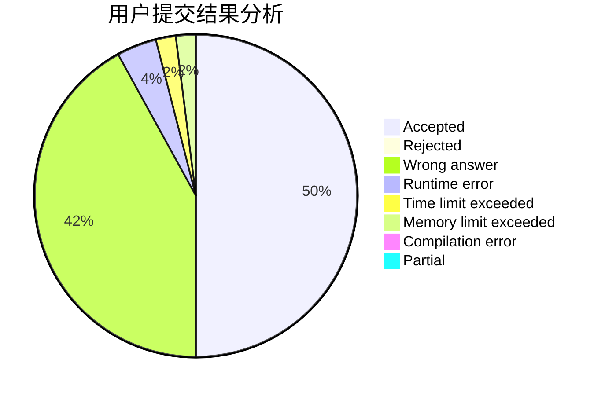
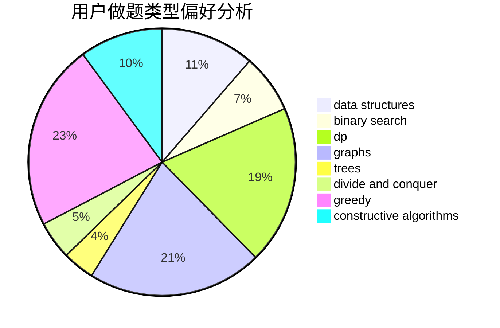
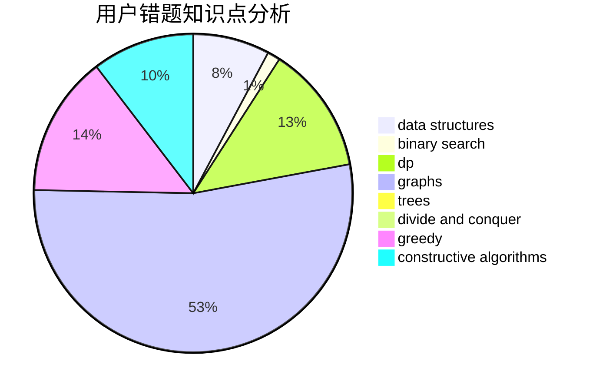

# MtOI
<!-- tabs:start -->
#### **用户提交结果分析**

#### **用户做题类型偏好分析**

#### **用户错题知识点分析**

<!-- tabs:end -->
# 推荐题目
[Diamond Miner](https://codeforces.com/contest/1496/problem/C)		geometry,
                        greedy,
                        math,
                        sortings		  
[The Thorny Path](http://codeforces.com/problemset/problem/1411/F)		greedy,
                        math		  
[Strongly Connected City](http://codeforces.com/problemset/problem/475/B)		brute force,
                        dfs and similar,
                        graphs,
                        implementation		  
[Minimal Diameter Forest](http://codeforces.com/problemset/problem/1092/E)		constructive algorithms,
                        dfs and similar,
                        greedy,
                        trees		  
[Vasya and Golden Ticket](https://codeforces.com/contest/1058/problem/C)		implementation		  
[Polycarp at the Radio](http://codeforces.com/problemset/problem/723/C)		greedy		  
[Beautiful Fibonacci Problem](http://codeforces.com/problemset/problem/1264/F)		constructive algorithms,
                        number theory		  
[Save the Nature](https://codeforces.com/contest/1241/problem/C)		binary search,
                        greedy		  
[Bearish Fanpages](http://codeforces.com/problemset/problem/643/D)		nan		  
[An overnight dance in discotheque](http://codeforces.com/problemset/problem/814/D)		dfs and similar,
                        dp,
                        geometry,
                        greedy,
                        trees		  
<!-- tabs:start -->
#### **data structures**
[Diamond Miner](http://codeforces.com/problemset/problem/1324/C)		binary search,
                        data structures,
                        dfs and similar,
                        greedy,
                        implementation		  
[The Thorny Path](http://codeforces.com/problemset/problem/938/G)		bitmasks,
                        data structures,
                        dsu,
                        graphs		  
[Strongly Connected City](http://codeforces.com/problemset/problem/368/B)		data structures,
                        dp		  
[Minimal Diameter Forest](http://codeforces.com/problemset/problem/1217/F)		data structures,
                        divide and conquer,
                        dsu,
                        graphs,
                        trees		  
[Vasya and Golden Ticket](http://codeforces.com/problemset/problem/1320/A)		data structures,
                        dp,
                        greedy,
                        math,
                        sortings		  
[Polycarp at the Radio](https://codeforces.com/contest/1501/problem/F)		data structures,
                        sortings,
                        two pointers		  
[Beautiful Fibonacci Problem](http://codeforces.com/problemset/problem/1163/F)		data structures,
                        graphs,
                        shortest paths		  
[Save the Nature](http://codeforces.com/problemset/problem/961/E)		data structures		  
[Bearish Fanpages](http://codeforces.com/problemset/problem/1109/E)		data structures,
                        number theory		  
[An overnight dance in discotheque](https://codeforces.com/contest/1293/problem/C)		data structures,
                        dsu,
                        implementation		  
#### **binary search**
[Diamond Miner](https://codeforces.com/contest/1241/problem/C)		binary search,
                        greedy		  
[The Thorny Path](http://codeforces.com/problemset/problem/1324/C)		binary search,
                        data structures,
                        dfs and similar,
                        greedy,
                        implementation		  
[Strongly Connected City](http://codeforces.com/problemset/problem/84/C)		binary search,
                        implementation		  
[Minimal Diameter Forest](http://codeforces.com/problemset/problem/1492/C)		binary search,
                        data structures,
                        dp,
                        greedy,
                        two pointers		  
[Vasya and Golden Ticket](http://codeforces.com/problemset/problem/1463/D)		binary search,
                        constructive algorithms,
                        greedy,
                        two pointers		  
[Polycarp at the Radio](http://codeforces.com/problemset/problem/1490/G)		binary search,
                        data structures,
                        math		  
[Beautiful Fibonacci Problem](http://codeforces.com/problemset/problem/1479/D)		binary search,
                        bitmasks,
                        brute force,
                        data structures,
                        probabilities,
                        trees		  
[Save the Nature](http://codeforces.com/problemset/problem/1436/E)		binary search,
                        data structures,
                        two pointers		  
[Bearish Fanpages](http://codeforces.com/problemset/problem/1461/D)		binary search,
                        brute force,
                        data structures,
                        divide and conquer,
                        implementation,
                        sortings		  
[An overnight dance in discotheque](http://codeforces.com/problemset/problem/1493/C)		binary search,
                        brute force,
                        constructive algorithms,
                        greedy,
                        strings		  
#### **dp**
[Diamond Miner](http://codeforces.com/problemset/problem/814/D)		dfs and similar,
                        dp,
                        geometry,
                        greedy,
                        trees		  
[The Thorny Path](http://codeforces.com/problemset/problem/351/C)		dp,
                        matrices		  
[Strongly Connected City](http://codeforces.com/problemset/problem/95/B)		dp,
                        greedy		  
[Minimal Diameter Forest](http://codeforces.com/problemset/problem/295/B)		dp,
                        graphs,
                        shortest paths		  
[Vasya and Golden Ticket](http://codeforces.com/problemset/problem/1110/H)		dp,
                        strings		  
[Polycarp at the Radio](http://codeforces.com/problemset/problem/963/B)		constructive algorithms,
                        dfs and similar,
                        dp,
                        greedy,
                        trees		  
[Beautiful Fibonacci Problem](http://codeforces.com/problemset/problem/368/B)		data structures,
                        dp		  
[Save the Nature](http://codeforces.com/problemset/problem/1185/G1)		bitmasks,
                        combinatorics,
                        dp		  
[Bearish Fanpages](http://codeforces.com/problemset/problem/1320/A)		data structures,
                        dp,
                        greedy,
                        math,
                        sortings		  
[An overnight dance in discotheque](http://codeforces.com/problemset/problem/1103/D)		bitmasks,
                        dp		  
#### **graph**
[Diamond Miner](http://codeforces.com/problemset/problem/475/B)		brute force,
                        dfs and similar,
                        graphs,
                        implementation		  
[The Thorny Path](http://codeforces.com/problemset/problem/25/D)		dsu,
                        graphs,
                        trees		  
[Strongly Connected City](http://codeforces.com/problemset/problem/938/G)		bitmasks,
                        data structures,
                        dsu,
                        graphs		  
[Minimal Diameter Forest](http://codeforces.com/problemset/problem/295/B)		dp,
                        graphs,
                        shortest paths		  
[Vasya and Golden Ticket](http://codeforces.com/problemset/problem/1482/F)		graphs,
                        shortest paths		  
[Polycarp at the Radio](http://codeforces.com/problemset/problem/1217/F)		data structures,
                        divide and conquer,
                        dsu,
                        graphs,
                        trees		  
[Beautiful Fibonacci Problem](https://codeforces.com/contest/745/problem/C)		dfs and similar,
                        graphs		  
[Save the Nature](http://codeforces.com/problemset/problem/1163/F)		data structures,
                        graphs,
                        shortest paths		  
[Bearish Fanpages](http://codeforces.com/problemset/problem/732/F)		dfs and similar,
                        graphs		  
[An overnight dance in discotheque](http://codeforces.com/problemset/problem/1487/C)		brute force,
                        constructive algorithms,
                        dfs and similar,
                        graphs,
                        greedy,
                        implementation,
                        math		  
#### **trees**
[Diamond Miner](http://codeforces.com/problemset/problem/1092/E)		constructive algorithms,
                        dfs and similar,
                        greedy,
                        trees		  
[The Thorny Path](http://codeforces.com/problemset/problem/814/D)		dfs and similar,
                        dp,
                        geometry,
                        greedy,
                        trees		  
[Strongly Connected City](http://codeforces.com/problemset/problem/25/D)		dsu,
                        graphs,
                        trees		  
[Minimal Diameter Forest](http://codeforces.com/problemset/problem/963/B)		constructive algorithms,
                        dfs and similar,
                        dp,
                        greedy,
                        trees		  
[Vasya and Golden Ticket](http://codeforces.com/problemset/problem/754/E)		bitmasks,
                        brute force,
                        fft,
                        strings,
                        trees		  
[Polycarp at the Radio](http://codeforces.com/problemset/problem/1217/F)		data structures,
                        divide and conquer,
                        dsu,
                        graphs,
                        trees		  
[Beautiful Fibonacci Problem](http://codeforces.com/problemset/problem/1485/E)		dfs and similar,
                        dp,
                        greedy,
                        trees		  
[Save the Nature](http://codeforces.com/problemset/problem/1479/D)		binary search,
                        bitmasks,
                        brute force,
                        data structures,
                        probabilities,
                        trees		  
[Bearish Fanpages](http://codeforces.com/problemset/problem/1511/C)		brute force,
                        data structures,
                        implementation,
                        trees		  
[An overnight dance in discotheque](http://codeforces.com/problemset/problem/1499/F)		combinatorics,
                        dfs and similar,
                        dp,
                        trees		  
#### **divide and conquer**
[Diamond Miner](http://codeforces.com/problemset/problem/1217/F)		data structures,
                        divide and conquer,
                        dsu,
                        graphs,
                        trees		  
[The Thorny Path](http://codeforces.com/problemset/problem/914/G)		bitmasks,
                        divide and conquer,
                        dp,
                        fft,
                        math		  
[Strongly Connected City](http://codeforces.com/problemset/problem/1461/D)		binary search,
                        brute force,
                        data structures,
                        divide and conquer,
                        implementation,
                        sortings		  
[Minimal Diameter Forest](http://codeforces.com/problemset/problem/1466/G)		combinatorics,
                        divide and conquer,
                        hashing,
                        math,
                        string suffix structures,
                        strings		  
[Vasya and Golden Ticket](http://codeforces.com/problemset/problem/1490/D)		dfs and similar,
                        divide and conquer,
                        implementation		  
[Polycarp at the Radio](https://codeforces.com/contest/1483/problem/C)		data structures,
                        divide and conquer,
                        dp		  
[Beautiful Fibonacci Problem](http://codeforces.com/problemset/problem/1491/E)		brute force,
                        dfs and similar,
                        divide and conquer,
                        number theory,
                        trees		  
[Save the Nature](http://codeforces.com/problemset/problem/1303/G)		data structures,
                        divide and conquer,
                        geometry,
                        trees		  
[Bearish Fanpages](http://codeforces.com/problemset/problem/1494/D)		constructive algorithms,
                        data structures,
                        dfs and similar,
                        divide and conquer,
                        dsu,
                        greedy,
                        sortings,
                        trees		  
[An overnight dance in discotheque](http://codeforces.com/problemset/problem/1482/E)		data structures,
                        divide and conquer,
                        dp		  
#### **greedy**
[Diamond Miner](https://codeforces.com/contest/1496/problem/C)		geometry,
                        greedy,
                        math,
                        sortings		  
[The Thorny Path](http://codeforces.com/problemset/problem/1411/F)		greedy,
                        math		  
[Strongly Connected City](http://codeforces.com/problemset/problem/1092/E)		constructive algorithms,
                        dfs and similar,
                        greedy,
                        trees		  
[Minimal Diameter Forest](http://codeforces.com/problemset/problem/723/C)		greedy		  
[Vasya and Golden Ticket](https://codeforces.com/contest/1241/problem/C)		binary search,
                        greedy		  
[Polycarp at the Radio](http://codeforces.com/problemset/problem/814/D)		dfs and similar,
                        dp,
                        geometry,
                        greedy,
                        trees		  
[Beautiful Fibonacci Problem](http://codeforces.com/problemset/problem/1324/C)		binary search,
                        data structures,
                        dfs and similar,
                        greedy,
                        implementation		  
[Save the Nature](http://codeforces.com/problemset/problem/95/B)		dp,
                        greedy		  
[Bearish Fanpages](http://codeforces.com/problemset/problem/963/B)		constructive algorithms,
                        dfs and similar,
                        dp,
                        greedy,
                        trees		  
[An overnight dance in discotheque](http://codeforces.com/problemset/problem/91/A)		greedy,
                        strings		  
#### **constructive algorithms**
[Diamond Miner](http://codeforces.com/problemset/problem/1092/E)		constructive algorithms,
                        dfs and similar,
                        greedy,
                        trees		  
[The Thorny Path](http://codeforces.com/problemset/problem/1264/F)		constructive algorithms,
                        number theory		  
[Strongly Connected City](http://codeforces.com/problemset/problem/417/E)		constructive algorithms,
                        math,
                        probabilities		  
[Minimal Diameter Forest](http://codeforces.com/problemset/problem/963/B)		constructive algorithms,
                        dfs and similar,
                        dp,
                        greedy,
                        trees		  
[Vasya and Golden Ticket](http://codeforces.com/problemset/problem/578/E)		constructive algorithms,
                        greedy		  
[Polycarp at the Radio](http://codeforces.com/problemset/problem/1512/D)		constructive algorithms,
                        data structures,
                        greedy		  
[Beautiful Fibonacci Problem](http://codeforces.com/problemset/problem/1148/F)		bitmasks,
                        constructive algorithms		  
[Save the Nature](http://codeforces.com/problemset/problem/1493/A)		constructive algorithms,
                        greedy		  
[Bearish Fanpages](http://codeforces.com/problemset/problem/1463/D)		binary search,
                        constructive algorithms,
                        greedy,
                        two pointers		  
[An overnight dance in discotheque](https://codeforces.com/contest/1456/problem/B)		bitmasks,
                        brute force,
                        constructive algorithms		  
#### **sortings**
[Diamond Miner](https://codeforces.com/contest/1496/problem/C)		geometry,
                        greedy,
                        math,
                        sortings		  
[The Thorny Path](http://codeforces.com/problemset/problem/1320/A)		data structures,
                        dp,
                        greedy,
                        math,
                        sortings		  
[Strongly Connected City](https://codeforces.com/contest/1501/problem/F)		data structures,
                        sortings,
                        two pointers		  
[Minimal Diameter Forest](https://codeforces.com/contest/1496/problem/C)		geometry,
                        greedy,
                        math,
                        sortings		  
[Vasya and Golden Ticket](http://codeforces.com/problemset/problem/1495/A)		geometry,
                        greedy,
                        math,
                        sortings		  
[Polycarp at the Radio](http://codeforces.com/problemset/problem/1497/A)		brute force,
                        data structures,
                        greedy,
                        sortings		  
[Beautiful Fibonacci Problem](http://codeforces.com/problemset/problem/1427/A)		math,
                        sortings		  
[Save the Nature](http://codeforces.com/problemset/problem/1461/D)		binary search,
                        brute force,
                        data structures,
                        divide and conquer,
                        implementation,
                        sortings		  
[Bearish Fanpages](http://codeforces.com/problemset/problem/1437/C)		dp,
                        flows,
                        graph matchings,
                        greedy,
                        math,
                        sortings		  
[An overnight dance in discotheque](http://codeforces.com/problemset/problem/1473/A)		greedy,
                        implementation,
                        math,
                        sortings		  
<!-- tabs:end -->
