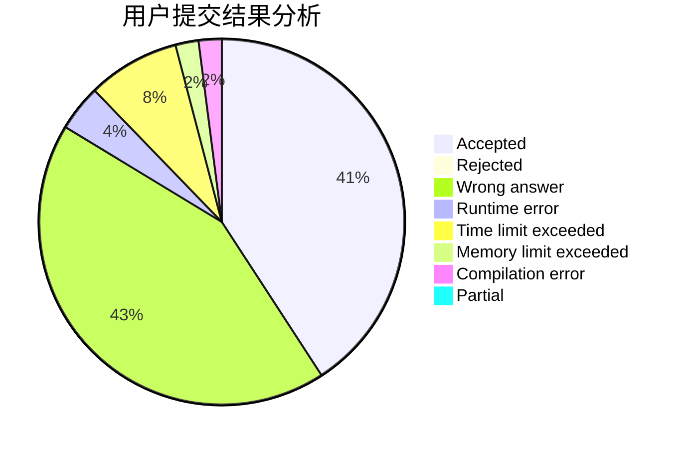
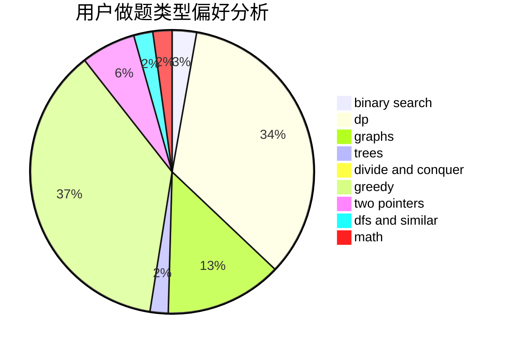

# MuXijin

<!-- tabs:start -->

#### **用户提交结果分析**

#### **用户做题类型偏好分析**

<!-- tabs:end -->
# 推荐题目
[17C](https://codeforces.com/contest/17/problem/C)
[600C](https://codeforces.com/contest/600/problem/C)
[289D](https://codeforces.com/contest/289/problem/D)
[495B](https://codeforces.com/contest/495/problem/B)
[294D](https://codeforces.com/contest/294/problem/D)
[1500E](https://codeforces.com/contest/1500/problem/E)
[732A](https://codeforces.com/contest/732/problem/A)
[276C](https://codeforces.com/contest/276/problem/C)
[371D](https://codeforces.com/contest/371/problem/D)
[810E](https://codeforces.com/contest/810/problem/E)
