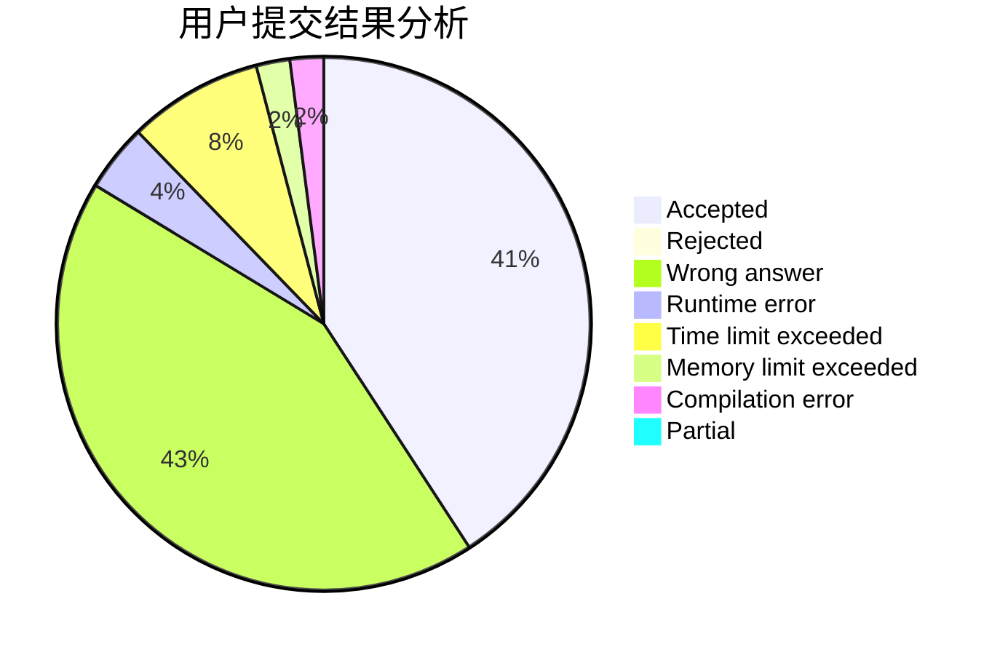
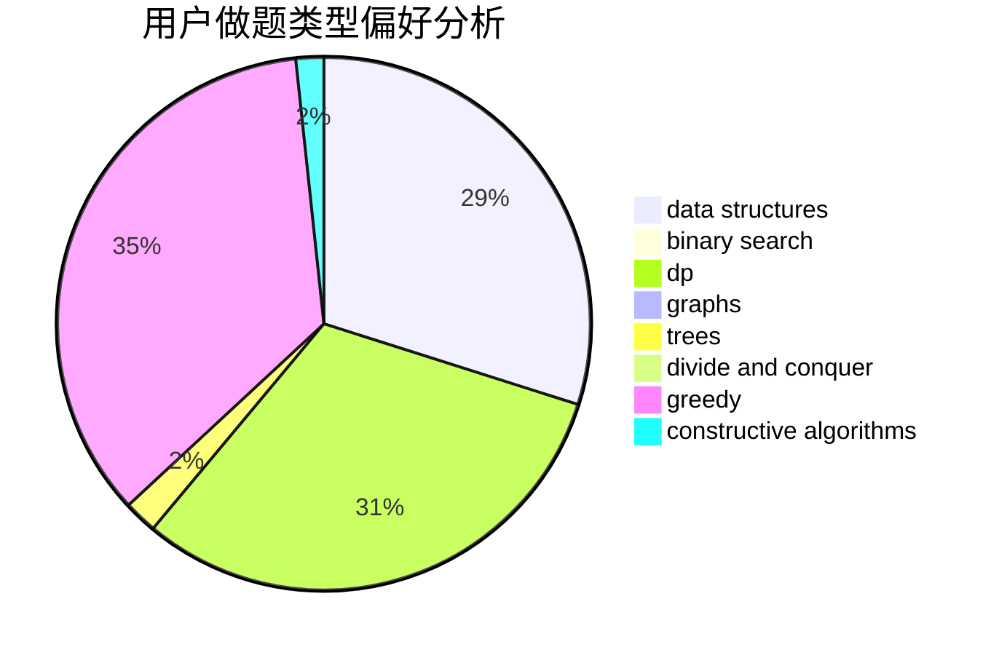

# MuXijin

<!-- tabs:start -->

#### **用户提交结果分析**

#### **用户做题类型偏好分析**

#### **用户错题知识点分析**

<!-- tabs:end -->
# 推荐题目
[17C](https://codeforces.com/contest/17/problem/C)		dp		  
[600C](https://codeforces.com/contest/600/problem/C)		constructive algorithms,
                        greedy,
                        strings		  
[289D](https://codeforces.com/contest/289/problem/D)		dsu,graphs,sortings,trees		  
[495B](https://codeforces.com/contest/495/problem/B)		math,
                        number theory		  
[294D](https://codeforces.com/contest/294/problem/D)		brute force,
                        implementation,
                        number theory		  
[1500E](https://codeforces.com/contest/1500/problem/E)		binary search,
                        data structures		  
[732A](https://codeforces.com/contest/732/problem/A)		brute force,
                        constructive algorithms,
                        implementation,
                        math		  
[276C](https://codeforces.com/contest/276/problem/C)		data structures,
                        greedy,
                        implementation,
                        sortings		  
[371D](https://codeforces.com/contest/371/problem/D)		data structures,
                        dsu,
                        implementation,
                        trees		  
[810E](https://codeforces.com/contest/810/problem/E)		dsu,graphs,sortings,trees		  
