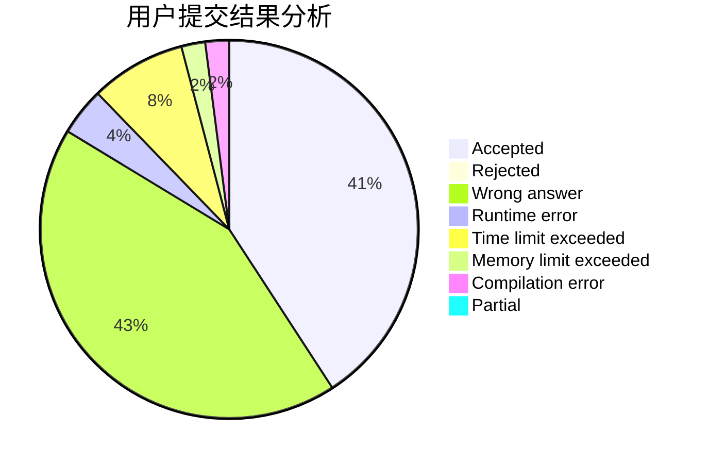
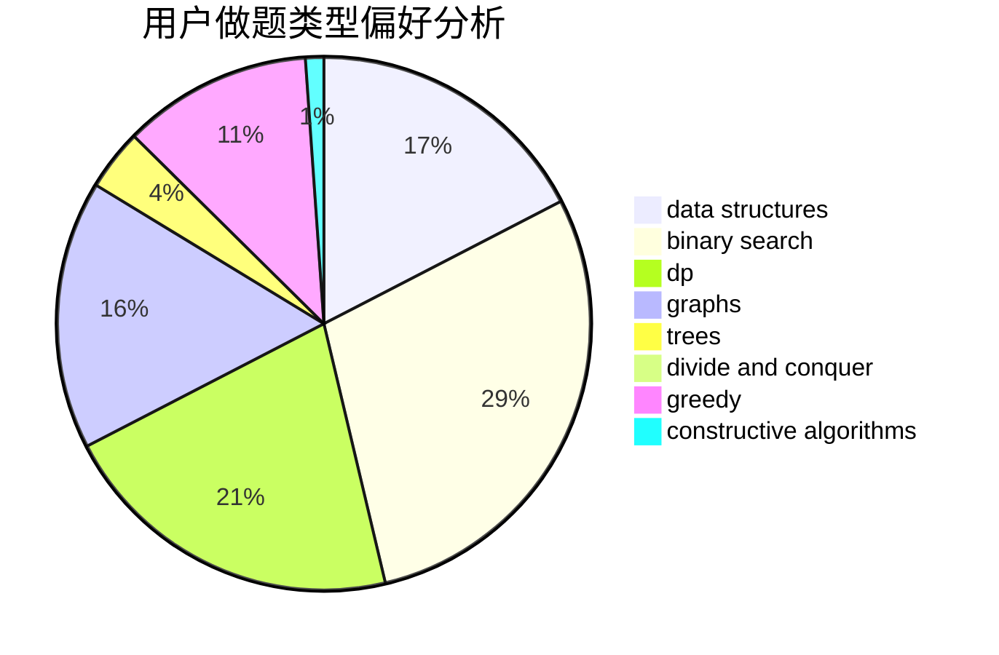

# MuXijin

<!-- tabs:start -->

#### **用户提交结果分析**

#### **用户做题类型偏好分析**

#### **用户错题知识点分析**

<!-- tabs:end -->
# 推荐题目
[158A](https://codeforces.com/contest/158/problem/A)		*special problem,
                        implementation		  
[580A](https://codeforces.com/contest/580/problem/A)		brute force,
                        dp,
                        implementation		  
[273E](https://codeforces.com/contest/273/problem/E)		dp,
                        games		  
[476B](https://codeforces.com/contest/476/problem/B)		bitmasks,
                        brute force,
                        combinatorics,
                        dp,
                        math,
                        probabilities		  
[279E](https://codeforces.com/contest/279/problem/E)		dp,
                        games,
                        greedy,
                        number theory		  
[1492D](https://codeforces.com/contest/1492/problem/D)		bitmasks,
                        constructive algorithms,
                        greedy,
                        math		  
[712E](https://codeforces.com/contest/712/problem/E)		data structures,
                        math,
                        probabilities		  
[258D](https://codeforces.com/contest/258/problem/D)		dp,
                        math,
                        probabilities		  
[346A](https://codeforces.com/contest/346/problem/A)		games,
                        math,
                        number theory		  
[796D](https://codeforces.com/contest/796/problem/D)		constructive algorithms,
                        dfs and similar,
                        dp,
                        graphs,
                        shortest paths,
                        trees		  
