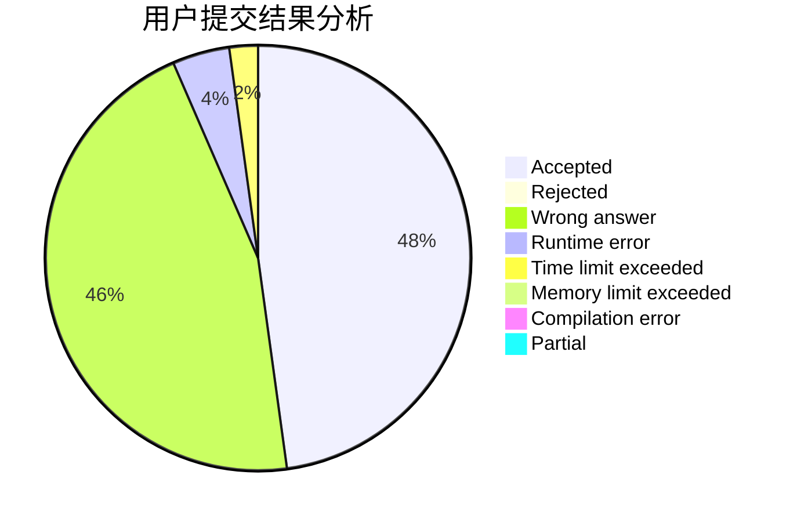
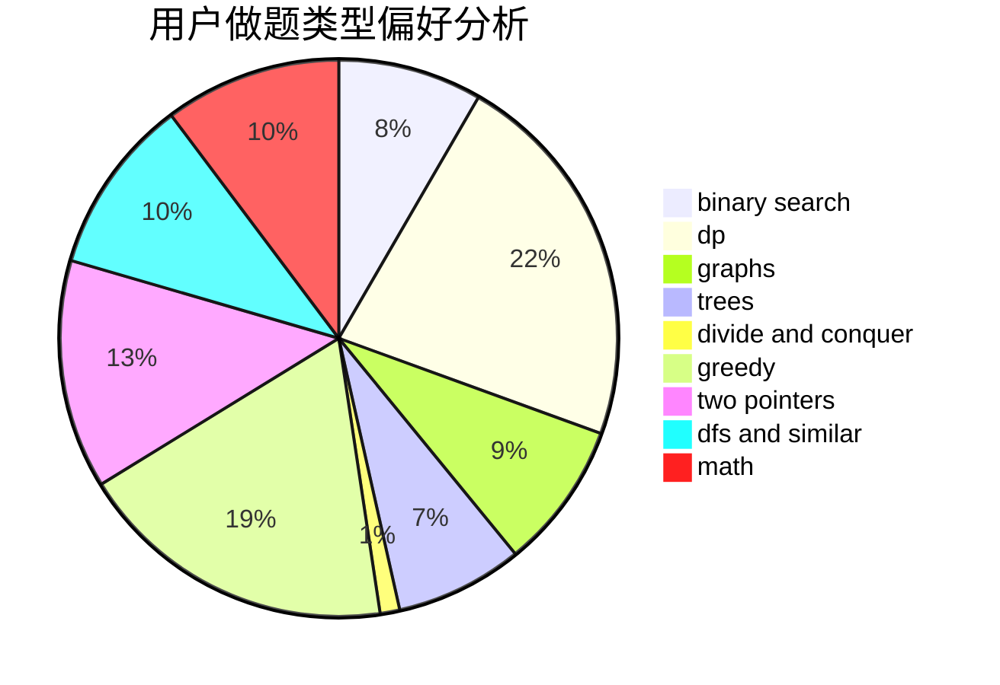

# Multiply_Ten

<!-- tabs:start -->

#### **用户提交结果分析**

#### **用户做题类型偏好分析**

<!-- tabs:end -->
# 推荐题目
[453B](https://codeforces.com/contest/453/problem/B)
[750F](https://codeforces.com/contest/750/problem/F)
[582A](https://codeforces.com/contest/582/problem/A)
[665F](https://codeforces.com/contest/665/problem/F)
[1345B](https://codeforces.com/contest/1345/problem/B)
[553C](https://codeforces.com/contest/553/problem/C)
[1218H](https://codeforces.com/contest/1218/problem/H)
[888B](https://codeforces.com/contest/888/problem/B)
[112B](https://codeforces.com/contest/112/problem/B)
[732D](https://codeforces.com/contest/732/problem/D)
