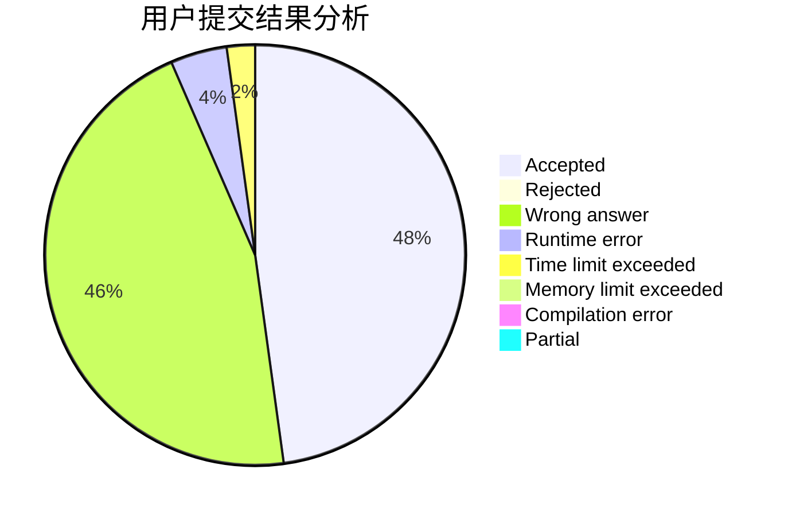
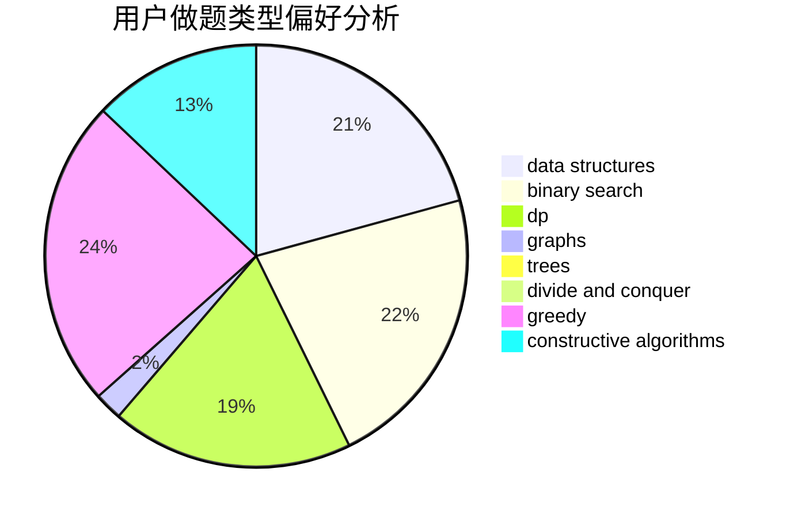

# Multiply_Ten

<!-- tabs:start -->

#### **用户提交结果分析**

#### **用户做题类型偏好分析**

#### **用户错题知识点分析**

<!-- tabs:end -->
# 推荐题目
[431D](https://codeforces.com/contest/431/problem/D)		binary search,
                        bitmasks,
                        combinatorics,
                        dp,
                        math		  
[733A](https://codeforces.com/contest/733/problem/A)		implementation		  
[559C](https://codeforces.com/contest/559/problem/C)		combinatorics,
                        dp,
                        math,
                        number theory		  
[633D](https://codeforces.com/contest/633/problem/D)		brute force,
                        dp,
                        hashing,
                        implementation,
                        math		  
[1338A](https://codeforces.com/contest/1338/problem/A)		greedy,
                        math		  
[52B](https://codeforces.com/contest/52/problem/B)		combinatorics		  
[1213E](https://codeforces.com/contest/1213/problem/E)		brute force,
                        constructive algorithms		  
[868F](https://codeforces.com/contest/868/problem/F)		divide and conquer,
                        dp		  
[1120C](https://codeforces.com/contest/1120/problem/C)		dp,
                        strings		  
[713D](https://codeforces.com/contest/713/problem/D)		binary search,
                        data structures		  
