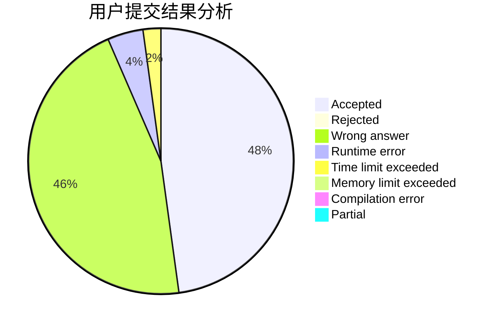
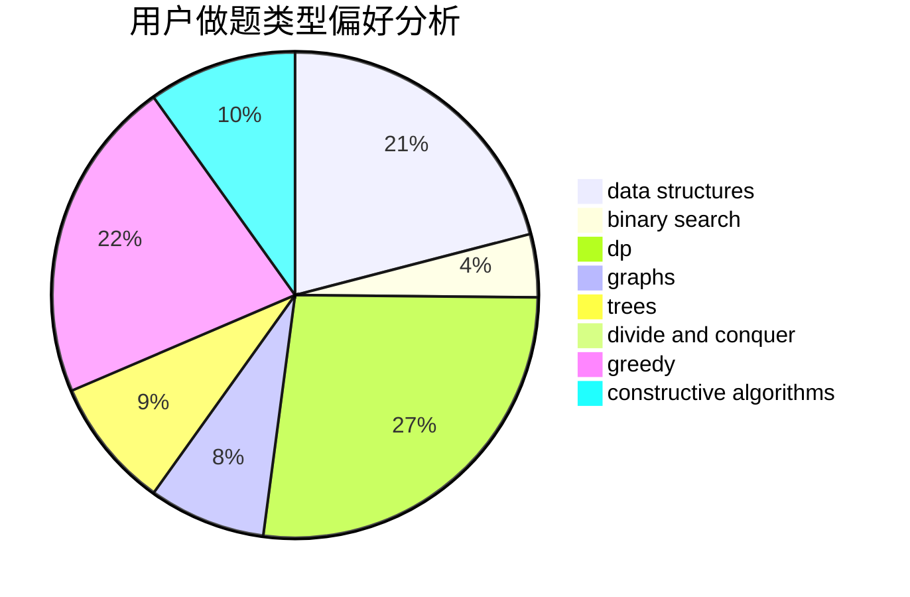

# Multiply_Ten

<!-- tabs:start -->

#### **用户提交结果分析**

#### **用户做题类型偏好分析**

#### **用户错题知识点分析**

<!-- tabs:end -->
# 推荐题目
[453B](https://codeforces.com/contest/453/problem/B)		bitmasks,
                        brute force,
                        dp		  
[750F](https://codeforces.com/contest/750/problem/F)		constructive algorithms,
                        implementation,
                        interactive,
                        trees		  
[582A](https://codeforces.com/contest/582/problem/A)		constructive algorithms,
                        greedy,
                        number theory		  
[665F](https://codeforces.com/contest/665/problem/F)		data structures,
                        dp,
                        math,
                        number theory,
                        sortings,
                        two pointers		  
[1345B](https://codeforces.com/contest/1345/problem/B)		binary search,
                        brute force,
                        dp,
                        math		  
[553C](https://codeforces.com/contest/553/problem/C)		dfs and similar,
                        dsu,
                        graphs		  
[1218H](https://codeforces.com/contest/1218/problem/H)		dfs and similar		  
[888B](https://codeforces.com/contest/888/problem/B)		greedy		  
[112B](https://codeforces.com/contest/112/problem/B)		implementation,
                        math		  
[732D](https://codeforces.com/contest/732/problem/D)		binary search,
                        greedy,
                        sortings		  
