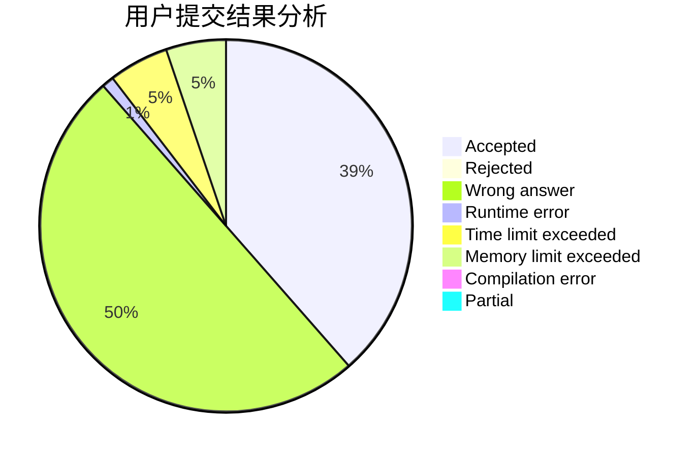
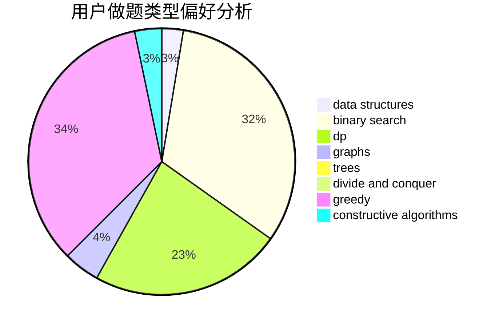
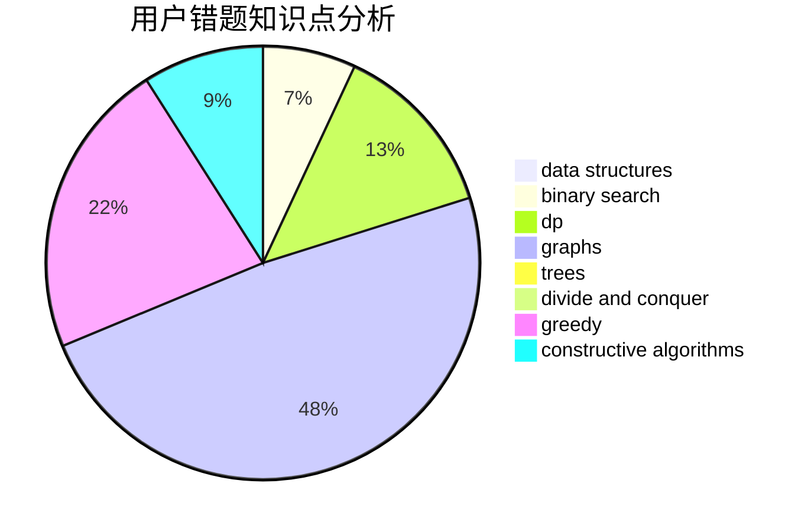

# 892832648

<!-- tabs:start -->

#### **用户提交结果分析**

#### **用户做题类型偏好分析**

#### **用户错题知识点分析**

<!-- tabs:end -->
# 推荐题目
[1450G](https://codeforces.com/contest/1450/problem/G)		bitmasks,
                        dp,
                        trees		  
[1451F](https://codeforces.com/contest/1451/problem/F)		constructive algorithms,
                        games		  
[14512](https://codeforces.com/contest/1451/problem/2)		dsu,graphs,sortings,trees		  
[1133E](https://codeforces.com/contest/1133/problem/E)		dp,
                        sortings,
                        two pointers		  
[1350E](https://codeforces.com/contest/1350/problem/E)		dsu,graphs,sortings,trees		  
[1169B](https://codeforces.com/contest/1169/problem/B)		graphs,
                        implementation		  
[144D](https://codeforces.com/contest/144/problem/D)		data structures,
                        dfs and similar,
                        graphs,
                        shortest paths		  
[144B](https://codeforces.com/contest/144/problem/B)		implementation		  
[1079C](https://codeforces.com/contest/1079/problem/C)		dsu,graphs,sortings,trees		  
[144E](https://codeforces.com/contest/144/problem/E)		data structures,
                        greedy		  
