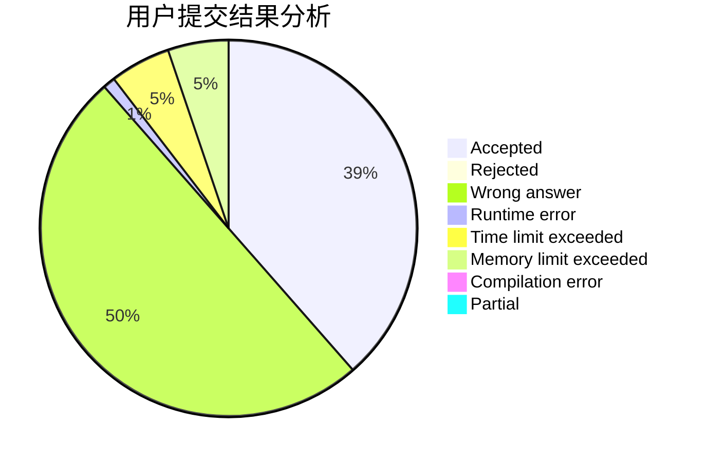
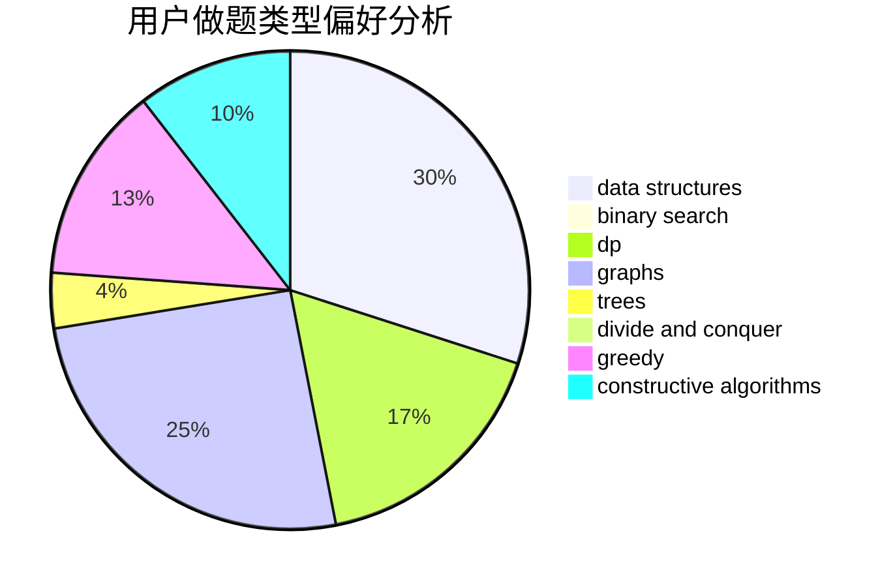

# 892832648
<!-- tabs:start -->
#### **用户提交结果分析**

#### **用户做题类型偏好分析**

#### **用户错题知识点分析**

<!-- tabs:end -->
# 推荐题目
[Cheat and Win](http://codeforces.com/problemset/problem/1439/E)		bitmasks,
                        data structures,
                        games,
                        trees		  
[Extreme Subtraction](http://codeforces.com/problemset/problem/1442/A)		constructive algorithms,
                        dp,
                        greedy		  
[A Tale of Two Lands](http://codeforces.com/problemset/problem/1166/C)		binary search,
                        sortings,
                        two pointers		  
[Regular Bracket Sequence](http://codeforces.com/problemset/problem/1132/A)		greedy,
                        implementation		  
[Valerii Against Everyone](http://codeforces.com/problemset/problem/1438/B)		constructive algorithms,
                        data structures,
                        greedy,
                        sortings		  
[Negative Time Summation](http://codeforces.com/problemset/problem/1078/E)		constructive algorithms		  
[Hilbert's Hotel](http://codeforces.com/problemset/problem/1344/A)		math,
                        number theory,
                        sortings		  
[New Year Table](http://codeforces.com/problemset/problem/140/A)		geometry,
                        math		  
[Identify the Operations](http://codeforces.com/problemset/problem/1442/B)		combinatorics,
                        data structures,
                        dsu,
                        greedy,
                        implementation		  
[Eleven Segments (2 points)](https://codeforces.com/contest/1164/problem/J)		nan		  
<!-- tabs:start -->
#### **data structures**
[Cheat and Win](http://codeforces.com/problemset/problem/1439/E)		bitmasks,
                        data structures,
                        games,
                        trees		  
[Valerii Against Everyone](http://codeforces.com/problemset/problem/1438/B)		constructive algorithms,
                        data structures,
                        greedy,
                        sortings		  
[Identify the Operations](http://codeforces.com/problemset/problem/1442/B)		combinatorics,
                        data structures,
                        dsu,
                        greedy,
                        implementation		  
[Graph Subset Problem](http://codeforces.com/problemset/problem/1439/B)		constructive algorithms,
                        data structures,
                        graphs		  
[Make It Increasing](http://codeforces.com/problemset/problem/1437/E)		binary search,
                        constructive algorithms,
                        data structures,
                        dp,
                        implementation		  
[Death DBMS](http://codeforces.com/problemset/problem/1437/G)		data structures,
                        string suffix structures,
                        strings,
                        trees		  
[Lunar New Year and a Wander](http://codeforces.com/problemset/problem/1106/D)		data structures,
                        dfs and similar,
                        graphs,
                        greedy,
                        shortest paths		  
[Greedy Shopping](https://codeforces.com/contest/1440/problem/E)		binary search,
                        data structures,
                        divide and conquer,
                        greedy,
                        implementation		  
[Maximum width](http://codeforces.com/problemset/problem/1492/C)		binary search,
                        data structures,
                        dp,
                        greedy,
                        two pointers		  
[Old Floppy Drive](http://codeforces.com/problemset/problem/1490/G)		binary search,
                        data structures,
                        math		  
#### **binary search**
[A Tale of Two Lands](http://codeforces.com/problemset/problem/1166/C)		binary search,
                        sortings,
                        two pointers		  
[Make It Increasing](http://codeforces.com/problemset/problem/1437/E)		binary search,
                        constructive algorithms,
                        data structures,
                        dp,
                        implementation		  
[Simple Polygon Embedding](http://codeforces.com/problemset/problem/1354/C1)		binary search,
                        geometry,
                        math,
                        ternary search		  
[Yurii Can Do Everything](http://codeforces.com/problemset/problem/1438/E)		binary search,
                        bitmasks,
                        brute force,
                        constructive algorithms,
                        divide and conquer,
                        two pointers		  
[Greedy Shopping](https://codeforces.com/contest/1440/problem/E)		binary search,
                        data structures,
                        divide and conquer,
                        greedy,
                        implementation		  
[Maximum width](http://codeforces.com/problemset/problem/1492/C)		binary search,
                        data structures,
                        dp,
                        greedy,
                        two pointers		  
[Pairs](http://codeforces.com/problemset/problem/1463/D)		binary search,
                        constructive algorithms,
                        greedy,
                        two pointers		  
[Old Floppy Drive](http://codeforces.com/problemset/problem/1490/G)		binary search,
                        data structures,
                        math		  
[Odd Mineral Resource](http://codeforces.com/problemset/problem/1479/D)		binary search,
                        bitmasks,
                        brute force,
                        data structures,
                        probabilities,
                        trees		  
[Complicated Computations](http://codeforces.com/problemset/problem/1436/E)		binary search,
                        data structures,
                        two pointers		  
#### **dp**
[Extreme Subtraction](http://codeforces.com/problemset/problem/1442/A)		constructive algorithms,
                        dp,
                        greedy		  
[Make It Increasing](http://codeforces.com/problemset/problem/1437/E)		binary search,
                        constructive algorithms,
                        data structures,
                        dp,
                        implementation		  
[Emotional Fishermen](http://codeforces.com/problemset/problem/1437/F)		combinatorics,
                        dp,
                        math,
                        two pointers		  
[INOI Final Contests](http://codeforces.com/problemset/problem/1439/D)		combinatorics,
                        dp,
                        fft		  
[Maximum width](http://codeforces.com/problemset/problem/1492/C)		binary search,
                        data structures,
                        dp,
                        greedy,
                        two pointers		  
[Bouncing Ball](https://codeforces.com/contest/1457/problem/C)		brute force,
                        dp,
                        implementation		  
[Pekora and Trampoline](http://codeforces.com/problemset/problem/1491/C)		brute force,
                        data structures,
                        dp,
                        greedy,
                        implementation		  
[Chef Monocarp](http://codeforces.com/problemset/problem/1437/C)		dp,
                        flows,
                        graph matchings,
                        greedy,
                        math,
                        sortings		  
[Binary Removals](http://codeforces.com/problemset/problem/1499/B)		brute force,
                        dp,
                        greedy,
                        implementation		  
[Zookeeper and The Infinite Zoo](http://codeforces.com/problemset/problem/1491/D)		bitmasks,
                        constructive algorithms,
                        dp,
                        greedy,
                        math		  
#### **graph**
[Graph Subset Problem](http://codeforces.com/problemset/problem/1439/B)		constructive algorithms,
                        data structures,
                        graphs		  
[Binary Table (Hard Version)](https://codeforces.com/contest/1440/problem/C2)		constructive algorithms,
                        graphs,
                        greedy,
                        implementation		  
[Lunar New Year and a Wander](http://codeforces.com/problemset/problem/1106/D)		data structures,
                        dfs and similar,
                        graphs,
                        greedy,
                        shortest paths		  
[Minimum Ties](http://codeforces.com/problemset/problem/1487/C)		brute force,
                        constructive algorithms,
                        dfs and similar,
                        graphs,
                        greedy,
                        implementation,
                        math		  
[Chef Monocarp](http://codeforces.com/problemset/problem/1437/C)		dp,
                        flows,
                        graph matchings,
                        greedy,
                        math,
                        sortings		  
[Strange Housing](http://codeforces.com/problemset/problem/1470/D)		constructive algorithms,
                        dfs and similar,
                        graph matchings,
                        graphs,
                        greedy		  
[Longest Simple Cycle](http://codeforces.com/problemset/problem/1476/C)		dp,
                        graphs,
                        greedy		  
[Shortest and Longest LIS](http://codeforces.com/problemset/problem/1304/D)		constructive algorithms,
                        graphs,
                        greedy,
                        two pointers		  
[Ball in Berland](http://codeforces.com/problemset/problem/1475/C)		combinatorics,
                        graphs,
                        math		  
[Kyoya and Train](http://codeforces.com/problemset/problem/553/E)		dp,
                        fft,
                        graphs,
                        math,
                        probabilities		  
#### **trees**
[Cheat and Win](http://codeforces.com/problemset/problem/1439/E)		bitmasks,
                        data structures,
                        games,
                        trees		  
[Death DBMS](http://codeforces.com/problemset/problem/1437/G)		data structures,
                        string suffix structures,
                        strings,
                        trees		  
[Olha and Igor](http://codeforces.com/problemset/problem/1438/F)		interactive,
                        probabilities,
                        trees		  
[Odd Mineral Resource](http://codeforces.com/problemset/problem/1479/D)		binary search,
                        bitmasks,
                        brute force,
                        data structures,
                        probabilities,
                        trees		  
[Yet Another Card Deck](http://codeforces.com/problemset/problem/1511/C)		brute force,
                        data structures,
                        implementation,
                        trees		  
[Diameter Cuts](http://codeforces.com/problemset/problem/1499/F)		combinatorics,
                        dfs and similar,
                        dp,
                        trees		  
[Fib-tree](http://codeforces.com/problemset/problem/1491/E)		brute force,
                        dfs and similar,
                        divide and conquer,
                        number theory,
                        trees		  
[13th Labour of Heracles](http://codeforces.com/problemset/problem/1466/D)		data structures,
                        greedy,
                        sortings,
                        trees		  
[BFS Trees](http://codeforces.com/problemset/problem/1495/D)		combinatorics,
                        dfs and similar,
                        graphs,
                        math,
                        shortest paths,
                        trees		  
[Sum of Prefix Sums](http://codeforces.com/problemset/problem/1303/G)		data structures,
                        divide and conquer,
                        geometry,
                        trees		  
#### **divide and conquer**
[Yurii Can Do Everything](http://codeforces.com/problemset/problem/1438/E)		binary search,
                        bitmasks,
                        brute force,
                        constructive algorithms,
                        divide and conquer,
                        two pointers		  
[Greedy Shopping](https://codeforces.com/contest/1440/problem/E)		binary search,
                        data structures,
                        divide and conquer,
                        greedy,
                        implementation		  
[Divide and Summarize](http://codeforces.com/problemset/problem/1461/D)		binary search,
                        brute force,
                        data structures,
                        divide and conquer,
                        implementation,
                        sortings		  
[Song of the Sirens](http://codeforces.com/problemset/problem/1466/G)		combinatorics,
                        divide and conquer,
                        hashing,
                        math,
                        string suffix structures,
                        strings		  
[Permutation Transformation](http://codeforces.com/problemset/problem/1490/D)		dfs and similar,
                        divide and conquer,
                        implementation		  
[Skyline Photo](https://codeforces.com/contest/1483/problem/C)		data structures,
                        divide and conquer,
                        dp		  
[Fib-tree](http://codeforces.com/problemset/problem/1491/E)		brute force,
                        dfs and similar,
                        divide and conquer,
                        number theory,
                        trees		  
[Sum of Prefix Sums](http://codeforces.com/problemset/problem/1303/G)		data structures,
                        divide and conquer,
                        geometry,
                        trees		  
[Dogeforces](http://codeforces.com/problemset/problem/1494/D)		constructive algorithms,
                        data structures,
                        dfs and similar,
                        divide and conquer,
                        dsu,
                        greedy,
                        sortings,
                        trees		  
[Logistical Questions](http://codeforces.com/problemset/problem/566/C)		dfs and similar,
                        divide and conquer,
                        trees		  
#### **greedy**
[Extreme Subtraction](http://codeforces.com/problemset/problem/1442/A)		constructive algorithms,
                        dp,
                        greedy		  
[Regular Bracket Sequence](http://codeforces.com/problemset/problem/1132/A)		greedy,
                        implementation		  
[Valerii Against Everyone](http://codeforces.com/problemset/problem/1438/B)		constructive algorithms,
                        data structures,
                        greedy,
                        sortings		  
[Identify the Operations](http://codeforces.com/problemset/problem/1442/B)		combinatorics,
                        data structures,
                        dsu,
                        greedy,
                        implementation		  
[Refactoring](http://codeforces.com/problemset/problem/1055/D)		greedy,
                        implementation,
                        strings		  
[File Name](https://codeforces.com/contest/1298/problem/C)		greedy,
                        strings		  
[Platforms Jumping](https://codeforces.com/contest/1432/problem/F)		greedy		  
[Binary Table (Hard Version)](https://codeforces.com/contest/1440/problem/C2)		constructive algorithms,
                        graphs,
                        greedy,
                        implementation		  
[Sum of Medians](http://codeforces.com/problemset/problem/1440/B)		greedy,
                        math		  
[Lunar New Year and a Wander](http://codeforces.com/problemset/problem/1106/D)		data structures,
                        dfs and similar,
                        graphs,
                        greedy,
                        shortest paths		  
#### **constructive algorithms**
[Extreme Subtraction](http://codeforces.com/problemset/problem/1442/A)		constructive algorithms,
                        dp,
                        greedy		  
[Valerii Against Everyone](http://codeforces.com/problemset/problem/1438/B)		constructive algorithms,
                        data structures,
                        greedy,
                        sortings		  
[Negative Time Summation](http://codeforces.com/problemset/problem/1078/E)		constructive algorithms		  
[Graph Subset Problem](http://codeforces.com/problemset/problem/1439/B)		constructive algorithms,
                        data structures,
                        graphs		  
[Make It Increasing](http://codeforces.com/problemset/problem/1437/E)		binary search,
                        constructive algorithms,
                        data structures,
                        dp,
                        implementation		  
[Binary Table (Hard Version)](https://codeforces.com/contest/1440/problem/C2)		constructive algorithms,
                        graphs,
                        greedy,
                        implementation		  
[Colored Cubes](http://codeforces.com/problemset/problem/1025/E)		constructive algorithms,
                        implementation,
                        matrices		  
[Yurii Can Do Everything](http://codeforces.com/problemset/problem/1438/E)		binary search,
                        bitmasks,
                        brute force,
                        constructive algorithms,
                        divide and conquer,
                        two pointers		  
[Company Acquisitions](http://codeforces.com/problemset/problem/1025/G)		constructive algorithms,
                        math		  
[Powerful Ksenia](http://codeforces.com/problemset/problem/1438/D)		bitmasks,
                        constructive algorithms,
                        math		  
#### **sortings**
[A Tale of Two Lands](http://codeforces.com/problemset/problem/1166/C)		binary search,
                        sortings,
                        two pointers		  
[Valerii Against Everyone](http://codeforces.com/problemset/problem/1438/B)		constructive algorithms,
                        data structures,
                        greedy,
                        sortings		  
[Hilbert's Hotel](http://codeforces.com/problemset/problem/1344/A)		math,
                        number theory,
                        sortings		  
[Diamond Miner](https://codeforces.com/contest/1496/problem/C)		geometry,
                        greedy,
                        math,
                        sortings		  
[Meximization](http://codeforces.com/problemset/problem/1497/A)		brute force,
                        data structures,
                        greedy,
                        sortings		  
[Avoiding Zero](http://codeforces.com/problemset/problem/1427/A)		math,
                        sortings		  
[Divide and Summarize](http://codeforces.com/problemset/problem/1461/D)		binary search,
                        brute force,
                        data structures,
                        divide and conquer,
                        implementation,
                        sortings		  
[Chef Monocarp](http://codeforces.com/problemset/problem/1437/C)		dp,
                        flows,
                        graph matchings,
                        greedy,
                        math,
                        sortings		  
[Replacing Elements](http://codeforces.com/problemset/problem/1473/A)		greedy,
                        implementation,
                        math,
                        sortings		  
[Eastern Exhibition](http://codeforces.com/problemset/problem/1486/B)		binary search,
                        geometry,
                        shortest paths,
                        sortings		  
<!-- tabs:end -->
