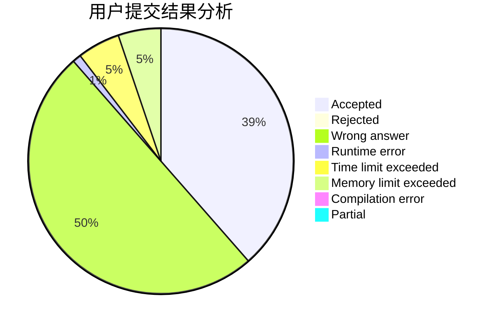
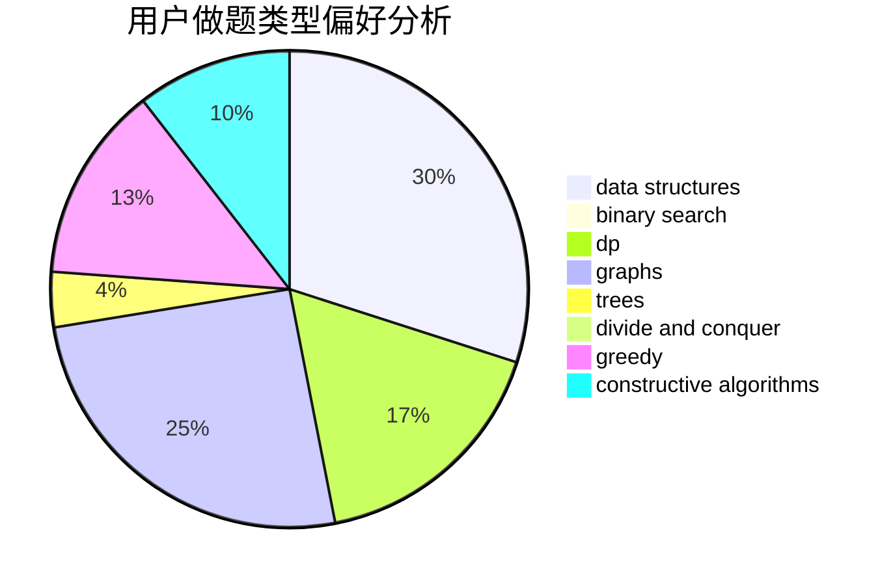

# 892832648
<!-- tabs:start -->
#### **用户提交结果分析**

#### **用户做题类型偏好分析**

#### **用户错题知识点分析**

<!-- tabs:end -->
# 推荐题目
[Cheat and Win](http://codeforces.com/problemset/problem/1439/E)		bitmasks,
                        data structures,
                        games,
                        trees		  
[Extreme Subtraction](http://codeforces.com/problemset/problem/1442/A)		constructive algorithms,
                        dp,
                        greedy		  
[A Tale of Two Lands](http://codeforces.com/problemset/problem/1166/C)		binary search,
                        sortings,
                        two pointers		  
[Regular Bracket Sequence](http://codeforces.com/problemset/problem/1132/A)		greedy,
                        implementation		  
[Valerii Against Everyone](http://codeforces.com/problemset/problem/1438/B)		constructive algorithms,
                        data structures,
                        greedy,
                        sortings		  
[Negative Time Summation](http://codeforces.com/problemset/problem/1078/E)		constructive algorithms		  
[Hilbert's Hotel](http://codeforces.com/problemset/problem/1344/A)		math,
                        number theory,
                        sortings		  
[New Year Table](http://codeforces.com/problemset/problem/140/A)		geometry,
                        math		  
[Identify the Operations](http://codeforces.com/problemset/problem/1442/B)		combinatorics,
                        data structures,
                        dsu,
                        greedy,
                        implementation		  
[Eleven Segments (2 points)](https://codeforces.com/contest/1164/problem/J)		nan		  
<!-- tabs:start -->
#### **data structures**
[Cheat and Win](http://codeforces.com/problemset/problem/1439/E)		bitmasks,
                        data structures,
                        games,
                        trees		  
[Extreme Subtraction](http://codeforces.com/problemset/problem/1438/B)		constructive algorithms,
                        data structures,
                        greedy,
                        sortings		  
[A Tale of Two Lands](http://codeforces.com/problemset/problem/1442/B)		combinatorics,
                        data structures,
                        dsu,
                        greedy,
                        implementation		  
[Regular Bracket Sequence](http://codeforces.com/problemset/problem/1439/B)		constructive algorithms,
                        data structures,
                        graphs		  
[Valerii Against Everyone](http://codeforces.com/problemset/problem/1437/E)		binary search,
                        constructive algorithms,
                        data structures,
                        dp,
                        implementation		  
[Negative Time Summation](https://codeforces.com/contest/1440/problem/D)		constructive algorithms,
                        data structures,
                        graphs		  
[Hilbert's Hotel](http://codeforces.com/problemset/problem/1437/G)		data structures,
                        string suffix structures,
                        strings,
                        trees		  
[New Year Table](http://codeforces.com/problemset/problem/1106/D)		data structures,
                        dfs and similar,
                        graphs,
                        greedy,
                        shortest paths		  
[Identify the Operations](https://codeforces.com/contest/1440/problem/E)		binary search,
                        data structures,
                        divide and conquer,
                        greedy,
                        implementation		  
[Eleven Segments (2 points)](http://codeforces.com/problemset/problem/1439/C)		binary search,
                        data structures,
                        divide and conquer,
                        greedy,
                        implementation		  
#### **binary search**
[Cheat and Win](http://codeforces.com/problemset/problem/1166/C)		binary search,
                        sortings,
                        two pointers		  
[Extreme Subtraction](http://codeforces.com/problemset/problem/1437/E)		binary search,
                        constructive algorithms,
                        data structures,
                        dp,
                        implementation		  
[A Tale of Two Lands](http://codeforces.com/problemset/problem/1354/C1)		binary search,
                        geometry,
                        math,
                        ternary search		  
[Regular Bracket Sequence](http://codeforces.com/problemset/problem/1438/E)		binary search,
                        bitmasks,
                        brute force,
                        constructive algorithms,
                        divide and conquer,
                        two pointers		  
[Valerii Against Everyone](https://codeforces.com/contest/1440/problem/E)		binary search,
                        data structures,
                        divide and conquer,
                        greedy,
                        implementation		  
[Negative Time Summation](http://codeforces.com/problemset/problem/1439/C)		binary search,
                        data structures,
                        divide and conquer,
                        greedy,
                        implementation		  
[Hilbert's Hotel](http://codeforces.com/problemset/problem/1492/C)		binary search,
                        data structures,
                        dp,
                        greedy,
                        two pointers		  
[New Year Table](http://codeforces.com/problemset/problem/1463/D)		binary search,
                        constructive algorithms,
                        greedy,
                        two pointers		  
[Identify the Operations](http://codeforces.com/problemset/problem/1490/G)		binary search,
                        data structures,
                        math		  
[Eleven Segments (2 points)](http://codeforces.com/problemset/problem/1479/D)		binary search,
                        bitmasks,
                        brute force,
                        data structures,
                        probabilities,
                        trees		  
#### **dp**
[Cheat and Win](http://codeforces.com/problemset/problem/1442/A)		constructive algorithms,
                        dp,
                        greedy		  
[Extreme Subtraction](http://codeforces.com/problemset/problem/1437/E)		binary search,
                        constructive algorithms,
                        data structures,
                        dp,
                        implementation		  
[A Tale of Two Lands](http://codeforces.com/problemset/problem/1437/F)		combinatorics,
                        dp,
                        math,
                        two pointers		  
[Regular Bracket Sequence](http://codeforces.com/problemset/problem/1439/D)		combinatorics,
                        dp,
                        fft		  
[Valerii Against Everyone](http://codeforces.com/problemset/problem/1492/C)		binary search,
                        data structures,
                        dp,
                        greedy,
                        two pointers		  
[Negative Time Summation](https://codeforces.com/contest/1457/problem/C)		brute force,
                        dp,
                        implementation		  
[Hilbert's Hotel](http://codeforces.com/problemset/problem/1491/C)		brute force,
                        data structures,
                        dp,
                        greedy,
                        implementation		  
[New Year Table](http://codeforces.com/problemset/problem/1437/C)		dp,
                        flows,
                        graph matchings,
                        greedy,
                        math,
                        sortings		  
[Identify the Operations](http://codeforces.com/problemset/problem/1499/B)		brute force,
                        dp,
                        greedy,
                        implementation		  
[Eleven Segments (2 points)](http://codeforces.com/problemset/problem/1491/D)		bitmasks,
                        constructive algorithms,
                        dp,
                        greedy,
                        math		  
#### **graph**
[Cheat and Win](http://codeforces.com/problemset/problem/1439/B)		constructive algorithms,
                        data structures,
                        graphs		  
[Extreme Subtraction](https://codeforces.com/contest/1440/problem/D)		constructive algorithms,
                        data structures,
                        graphs		  
[A Tale of Two Lands](https://codeforces.com/contest/1440/problem/C2)		constructive algorithms,
                        graphs,
                        greedy,
                        implementation		  
[Regular Bracket Sequence](http://codeforces.com/problemset/problem/1106/D)		data structures,
                        dfs and similar,
                        graphs,
                        greedy,
                        shortest paths		  
[Valerii Against Everyone](http://codeforces.com/problemset/problem/1439/A2)		constructive algorithms,
                        graphs,
                        greedy,
                        implementation		  
[Negative Time Summation](http://codeforces.com/problemset/problem/1487/C)		brute force,
                        constructive algorithms,
                        dfs and similar,
                        graphs,
                        greedy,
                        implementation,
                        math		  
[Hilbert's Hotel](http://codeforces.com/problemset/problem/1437/C)		dp,
                        flows,
                        graph matchings,
                        greedy,
                        math,
                        sortings		  
[New Year Table](http://codeforces.com/problemset/problem/1470/D)		constructive algorithms,
                        dfs and similar,
                        graph matchings,
                        graphs,
                        greedy		  
[Identify the Operations](http://codeforces.com/problemset/problem/1476/C)		dp,
                        graphs,
                        greedy		  
[Eleven Segments (2 points)](http://codeforces.com/problemset/problem/1304/D)		constructive algorithms,
                        graphs,
                        greedy,
                        two pointers		  
#### **trees**
[Cheat and Win](http://codeforces.com/problemset/problem/1439/E)		bitmasks,
                        data structures,
                        games,
                        trees		  
[Extreme Subtraction](http://codeforces.com/problemset/problem/1437/G)		data structures,
                        string suffix structures,
                        strings,
                        trees		  
[A Tale of Two Lands](http://codeforces.com/problemset/problem/1438/F)		interactive,
                        probabilities,
                        trees		  
[Regular Bracket Sequence](http://codeforces.com/problemset/problem/1479/D)		binary search,
                        bitmasks,
                        brute force,
                        data structures,
                        probabilities,
                        trees		  
[Valerii Against Everyone](http://codeforces.com/problemset/problem/1511/C)		brute force,
                        data structures,
                        implementation,
                        trees		  
[Negative Time Summation](http://codeforces.com/problemset/problem/1499/F)		combinatorics,
                        dfs and similar,
                        dp,
                        trees		  
[Hilbert's Hotel](http://codeforces.com/problemset/problem/1491/E)		brute force,
                        dfs and similar,
                        divide and conquer,
                        number theory,
                        trees		  
[New Year Table](http://codeforces.com/problemset/problem/1466/D)		data structures,
                        greedy,
                        sortings,
                        trees		  
[Identify the Operations](http://codeforces.com/problemset/problem/1495/D)		combinatorics,
                        dfs and similar,
                        graphs,
                        math,
                        shortest paths,
                        trees		  
[Eleven Segments (2 points)](http://codeforces.com/problemset/problem/1303/G)		data structures,
                        divide and conquer,
                        geometry,
                        trees		  
#### **divide and conquer**
[Cheat and Win](http://codeforces.com/problemset/problem/1438/E)		binary search,
                        bitmasks,
                        brute force,
                        constructive algorithms,
                        divide and conquer,
                        two pointers		  
[Extreme Subtraction](https://codeforces.com/contest/1440/problem/E)		binary search,
                        data structures,
                        divide and conquer,
                        greedy,
                        implementation		  
[A Tale of Two Lands](http://codeforces.com/problemset/problem/1439/C)		binary search,
                        data structures,
                        divide and conquer,
                        greedy,
                        implementation		  
[Regular Bracket Sequence](http://codeforces.com/problemset/problem/1461/D)		binary search,
                        brute force,
                        data structures,
                        divide and conquer,
                        implementation,
                        sortings		  
[Valerii Against Everyone](http://codeforces.com/problemset/problem/1466/G)		combinatorics,
                        divide and conquer,
                        hashing,
                        math,
                        string suffix structures,
                        strings		  
[Negative Time Summation](http://codeforces.com/problemset/problem/1490/D)		dfs and similar,
                        divide and conquer,
                        implementation		  
[Hilbert's Hotel](https://codeforces.com/contest/1483/problem/C)		data structures,
                        divide and conquer,
                        dp		  
[New Year Table](http://codeforces.com/problemset/problem/1491/E)		brute force,
                        dfs and similar,
                        divide and conquer,
                        number theory,
                        trees		  
[Identify the Operations](http://codeforces.com/problemset/problem/1303/G)		data structures,
                        divide and conquer,
                        geometry,
                        trees		  
[Eleven Segments (2 points)](http://codeforces.com/problemset/problem/1494/D)		constructive algorithms,
                        data structures,
                        dfs and similar,
                        divide and conquer,
                        dsu,
                        greedy,
                        sortings,
                        trees		  
#### **greedy**
[Cheat and Win](http://codeforces.com/problemset/problem/1442/A)		constructive algorithms,
                        dp,
                        greedy		  
[Extreme Subtraction](http://codeforces.com/problemset/problem/1132/A)		greedy,
                        implementation		  
[A Tale of Two Lands](http://codeforces.com/problemset/problem/1438/B)		constructive algorithms,
                        data structures,
                        greedy,
                        sortings		  
[Regular Bracket Sequence](http://codeforces.com/problemset/problem/1442/B)		combinatorics,
                        data structures,
                        dsu,
                        greedy,
                        implementation		  
[Valerii Against Everyone](http://codeforces.com/problemset/problem/1055/D)		greedy,
                        implementation,
                        strings		  
[Negative Time Summation](https://codeforces.com/contest/1298/problem/C)		greedy,
                        strings		  
[Hilbert's Hotel](https://codeforces.com/contest/1432/problem/F)		greedy		  
[New Year Table](https://codeforces.com/contest/1440/problem/C2)		constructive algorithms,
                        graphs,
                        greedy,
                        implementation		  
[Identify the Operations](http://codeforces.com/problemset/problem/1440/B)		greedy,
                        math		  
[Eleven Segments (2 points)](http://codeforces.com/problemset/problem/1106/D)		data structures,
                        dfs and similar,
                        graphs,
                        greedy,
                        shortest paths		  
#### **constructive algorithms**
[Cheat and Win](http://codeforces.com/problemset/problem/1442/A)		constructive algorithms,
                        dp,
                        greedy		  
[Extreme Subtraction](http://codeforces.com/problemset/problem/1438/B)		constructive algorithms,
                        data structures,
                        greedy,
                        sortings		  
[A Tale of Two Lands](http://codeforces.com/problemset/problem/1078/E)		constructive algorithms		  
[Regular Bracket Sequence](http://codeforces.com/problemset/problem/1439/B)		constructive algorithms,
                        data structures,
                        graphs		  
[Valerii Against Everyone](http://codeforces.com/problemset/problem/1437/E)		binary search,
                        constructive algorithms,
                        data structures,
                        dp,
                        implementation		  
[Negative Time Summation](https://codeforces.com/contest/1440/problem/D)		constructive algorithms,
                        data structures,
                        graphs		  
[Hilbert's Hotel](https://codeforces.com/contest/1440/problem/C2)		constructive algorithms,
                        graphs,
                        greedy,
                        implementation		  
[New Year Table](http://codeforces.com/problemset/problem/1025/E)		constructive algorithms,
                        implementation,
                        matrices		  
[Identify the Operations](http://codeforces.com/problemset/problem/1438/E)		binary search,
                        bitmasks,
                        brute force,
                        constructive algorithms,
                        divide and conquer,
                        two pointers		  
[Eleven Segments (2 points)](http://codeforces.com/problemset/problem/1025/G)		constructive algorithms,
                        math		  
#### **sortings**
[Cheat and Win](http://codeforces.com/problemset/problem/1166/C)		binary search,
                        sortings,
                        two pointers		  
[Extreme Subtraction](http://codeforces.com/problemset/problem/1438/B)		constructive algorithms,
                        data structures,
                        greedy,
                        sortings		  
[A Tale of Two Lands](http://codeforces.com/problemset/problem/1344/A)		math,
                        number theory,
                        sortings		  
[Regular Bracket Sequence](https://codeforces.com/contest/1496/problem/C)		geometry,
                        greedy,
                        math,
                        sortings		  
[Valerii Against Everyone](http://codeforces.com/problemset/problem/1495/A)		geometry,
                        greedy,
                        math,
                        sortings		  
[Negative Time Summation](http://codeforces.com/problemset/problem/1497/A)		brute force,
                        data structures,
                        greedy,
                        sortings		  
[Hilbert's Hotel](http://codeforces.com/problemset/problem/1427/A)		math,
                        sortings		  
[New Year Table](http://codeforces.com/problemset/problem/1461/D)		binary search,
                        brute force,
                        data structures,
                        divide and conquer,
                        implementation,
                        sortings		  
[Identify the Operations](http://codeforces.com/problemset/problem/1437/C)		dp,
                        flows,
                        graph matchings,
                        greedy,
                        math,
                        sortings		  
[Eleven Segments (2 points)](http://codeforces.com/problemset/problem/1473/A)		greedy,
                        implementation,
                        math,
                        sortings		  
<!-- tabs:end -->
