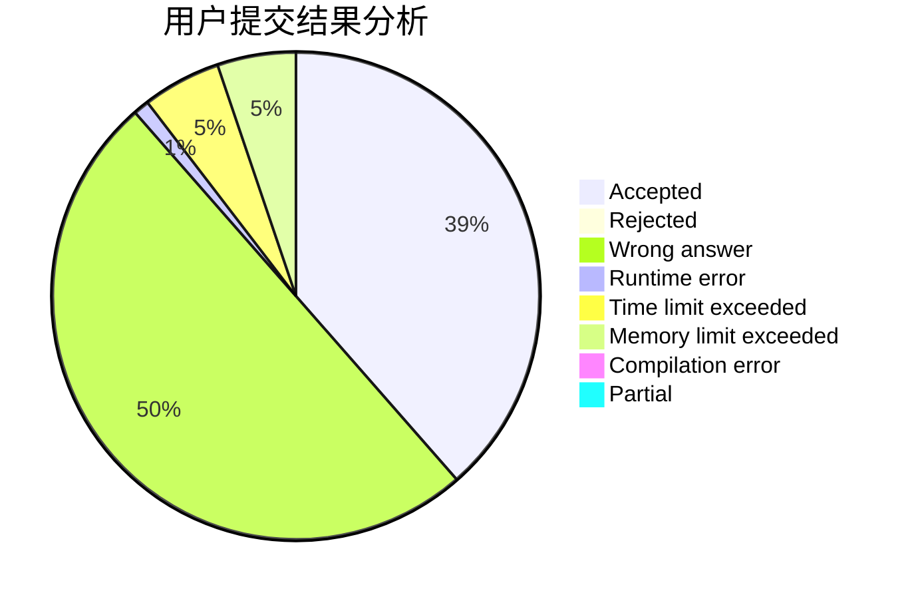
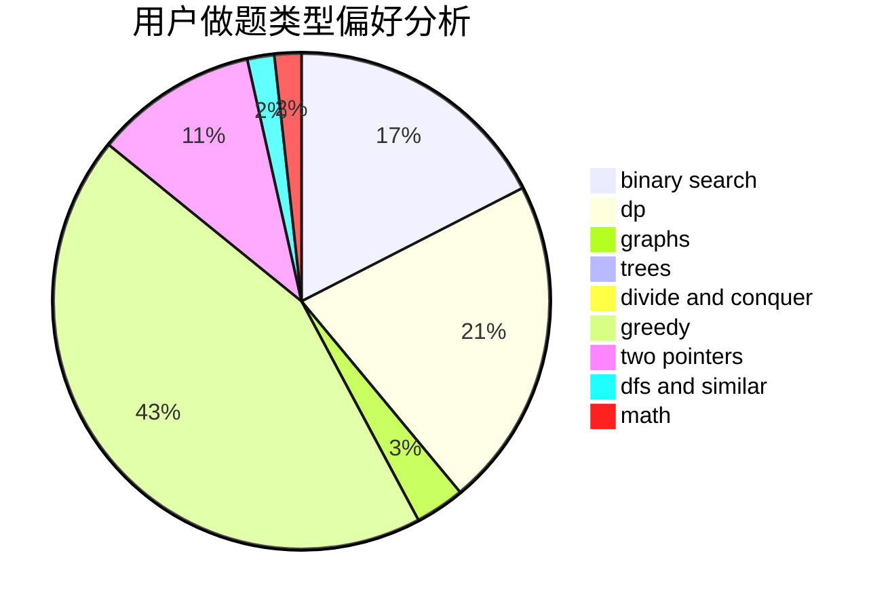

# 892832648

<!-- tabs:start -->

#### **用户提交结果分析**

#### **用户做题类型偏好分析**

<!-- tabs:end -->
# 推荐题目
[1450G](https://codeforces.com/contest/1450/problem/G)
[1451F](https://codeforces.com/contest/1451/problem/F)
[14512](https://codeforces.com/contest/1451/problem/2)
[1133E](https://codeforces.com/contest/1133/problem/E)
[1350E](https://codeforces.com/contest/1350/problem/E)
[1169B](https://codeforces.com/contest/1169/problem/B)
[144D](https://codeforces.com/contest/144/problem/D)
[144B](https://codeforces.com/contest/144/problem/B)
[1079C](https://codeforces.com/contest/1079/problem/C)
[144E](https://codeforces.com/contest/144/problem/E)
