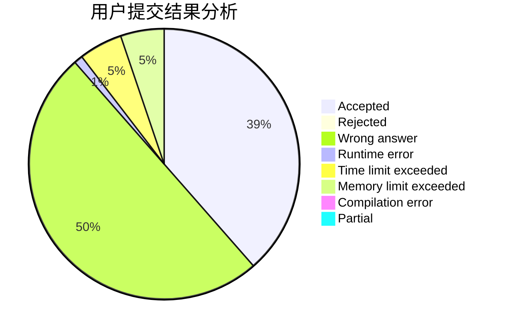
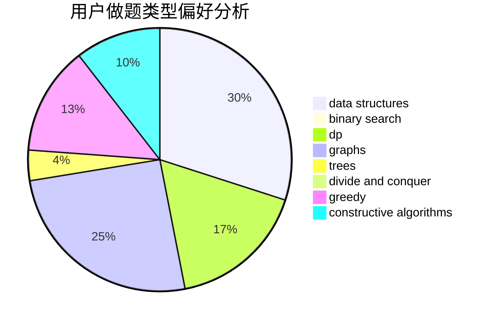

# 892832648

<!-- tabs:start -->

#### **用户提交结果分析**

#### **用户做题类型偏好分析**

#### **用户错题知识点分析**

<!-- tabs:end -->
# 推荐题目
[1439E](https://codeforces.com/contest/1439/problem/E)		bitmasks,
                        data structures,
                        games,
                        trees		  
[1442A](https://codeforces.com/contest/1442/problem/A)		constructive algorithms,
                        dp,
                        greedy		  
[1440B](https://codeforces.com/contest/1440/problem/B)		greedy,
                        math		  
[1132A](https://codeforces.com/contest/1132/problem/A)		greedy,
                        implementation		  
[1344A](https://codeforces.com/contest/1344/problem/A)		math,
                        number theory,
                        sortings		  
[1166C](https://codeforces.com/contest/1166/problem/C)		binary search,
                        sortings,
                        two pointers		  
[1438C](https://codeforces.com/contest/1438/problem/C)		2-sat,
                        chinese remainder theorem,
                        constructive algorithms,
                        fft,
                        flows		  
[1438B](https://codeforces.com/contest/1438/problem/B)		constructive algorithms,
                        data structures,
                        greedy,
                        sortings		  
[1078E](https://codeforces.com/contest/1078/problem/E)		constructive algorithms		  
[1438D](https://codeforces.com/contest/1438/problem/D)		bitmasks,
                        constructive algorithms,
                        math		  
