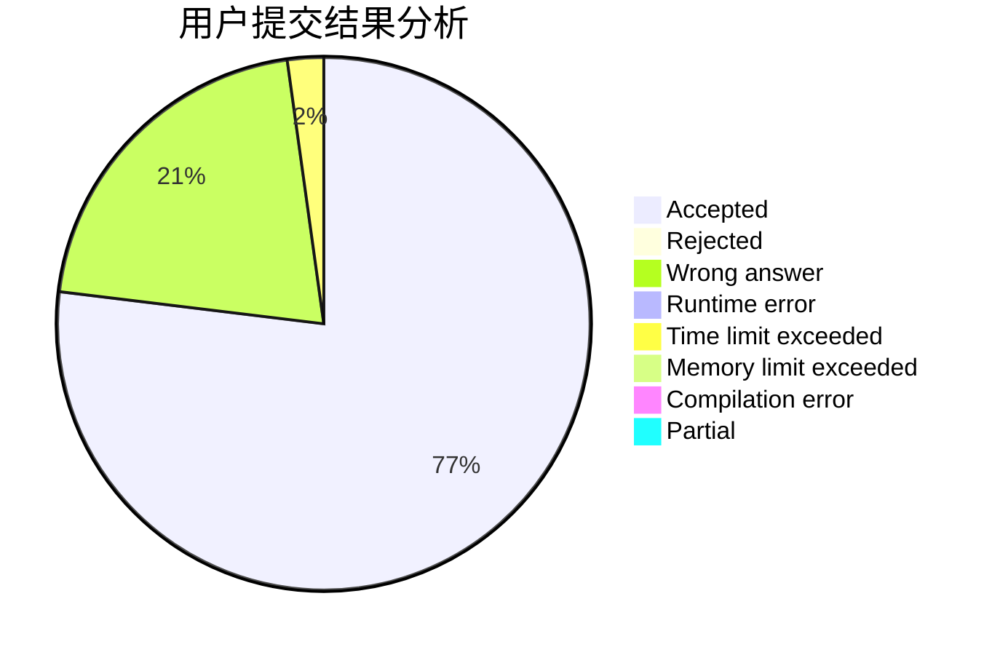
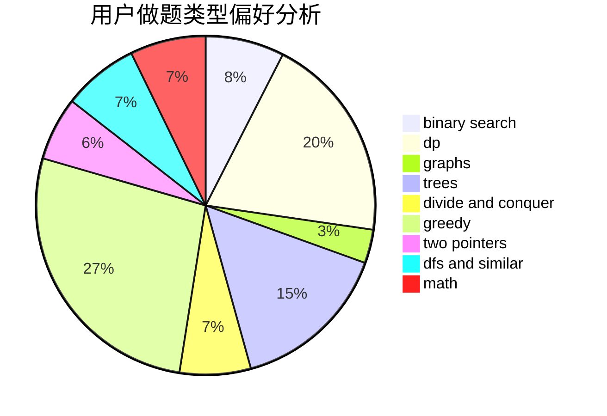

# Mx.

<!-- tabs:start -->

#### **用户提交结果分析**

#### **用户做题类型偏好分析**

<!-- tabs:end -->
# 推荐题目
[1260A](https://codeforces.com/contest/1260/problem/A)
[453B](https://codeforces.com/contest/453/problem/B)
[676D](https://codeforces.com/contest/676/problem/D)
[11882](https://codeforces.com/contest/1188/problem/2)
[986C](https://codeforces.com/contest/986/problem/C)
[842C](https://codeforces.com/contest/842/problem/C)
[1395F](https://codeforces.com/contest/1395/problem/F)
[1286A](https://codeforces.com/contest/1286/problem/A)
[2C](https://codeforces.com/contest/2/problem/C)
[1105A](https://codeforces.com/contest/1105/problem/A)
