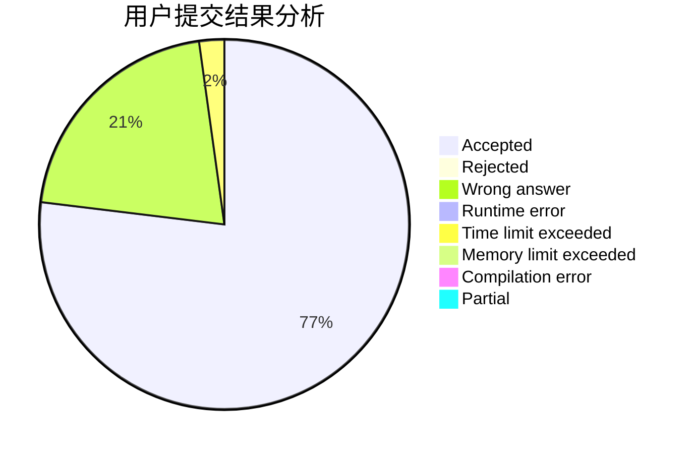
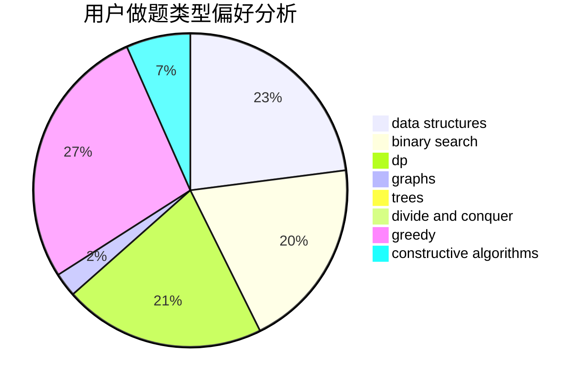
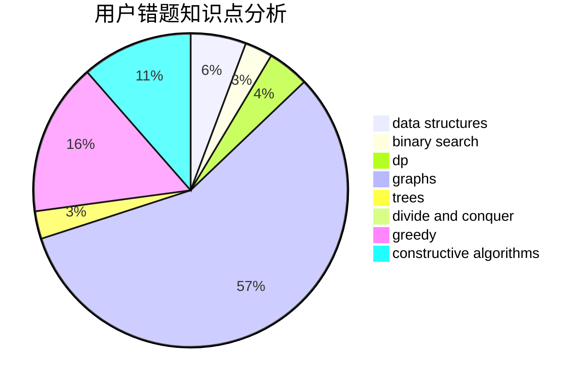

# Mx.

<!-- tabs:start -->

#### **用户提交结果分析**

#### **用户做题类型偏好分析**

#### **用户错题知识点分析**

<!-- tabs:end -->
# 推荐题目
[1252K](https://codeforces.com/contest/1252/problem/K)		data structures,
                        math,
                        matrices		  
[431D](https://codeforces.com/contest/431/problem/D)		binary search,
                        bitmasks,
                        combinatorics,
                        dp,
                        math		  
[652E](https://codeforces.com/contest/652/problem/E)		dfs and similar,
                        dsu,
                        graphs,
                        trees		  
[1184C3](https://codeforces.com/contest/1184C/problem/3)		nan		  
[963E](https://codeforces.com/contest/963/problem/E)		math		  
[822D](https://codeforces.com/contest/822/problem/D)		brute force,
                        dp,
                        greedy,
                        math,
                        number theory		  
[1385F](https://codeforces.com/contest/1385/problem/F)		data structures,
                        greedy,
                        implementation,
                        trees		  
[1280A](https://codeforces.com/contest/1280/problem/A)		implementation,
                        math		  
[285A](https://codeforces.com/contest/285/problem/A)		greedy,
                        implementation		  
[1104C](https://codeforces.com/contest/1104/problem/C)		dsu,graphs,sortings,trees		  
