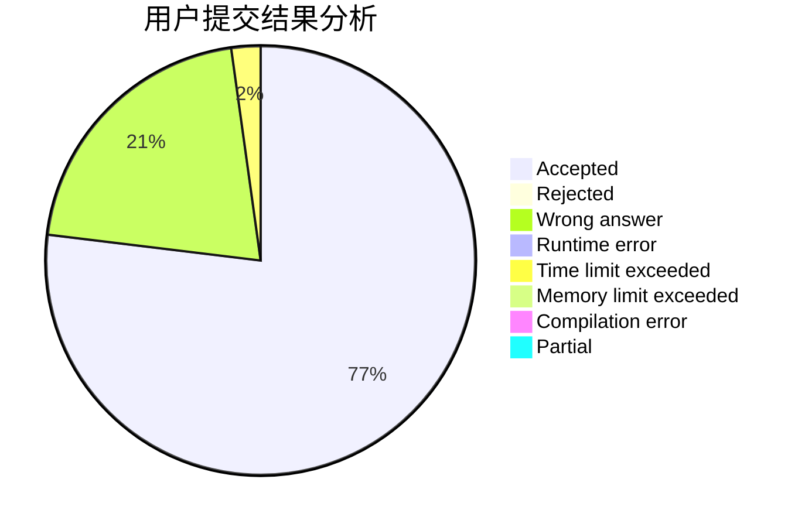
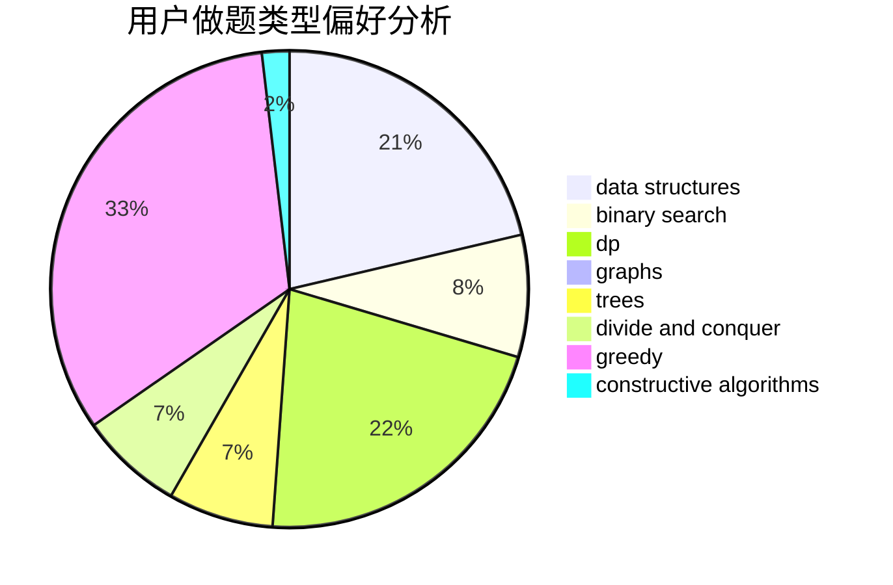
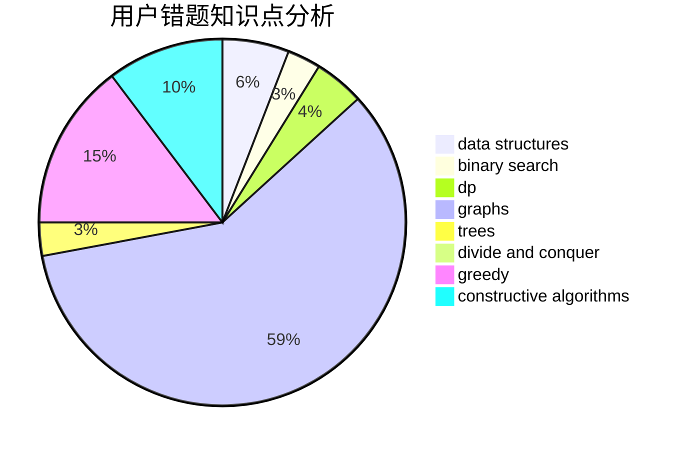

# Mx.

<!-- tabs:start -->

#### **用户提交结果分析**

#### **用户做题类型偏好分析**

#### **用户错题知识点分析**

<!-- tabs:end -->
# 推荐题目
[1260A](https://codeforces.com/contest/1260/problem/A)		math		  
[453B](https://codeforces.com/contest/453/problem/B)		bitmasks,
                        brute force,
                        dp		  
[676D](https://codeforces.com/contest/676/problem/D)		graphs,
                        implementation,
                        shortest paths		  
[11882](https://codeforces.com/contest/1188/problem/2)		dsu,graphs,sortings,trees		  
[986C](https://codeforces.com/contest/986/problem/C)		bitmasks,
                        dfs and similar,
                        dsu,
                        graphs		  
[842C](https://codeforces.com/contest/842/problem/C)		dfs and similar,
                        graphs,
                        math,
                        number theory,
                        trees		  
[1395F](https://codeforces.com/contest/1395/problem/F)		dsu,graphs,sortings,trees		  
[1286A](https://codeforces.com/contest/1286/problem/A)		dp,
                        greedy,
                        sortings		  
[2C](https://codeforces.com/contest/2/problem/C)		geometry		  
[1105A](https://codeforces.com/contest/1105/problem/A)		brute force,
                        implementation		  
