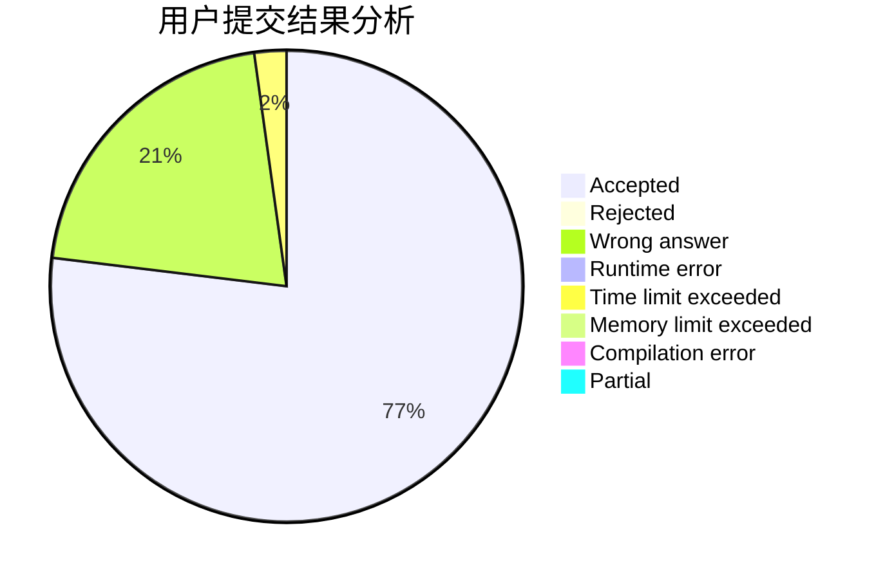
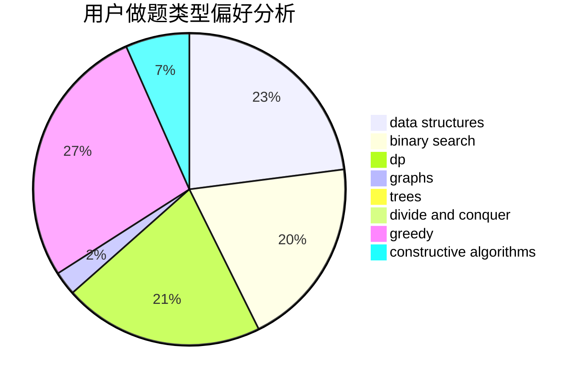
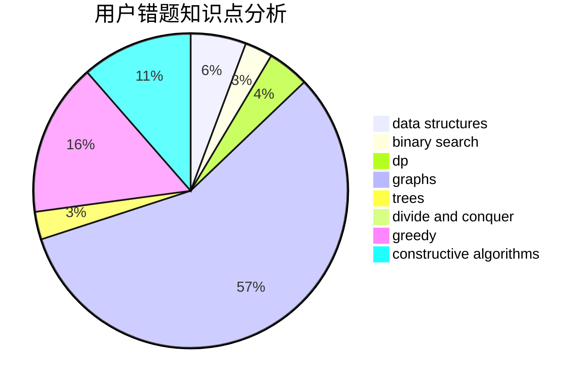

# Mx.
<!-- tabs:start -->
#### **用户提交结果分析**

#### **用户做题类型偏好分析**

#### **用户错题知识点分析**

<!-- tabs:end -->
# 推荐题目
[Turtles](http://codeforces.com/problemset/problem/348/D)		dp,
                        matrices		  
[Random Task](http://codeforces.com/problemset/problem/431/D)		binary search,
                        bitmasks,
                        combinatorics,
                        dp,
                        math		  
[Slightly Decreasing Permutations](http://codeforces.com/problemset/problem/285/A)		greedy,
                        implementation		  
[Palindrome-less Arrays](http://codeforces.com/problemset/problem/1140/E)		combinatorics,
                        divide and conquer,
                        dp		  
[Pursuit For Artifacts](http://codeforces.com/problemset/problem/652/E)		dfs and similar,
                        dsu,
                        graphs,
                        trees		  
[Sorting Railway Cars](http://codeforces.com/problemset/problem/605/A)		constructive algorithms,
                        greedy		  
[Heidi and the Turing Test (Hard)](http://codeforces.com/problemset/problem/1184/C3)		nan		  
[Circles of Waiting](http://codeforces.com/problemset/problem/963/E)		math		  
[Cut and Paste](http://codeforces.com/problemset/problem/1280/A)		implementation,
                        math		  
[Joysticks](http://codeforces.com/problemset/problem/651/A)		dp,
                        greedy,
                        implementation,
                        math		  
<!-- tabs:start -->
#### **data structures**
[Turtles](http://codeforces.com/problemset/problem/1385/F)		data structures,
                        greedy,
                        implementation,
                        trees		  
[Random Task](http://codeforces.com/problemset/problem/1252/K)		data structures,
                        math,
                        matrices		  
[Slightly Decreasing Permutations](http://codeforces.com/problemset/problem/765/F)		data structures		  
[Palindrome-less Arrays](http://codeforces.com/problemset/problem/1294/D)		data structures,
                        greedy,
                        implementation,
                        math		  
[Pursuit For Artifacts](http://codeforces.com/problemset/problem/920/F)		brute force,
                        data structures,
                        dsu,
                        number theory		  
[Sorting Railway Cars](http://codeforces.com/problemset/problem/1051/G)		data structures,
                        dsu,
                        greedy		  
[Heidi and the Turing Test (Hard)](http://codeforces.com/problemset/problem/1492/C)		binary search,
                        data structures,
                        dp,
                        greedy,
                        two pointers		  
[Circles of Waiting](http://codeforces.com/problemset/problem/1490/G)		binary search,
                        data structures,
                        math		  
[Cut and Paste](http://codeforces.com/problemset/problem/1479/D)		binary search,
                        bitmasks,
                        brute force,
                        data structures,
                        probabilities,
                        trees		  
[Joysticks](http://codeforces.com/problemset/problem/1497/A)		brute force,
                        data structures,
                        greedy,
                        sortings		  
#### **binary search**
[Turtles](http://codeforces.com/problemset/problem/431/D)		binary search,
                        bitmasks,
                        combinatorics,
                        dp,
                        math		  
[Random Task](http://codeforces.com/problemset/problem/301/B)		binary search,
                        graphs,
                        shortest paths		  
[Slightly Decreasing Permutations](http://codeforces.com/problemset/problem/1285/F)		binary search,
                        combinatorics,
                        number theory		  
[Palindrome-less Arrays](http://codeforces.com/problemset/problem/1492/C)		binary search,
                        data structures,
                        dp,
                        greedy,
                        two pointers		  
[Pursuit For Artifacts](http://codeforces.com/problemset/problem/1463/D)		binary search,
                        constructive algorithms,
                        greedy,
                        two pointers		  
[Sorting Railway Cars](http://codeforces.com/problemset/problem/1490/G)		binary search,
                        data structures,
                        math		  
[Heidi and the Turing Test (Hard)](http://codeforces.com/problemset/problem/1479/D)		binary search,
                        bitmasks,
                        brute force,
                        data structures,
                        probabilities,
                        trees		  
[Circles of Waiting](http://codeforces.com/problemset/problem/1436/E)		binary search,
                        data structures,
                        two pointers		  
[Cut and Paste](http://codeforces.com/problemset/problem/1461/D)		binary search,
                        brute force,
                        data structures,
                        divide and conquer,
                        implementation,
                        sortings		  
[Joysticks](http://codeforces.com/problemset/problem/1493/C)		binary search,
                        brute force,
                        constructive algorithms,
                        greedy,
                        strings		  
#### **dp**
[Turtles](http://codeforces.com/problemset/problem/348/D)		dp,
                        matrices		  
[Random Task](http://codeforces.com/problemset/problem/431/D)		binary search,
                        bitmasks,
                        combinatorics,
                        dp,
                        math		  
[Slightly Decreasing Permutations](http://codeforces.com/problemset/problem/1140/E)		combinatorics,
                        divide and conquer,
                        dp		  
[Palindrome-less Arrays](http://codeforces.com/problemset/problem/651/A)		dp,
                        greedy,
                        implementation,
                        math		  
[Pursuit For Artifacts](http://codeforces.com/problemset/problem/822/D)		brute force,
                        dp,
                        greedy,
                        math,
                        number theory		  
[Sorting Railway Cars](https://codeforces.com/contest/544/problem/C)		dp		  
[Heidi and the Turing Test (Hard)](http://codeforces.com/problemset/problem/1176/C)		dp,
                        greedy,
                        implementation		  
[Circles of Waiting](http://codeforces.com/problemset/problem/1451/B)		dp,
                        greedy,
                        implementation,
                        strings		  
[Cut and Paste](http://codeforces.com/problemset/problem/1492/C)		binary search,
                        data structures,
                        dp,
                        greedy,
                        two pointers		  
[Joysticks](https://codeforces.com/contest/1457/problem/C)		brute force,
                        dp,
                        implementation		  
#### **graph**
[Turtles](http://codeforces.com/problemset/problem/652/E)		dfs and similar,
                        dsu,
                        graphs,
                        trees		  
[Random Task](http://codeforces.com/problemset/problem/780/D)		2-sat,
                        graphs,
                        greedy,
                        implementation,
                        shortest paths,
                        strings		  
[Slightly Decreasing Permutations](http://codeforces.com/problemset/problem/301/B)		binary search,
                        graphs,
                        shortest paths		  
[Palindrome-less Arrays](http://codeforces.com/problemset/problem/1037/D)		dfs and similar,
                        graphs,
                        shortest paths,
                        trees		  
[Pursuit For Artifacts](http://codeforces.com/problemset/problem/1076/D)		graphs,
                        greedy,
                        shortest paths		  
[Sorting Railway Cars](http://codeforces.com/problemset/problem/557/D)		combinatorics,
                        dfs and similar,
                        graphs,
                        math		  
[Heidi and the Turing Test (Hard)](http://codeforces.com/problemset/problem/1487/C)		brute force,
                        constructive algorithms,
                        dfs and similar,
                        graphs,
                        greedy,
                        implementation,
                        math		  
[Circles of Waiting](http://codeforces.com/problemset/problem/1437/C)		dp,
                        flows,
                        graph matchings,
                        greedy,
                        math,
                        sortings		  
[Cut and Paste](http://codeforces.com/problemset/problem/1470/D)		constructive algorithms,
                        dfs and similar,
                        graph matchings,
                        graphs,
                        greedy		  
[Joysticks](http://codeforces.com/problemset/problem/1476/C)		dp,
                        graphs,
                        greedy		  
#### **trees**
[Turtles](http://codeforces.com/problemset/problem/652/E)		dfs and similar,
                        dsu,
                        graphs,
                        trees		  
[Random Task](http://codeforces.com/problemset/problem/1385/F)		data structures,
                        greedy,
                        implementation,
                        trees		  
[Slightly Decreasing Permutations](http://codeforces.com/problemset/problem/1037/D)		dfs and similar,
                        graphs,
                        shortest paths,
                        trees		  
[Palindrome-less Arrays](http://codeforces.com/problemset/problem/1479/D)		binary search,
                        bitmasks,
                        brute force,
                        data structures,
                        probabilities,
                        trees		  
[Pursuit For Artifacts](http://codeforces.com/problemset/problem/1511/C)		brute force,
                        data structures,
                        implementation,
                        trees		  
[Sorting Railway Cars](http://codeforces.com/problemset/problem/1499/F)		combinatorics,
                        dfs and similar,
                        dp,
                        trees		  
[Heidi and the Turing Test (Hard)](http://codeforces.com/problemset/problem/1491/E)		brute force,
                        dfs and similar,
                        divide and conquer,
                        number theory,
                        trees		  
[Circles of Waiting](http://codeforces.com/problemset/problem/1466/D)		data structures,
                        greedy,
                        sortings,
                        trees		  
[Cut and Paste](http://codeforces.com/problemset/problem/1495/D)		combinatorics,
                        dfs and similar,
                        graphs,
                        math,
                        shortest paths,
                        trees		  
[Joysticks](http://codeforces.com/problemset/problem/1303/G)		data structures,
                        divide and conquer,
                        geometry,
                        trees		  
#### **divide and conquer**
[Turtles](http://codeforces.com/problemset/problem/1140/E)		combinatorics,
                        divide and conquer,
                        dp		  
[Random Task](http://codeforces.com/problemset/problem/1461/D)		binary search,
                        brute force,
                        data structures,
                        divide and conquer,
                        implementation,
                        sortings		  
[Slightly Decreasing Permutations](http://codeforces.com/problemset/problem/1466/G)		combinatorics,
                        divide and conquer,
                        hashing,
                        math,
                        string suffix structures,
                        strings		  
[Palindrome-less Arrays](http://codeforces.com/problemset/problem/1490/D)		dfs and similar,
                        divide and conquer,
                        implementation		  
[Pursuit For Artifacts](https://codeforces.com/contest/1483/problem/C)		data structures,
                        divide and conquer,
                        dp		  
[Sorting Railway Cars](http://codeforces.com/problemset/problem/1491/E)		brute force,
                        dfs and similar,
                        divide and conquer,
                        number theory,
                        trees		  
[Heidi and the Turing Test (Hard)](http://codeforces.com/problemset/problem/1303/G)		data structures,
                        divide and conquer,
                        geometry,
                        trees		  
[Circles of Waiting](http://codeforces.com/problemset/problem/1494/D)		constructive algorithms,
                        data structures,
                        dfs and similar,
                        divide and conquer,
                        dsu,
                        greedy,
                        sortings,
                        trees		  
[Cut and Paste](http://codeforces.com/problemset/problem/1482/E)		data structures,
                        divide and conquer,
                        dp		  
[Joysticks](http://codeforces.com/problemset/problem/566/C)		dfs and similar,
                        divide and conquer,
                        trees		  
#### **greedy**
[Turtles](http://codeforces.com/problemset/problem/285/A)		greedy,
                        implementation		  
[Random Task](http://codeforces.com/problemset/problem/605/A)		constructive algorithms,
                        greedy		  
[Slightly Decreasing Permutations](http://codeforces.com/problemset/problem/651/A)		dp,
                        greedy,
                        implementation,
                        math		  
[Palindrome-less Arrays](http://codeforces.com/problemset/problem/1385/F)		data structures,
                        greedy,
                        implementation,
                        trees		  
[Pursuit For Artifacts](http://codeforces.com/problemset/problem/780/D)		2-sat,
                        graphs,
                        greedy,
                        implementation,
                        shortest paths,
                        strings		  
[Sorting Railway Cars](http://codeforces.com/problemset/problem/822/D)		brute force,
                        dp,
                        greedy,
                        math,
                        number theory		  
[Heidi and the Turing Test (Hard)](http://codeforces.com/problemset/problem/1137/B)		greedy,
                        hashing,
                        strings		  
[Circles of Waiting](http://codeforces.com/problemset/problem/1076/D)		graphs,
                        greedy,
                        shortest paths		  
[Cut and Paste](http://codeforces.com/problemset/problem/1090/A)		greedy		  
[Joysticks](http://codeforces.com/problemset/problem/1009/C)		greedy,
                        math		  
#### **constructive algorithms**
[Turtles](http://codeforces.com/problemset/problem/605/A)		constructive algorithms,
                        greedy		  
[Random Task](https://codeforces.com/contest/1104/problem/C)		constructive algorithms,
                        implementation		  
[Slightly Decreasing Permutations](http://codeforces.com/problemset/problem/1144/C)		constructive algorithms,
                        sortings		  
[Palindrome-less Arrays](http://codeforces.com/problemset/problem/1493/A)		constructive algorithms,
                        greedy		  
[Pursuit For Artifacts](http://codeforces.com/problemset/problem/1463/D)		binary search,
                        constructive algorithms,
                        greedy,
                        two pointers		  
[Sorting Railway Cars](https://codeforces.com/contest/1456/problem/B)		bitmasks,
                        brute force,
                        constructive algorithms		  
[Heidi and the Turing Test (Hard)](http://codeforces.com/problemset/problem/1492/D)		bitmasks,
                        constructive algorithms,
                        greedy,
                        math		  
[Circles of Waiting](https://codeforces.com/contest/1504/problem/D)		constructive algorithms,
                        games,
                        interactive		  
[Cut and Paste](https://codeforces.com/contest/1483/problem/A)		brute force,
                        constructive algorithms,
                        greedy,
                        implementation		  
[Joysticks](https://codeforces.com/contest/1457/problem/D)		bitmasks,
                        brute force,
                        constructive algorithms		  
#### **sortings**
[Turtles](http://codeforces.com/problemset/problem/1102/E)		combinatorics,
                        sortings		  
[Random Task](http://codeforces.com/problemset/problem/1144/C)		constructive algorithms,
                        sortings		  
[Slightly Decreasing Permutations](https://codeforces.com/contest/1496/problem/C)		geometry,
                        greedy,
                        math,
                        sortings		  
[Palindrome-less Arrays](http://codeforces.com/problemset/problem/1495/A)		geometry,
                        greedy,
                        math,
                        sortings		  
[Pursuit For Artifacts](http://codeforces.com/problemset/problem/1497/A)		brute force,
                        data structures,
                        greedy,
                        sortings		  
[Sorting Railway Cars](http://codeforces.com/problemset/problem/1427/A)		math,
                        sortings		  
[Heidi and the Turing Test (Hard)](http://codeforces.com/problemset/problem/1461/D)		binary search,
                        brute force,
                        data structures,
                        divide and conquer,
                        implementation,
                        sortings		  
[Circles of Waiting](http://codeforces.com/problemset/problem/1437/C)		dp,
                        flows,
                        graph matchings,
                        greedy,
                        math,
                        sortings		  
[Cut and Paste](http://codeforces.com/problemset/problem/1473/A)		greedy,
                        implementation,
                        math,
                        sortings		  
[Joysticks](http://codeforces.com/problemset/problem/1486/B)		binary search,
                        geometry,
                        shortest paths,
                        sortings		  
<!-- tabs:end -->
