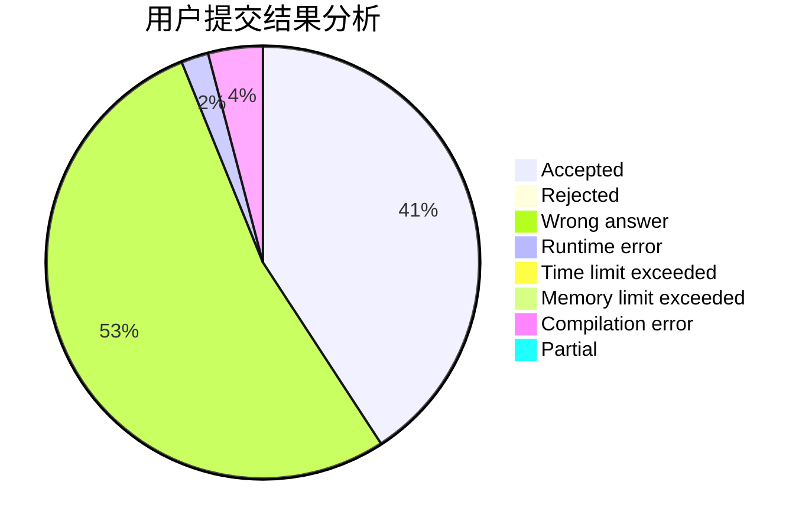
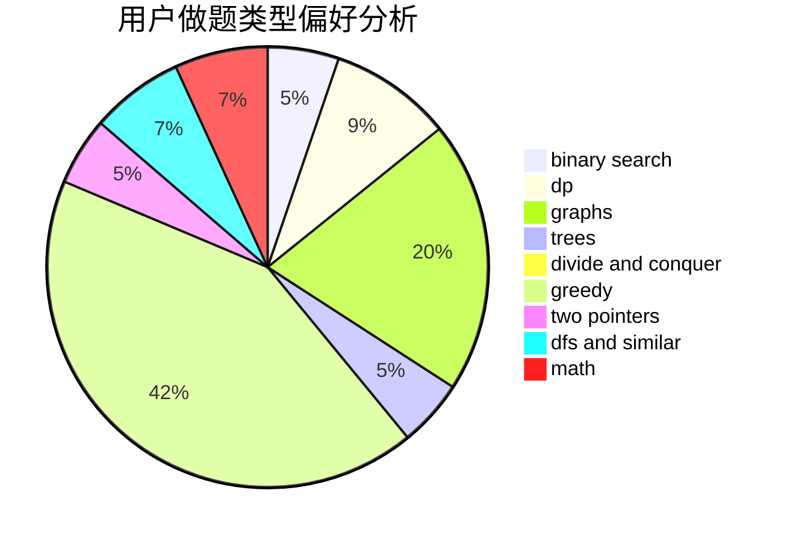

# MyAngelBakapiano

<!-- tabs:start -->

#### **用户提交结果分析**

#### **用户做题类型偏好分析**

<!-- tabs:end -->
# 推荐题目
[1497B](https://codeforces.com/contest/1497/problem/B)
[1445D](https://codeforces.com/contest/1445/problem/D)
[11881](https://codeforces.com/contest/1188/problem/1)
[703C](https://codeforces.com/contest/703/problem/C)
[339B](https://codeforces.com/contest/339/problem/B)
[902B](https://codeforces.com/contest/902/problem/B)
[474A](https://codeforces.com/contest/474/problem/A)
[845E](https://codeforces.com/contest/845/problem/E)
[768C](https://codeforces.com/contest/768/problem/C)
[233C](https://codeforces.com/contest/233/problem/C)
