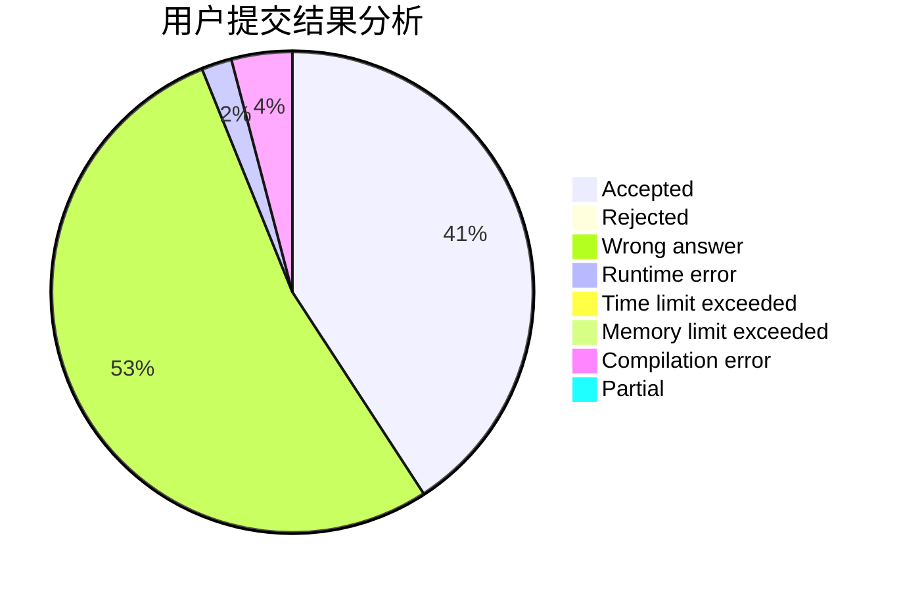
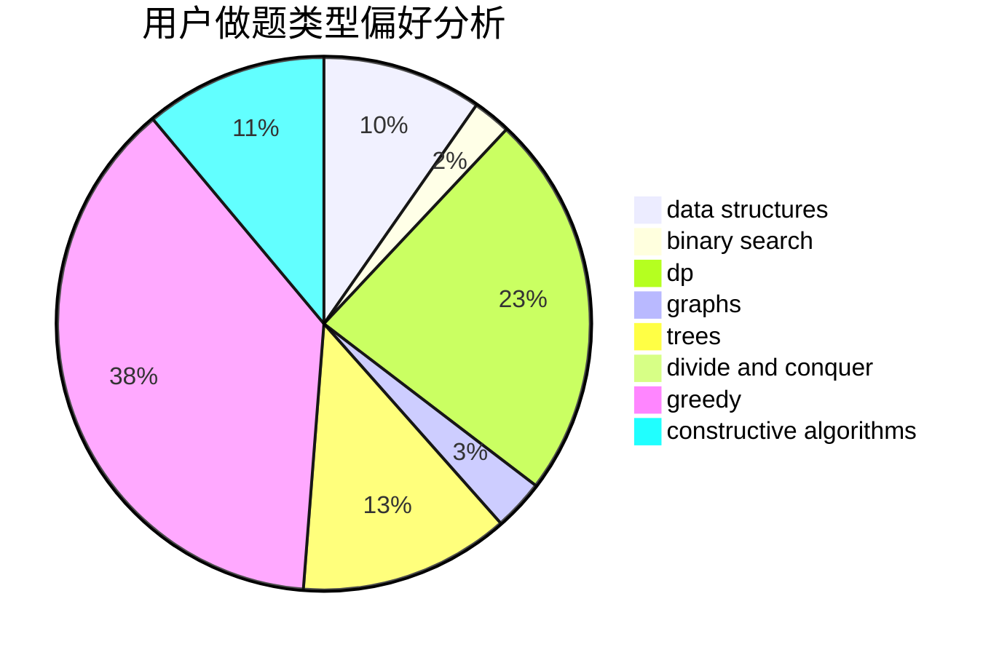
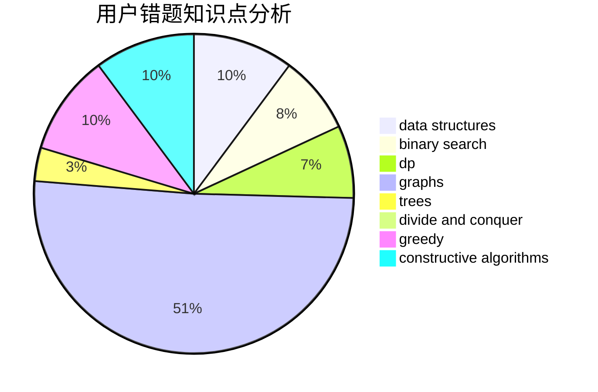

# MyAngelBakapiano

<!-- tabs:start -->

#### **用户提交结果分析**

#### **用户做题类型偏好分析**

#### **用户错题知识点分析**

<!-- tabs:end -->
# 推荐题目
[1489D](https://codeforces.com/contest/1489/problem/D)		dsu,graphs,sortings,trees		  
[1435D](https://codeforces.com/contest/1435/problem/D)		dsu,graphs,sortings,trees		  
[1184C2](https://codeforces.com/contest/1184C/problem/2)		data structures		  
[679E](https://codeforces.com/contest/679/problem/E)		data structures		  
[314C](https://codeforces.com/contest/314/problem/C)		data structures,
                        dp		  
[884A](https://codeforces.com/contest/884/problem/A)		implementation		  
[452A](https://codeforces.com/contest/452/problem/A)		brute force,
                        implementation,
                        strings		  
[827B](https://codeforces.com/contest/827/problem/B)		constructive algorithms,
                        greedy,
                        implementation,
                        trees		  
[749C](https://codeforces.com/contest/749/problem/C)		greedy,
                        implementation,
                        two pointers		  
[215A](https://codeforces.com/contest/215/problem/A)		brute force,
                        implementation		  
