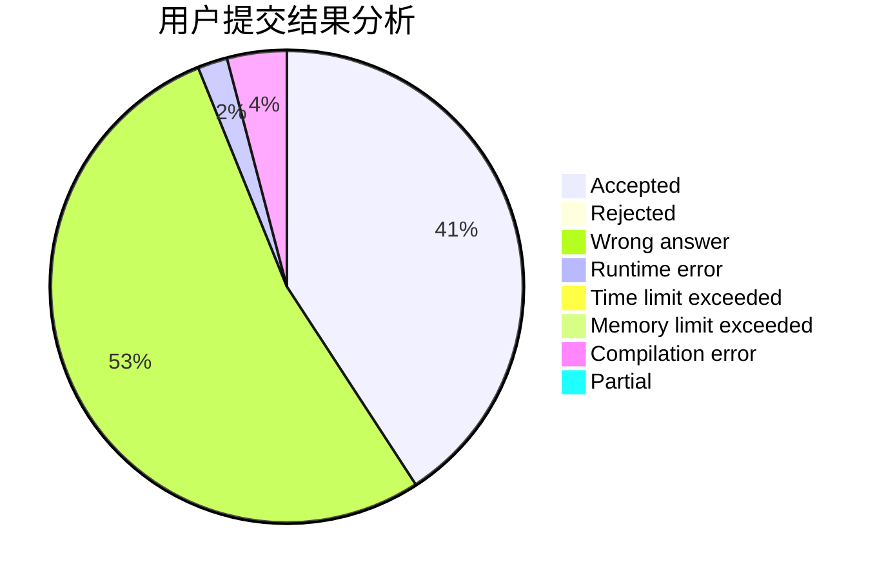
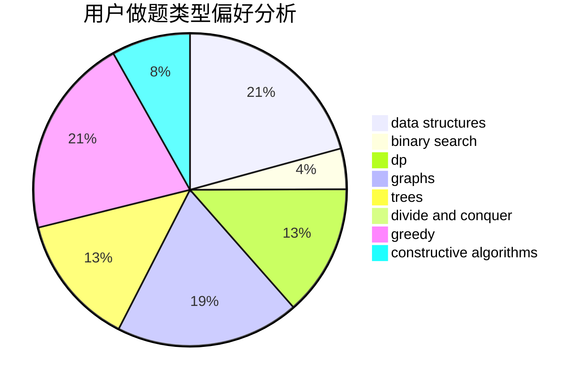
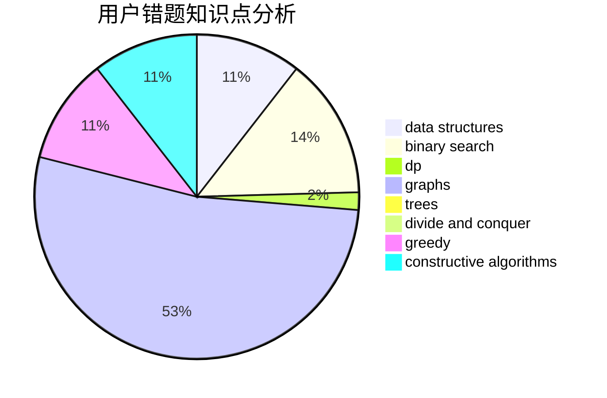

# MyAngelBakapiano

<!-- tabs:start -->

#### **用户提交结果分析**

#### **用户做题类型偏好分析**

#### **用户错题知识点分析**

<!-- tabs:end -->
# 推荐题目
[1497B](https://codeforces.com/contest/1497/problem/B)		constructive algorithms,
                        greedy,
                        math		  
[1445D](https://codeforces.com/contest/1445/problem/D)		dsu,graphs,sortings,trees		  
[11881](https://codeforces.com/contest/1188/problem/1)		dsu,graphs,sortings,trees		  
[703C](https://codeforces.com/contest/703/problem/C)		geometry,
                        implementation		  
[339B](https://codeforces.com/contest/339/problem/B)		implementation		  
[902B](https://codeforces.com/contest/902/problem/B)		dfs and similar,
                        dsu,
                        greedy		  
[474A](https://codeforces.com/contest/474/problem/A)		implementation		  
[845E](https://codeforces.com/contest/845/problem/E)		binary search,
                        data structures		  
[768C](https://codeforces.com/contest/768/problem/C)		brute force,
                        dp,
                        implementation,
                        sortings		  
[233C](https://codeforces.com/contest/233/problem/C)		dsu,graphs,sortings,trees		  
