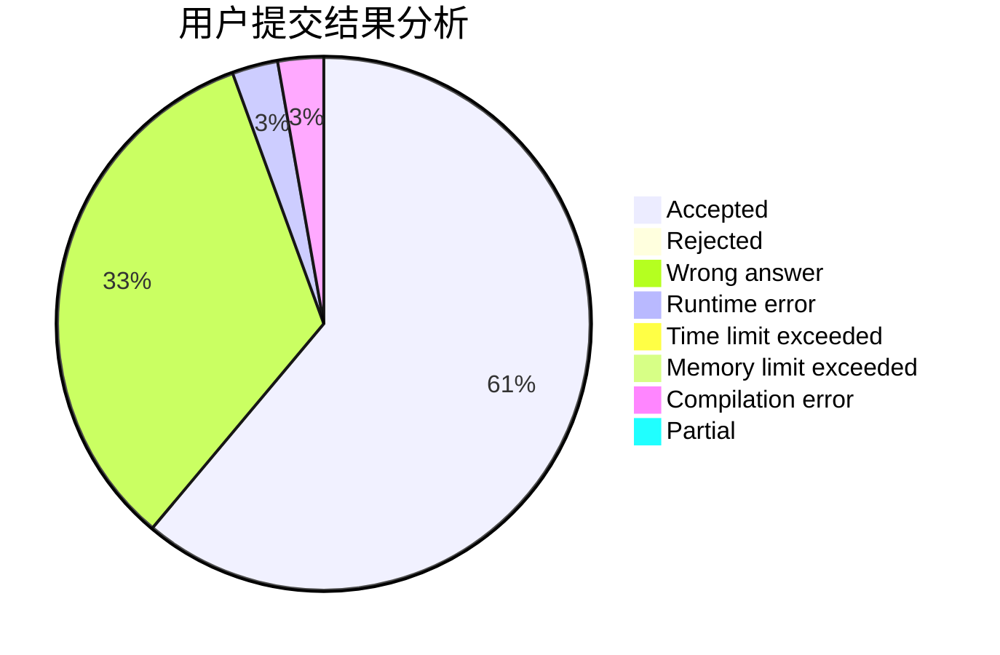
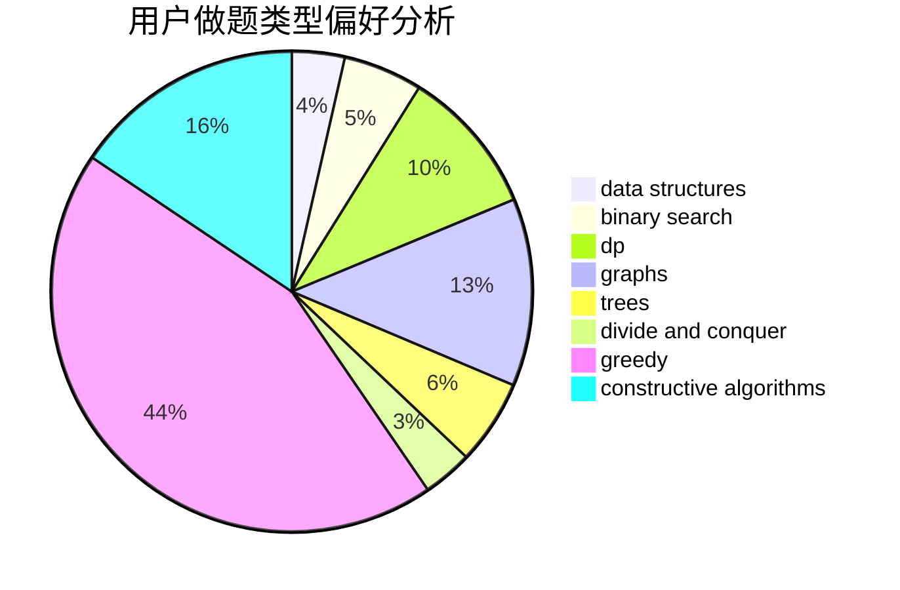

# Mybuger_OVO

<!-- tabs:start -->

#### **用户提交结果分析**

#### **用户做题类型偏好分析**

#### **用户错题知识点分析**

<!-- tabs:end -->
# 推荐题目
[1446C](https://codeforces.com/contest/1446/problem/C)		binary search,
                        bitmasks,
                        data structures,
                        divide and conquer,
                        dp,
                        trees		  
[1408G](https://codeforces.com/contest/1408/problem/G)		combinatorics,
                        dp,
                        dsu,
                        fft,
                        graphs,
                        trees		  
[629E](https://codeforces.com/contest/629/problem/E)		combinatorics,
                        data structures,
                        dfs and similar,
                        dp,
                        probabilities,
                        trees		  
[438D](https://codeforces.com/contest/438/problem/D)		data structures,
                        math		  
[1182C](https://codeforces.com/contest/1182/problem/C)		data structures,
                        greedy,
                        strings		  
[584C](https://codeforces.com/contest/584/problem/C)		constructive algorithms,
                        greedy,
                        strings		  
[543C](https://codeforces.com/contest/543/problem/C)		bitmasks,
                        dp		  
[166E](https://codeforces.com/contest/166/problem/E)		dp,
                        math,
                        matrices		  
[460E](https://codeforces.com/contest/460/problem/E)		brute force,
                        geometry,
                        math,
                        sortings		  
[1213B](https://codeforces.com/contest/1213/problem/B)		data structures,
                        implementation		  
